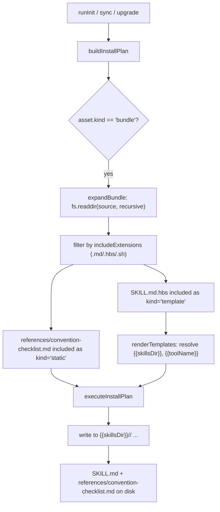

# Design Document

## Overview

This feature brings the two flat review skill templates — `git-code-review/SKILL.md.hbs` and `file-code-review/SKILL.md.hbs` — into compliance with the project's stack-agnostic, single-source governance principle that the `opsx-*` skills already follow. It also neutralizes hardcoded AI-model identity strings in those two skills plus `git-commit-push/SKILL.md.hbs`.

The work is almost entirely **template content editing** (Handlebars `.hbs` files and a new static Markdown reference) plus **verification that the existing install/sync/upgrade pipeline already supports the new file layout without code changes**. No TypeScript runtime logic is added or modified.

Three changes are made:

1. **Decouple conventions from a fixed tech stack.** The mandatory convention-review instructions in both review skills are rewritten to derive conventions from the `Project_Baseline` (`openspec/project.md` → `README.md` → `CLAUDE.md` → `AGENTS.md` → nearby architecture docs → generic fallback). The Java/Spring/MyBatis-specific tables are either removed or demoted into a clearly-labeled, non-mandatory `Optional_Example_Block`.

2. **Single-source the shared checklist.** The duplicated 4.x/5.x convention checklist is extracted into `references/convention-checklist.md` under each review skill's bundle directory, and both `SKILL.md.hbs` files reference it through a new `权威来源地图` (authoritative source map) section that mirrors the `opsx-*` layout.

3. **Neutralize identity strings.** The hardcoded `Claude Opus 4.8` commit trailer and `审查人` field values are replaced with the dynamic, tool-neutral `{{toolName}}` template variable (already present in the render context).

### Research Summary

Key findings from reading the codebase that drive the design:

- **`expandBundle` (src/core/init/buildInstallPlan.ts)** reads each bundle's source directory with `fs.readdir(sourceRoot, { recursive: true })`, then filters by `includeExtensions`. Any file placed anywhere under a bundle's `source` directory whose extension is in `includeExtensions` is automatically enumerated into the `Install_Plan`. A nested `references/convention-checklist.md` is therefore picked up with **no manifest or code change**.
- **`assetManifest` (src/core/assets/manifest.ts)** registers both `git-code-review-skill-bundle` and `file-code-review-skill-bundle` as `kind: 'bundle'` with `includeExtensions: ['.md', '.hbs', '.sh']`. Since `.md` is already included, the new reference file is discovered without a separate per-file asset entry (satisfies Requirement 5.3, 5.4).
- **Bundle expansion is per-source-directory and recursive.** `expandBundle` only walks the single `asset.source` root for a given asset. It cannot read a sibling skill's directory or a repo-level shared folder. This is the decisive constraint for *where* the shared reference must physically live (see Architecture → "Shared reference placement decision").
- **`kind` classification in `expandBundle`**: `asset.templateFiles?.includes(fileName) || entry.endsWith('.hbs') ? 'template' : 'static'`. For both review bundles `templateFiles` is `['SKILL.md.hbs']`. A `references/convention-checklist.md` (no `.hbs` suffix, not in `templateFiles`) is therefore copied as a **static** file — no Handlebars rendering. This is correct: the checklist is stack-agnostic prose with no template variables.
- **`SKILL.md.hbs` *is* a template** (it is in `templateFiles`), so it is rendered through Handlebars. Template variables such as `{{skillsDir}}` and `{{toolName}}` resolve in `SKILL.md` output. `toolName` is set to `adapter.definition.displayName` in `buildInstallPlan` (e.g. "Claude Code", "Cursor", "Codex CLI", "Generic"). This makes `{{toolName}}` the natural tool-neutral identity value.
- **Existing tests** (`test/integration/init-matrix.test.ts`, `test/integration/package-artifact.test.ts`) assert rendered-file presence and content via per-tool `toolExpectations` arrays and `expect(content).toContain(...)`. New reference files and content guarantees are validated by extending these arrays and adding focused assertions — the established testing pattern for this repo.

## Architecture

### Affected artifacts

```
templates/common/skills/
├── git-code-review/
│   ├── SKILL.md.hbs                       (rewritten: stack-agnostic + 权威来源地图 + neutral identity)
│   └── references/
│       └── convention-checklist.md        (NEW: stack-agnostic checklist + optional example block)
├── file-code-review/
│   ├── SKILL.md.hbs                       (rewritten: stack-agnostic + 权威来源地图 + neutral identity)
│   └── references/
│       └── convention-checklist.md        (NEW: byte-identical copy of the shared checklist)
└── git-commit-push/
    └── SKILL.md.hbs                       (edited: neutral commit-trailer identity only)
```

No changes to `src/` (manifest, install plan, render flow all already support this).

### Install/render data flow (unchanged, verified)



The new `references/convention-checklist.md` flows through the **existing** path with no new branches: it is a static `.md` already covered by `includeExtensions`, so it is enumerated, copied verbatim, and written under the resolved skill directory.

### Shared reference placement decision

**Decision: physically place `references/convention-checklist.md` under *each* review skill's bundle directory (two copies), kept byte-identical, and treat the reference file — not the `SKILL.md` body — as the single definition of the checklist content.**

Rationale and alternatives considered:

- **Why not one shared file referenced by both bundles?** `expandBundle` only walks a single `asset.source` root and cannot reach outside it. A file stored once at, say, `templates/common/shared/convention-checklist.md` would never be enumerated for either skill bundle without adding new code (a custom merge step or an additional asset entry). Requirement 5.4 explicitly forbids adding a separate per-file asset entry, and the feature's stated intent is "no code change to the pipeline." So a physically-shared single file is incompatible with the install mechanism.
- **Why not a symlink?** Symlinks are fragile across `npm pack`/`tar` packaging and Windows checkouts; `fs.readdir(..., { recursive: true })` + copy semantics would not reliably preserve them. Rejected.
- **Chosen approach — duplicate-but-canonical.** Each bundle gets its own `references/convention-checklist.md`. This satisfies the install constraint and the glossary definition (which already says the reference is "stored under **each** Review_Skill's bundle directory"). Requirement 4.6 ("the only location that defines the shared content across the pair") is interpreted at the **consumption level**: the checklist content is defined *only* inside the reference file and is **never inlined** in either `SKILL.md` body. To prevent drift between the two physical copies, a guard test asserts the two files are byte-identical (see Testing Strategy). The authoring source of truth is documented as `git-code-review/references/convention-checklist.md`; the `file-code-review` copy is maintained as an exact mirror.

This keeps a single logical source, honors the recursive-bundle mechanism, and adds zero pipeline code.

### Identity neutralization strategy

`SKILL.md.hbs` files are rendered templates, and the render context already exposes `toolName` (the active tool's display name). The neutral `Identity_String` is `{{toolName}}`:

- Commit trailer (`git-commit-push`, `git-code-review` examples): `Co-Authored-By: {{toolName}} <noreply@opsx-dev-pipeline.local>`
- Review report reviewer field (`git-code-review`, `file-code-review`): `**审查人:** {{toolName}}`

This is tool-neutral (it adapts to whichever AI tool generated the project, rather than naming a fixed model) and contains no literal model-version value such as "Claude Opus 4.8" (satisfies Requirement 3.1–3.4). A static fallback string (`AI 代码审查助手` / `AI Assistant`) was considered but rejected in favor of the dynamic variable, which carries more accurate provenance while remaining model-neutral.

## Components and Interfaces

This feature has no programmatic interfaces. The "components" are the content contracts each edited artifact must satisfy.

### Component 1: `convention-checklist.md` (shared reference, new)

Stack-agnostic review checklist that both review skills point to. Structure:

```markdown
# 通用代码审查清单（Convention Checklist）

> 本清单与具体语言/框架无关。所有"强制"检查项均以项目基准（Project_Baseline）解析到的规范为准。

## 1. 规范来源解析（强制）
- 按 Project_Baseline 顺序解析：openspec/project.md → README.md → CLAUDE.md → AGENTS.md → 邻近架构文档 → 通用约定兜底
- 在报告中记录实际使用的规范基准来源

## 2. 通用审查维度（强制，语言无关）
| 维度 | 检查要点 |
| ---- | -------- |
| 命名一致性 | 是否遵循项目基准中声明的命名约定 |
| 分层/模块边界 | 是否符合项目基准声明的架构边界，无反向/跨层依赖 |
| 错误处理 | 错误路径是否被处理并向上传递，无静默吞错 |
| 日志 | 使用项目约定的日志机制，无裸输出（如 print/console/System.out） |
| 安全 | 输入校验、注入防护、鉴权/授权按基准要求 |
| 敏感信息 | 无硬编码密钥/口令/令牌（见密钥扫描步骤） |
| 性能 | 无明显的 N+1、重复计算、未释放资源 |
| 测试 | 关键变更具备对应测试或验证手段 |

## 3. 严重程度判定（强制）
| 严重程度 | 图标 | 判定标准 |
| -------- | ---- | -------- |
| 严重 | 🚨 | 安全漏洞、Bug、破坏性变更、敏感信息泄露 |
| 重要 | ⚠️ | 规范违规、性能问题、设计原则违反 |
| 一般 | 📝 | 代码风格、命名、注释 |
| 建议 | 💡 | 最佳实践、优化建议 |

---

## 可选示例：Java / Spring 企业栈（仅示例，非强制）

> ⚠️ 以下为示例性映射，**仅当 Project_Baseline 识别出匹配的技术栈时**才适用。
> 不要将本节作为强制检查项；非匹配项目应忽略本节。

<details>
<summary>展开 Java/Spring 命名与注解示例</summary>

| 类型 | 命名模式（示例） |
| ---- | ---------------- |
| Controller | `*Controller` |
| Service 接口/实现 | `*Service` / `*ServiceImpl` |
| 数据对象 | `*DO` / `*Model` / `*VO` |
| 转换器 | `*Convert` / `*Converter` |

注解示例：`@RestController` / `@Service` / `@Transactional(rollbackFor = ...)` / 分页与对象转换工具按项目基准选择。

</details>
```

Content contract:
- The mandatory sections (1–3) contain no programming language, framework, library, or company-specific identifier as a required convention.
- The Java content is fully contained within the clearly-labeled `可选示例 ... 非强制` block and gated on "only when the baseline identifies a matching stack."
- No `YzwResult`, `@Authority`, `PurWebContractPaymentBaseController`, or `*BizService` appears as a mandatory item. (If retained at all, only inside the optional example block as illustration.)

### Component 2: `git-code-review/SKILL.md.hbs` (rewritten)

Content contract:
- Step "Load project conventions" resolves the `Project_Baseline` chain (already partially present) and instructs deriving conventions from it — not from a fixed stack.
- The inline 5.1–5.12 Java tables and the bottom "Convention Checklist (from openspec/project.md)" Java table are **removed from the body** and replaced by a pointer to `references/convention-checklist.md`.
- A new `## 权威来源地图` section lists `references/convention-checklist.md` as the authoritative checklist source, mirroring `opsx-verify`'s "权威来源地图".
- Report template `审查人` field uses `{{toolName}}`.
- Existing workflow steps (scope selection, secret scanning, report saving to `openspec/review/`, full-report output, optional proposal flow, Chinese output) are preserved.
- Baseline-fallback and "record resolved baseline in report" behavior preserved/strengthened (Requirement 6).

### Component 3: `file-code-review/SKILL.md.hbs` (rewritten)

Same content contract as Component 2, adapted to file/snippet review (no git scope step). Inline 4.1–4.12 Java tables removed and replaced by the `references/convention-checklist.md` pointer + `## 权威来源地图` section. `审查人` field uses `{{toolName}}`.

### Component 4: `git-commit-push/SKILL.md.hbs` (identity edit only)

Content contract:
- Both commit-message templates (single-line and heredoc) use `Co-Authored-By: {{toolName}} <noreply@opsx-dev-pipeline.local>`.
- No other workflow step changes (Requirement 7.3).
- Contains no literal model-version identity.

## Data Models

No data models or schemas are introduced. The only structured artifact is the install-context object already built by `buildInstallPlan`, used unchanged:

| Field | Source | Use in this feature |
| ----- | ------ | ------------------- |
| `toolName` | `adapter.definition.displayName` | Rendered as the neutral `Identity_String` in `SKILL.md` output |
| `skillsDir` | `adapter.getDestination('skills')` | Existing references to install path (unchanged) |

`InstallFile` records produced for the new reference file:
- `assetId`: `git-code-review-skill-bundle:references/convention-checklist.md` (and the `file-code-review` equivalent)
- `kind`: `static`
- `destinationPath`: `<resolved skillsDir>/<skill>/references/convention-checklist.md`

## Error Handling

This is template content and packaging work; error handling is about graceful degradation in the generated skill instructions and packaging integrity, not runtime exceptions in new code.

- **Missing `openspec/project.md`** — The rewritten skills instruct the agent to walk the fallback chain (`README.md` → `CLAUDE.md` → `AGENTS.md` → nearby architecture docs) and, if none is found, to proceed with generic conventions and explicitly record "未找到项目基准" in the report (Requirement 6.2, 6.4).
- **Baseline disclosure** — The report template requires a `规范基准` line recording the resolved source, so the basis of the review is always transparent (Requirement 6.3).
- **Reference copy drift** — Mitigated by a byte-identical guard test between the two `convention-checklist.md` copies; CI fails if they diverge.
- **Packaging omission** — `package.json` `files` already includes `templates/`, so the new reference ships in the tarball; the packaged-artifact test asserts its presence after a real install.
- **No template-variable leakage** — Because the reference is a static `.md` (not `.hbs`), it is copied verbatim; the only rendered variables (`{{toolName}}`, `{{skillsDir}}`) live in `SKILL.md.hbs`, which is already a template file.

## Testing Strategy

### Why property-based testing does not apply

This feature edits documentation/instruction content in Handlebars templates and verifies that the existing install pipeline already handles a nested static Markdown file. There is no pure function with a meaningful "for all inputs X, property P(X) holds" statement to test:

- The skill `.hbs` content is prose/configuration, validated by presence/absence assertions and snapshots, not by randomized inputs.
- The install/render behavior (`expandBundle` recursion, extension filtering) is **existing, unchanged** deterministic code; its behavior does not vary meaningfully with input and is best covered by integration examples (the established pattern in `test/integration`).

Per the project's testing guidance, this places the work in the IaC/configuration/template category, where snapshot and example-based integration tests are appropriate and property-based tests are not. The Correctness Properties section is therefore intentionally omitted.

### Test approach (extends existing `vitest` integration suite)

**1. Decoupling assertions (content) — `test/integration/init-matrix.test.ts`**
- After `runInit` for a representative tool (`claude`), read the rendered `git-code-review/SKILL.md` and `file-code-review/SKILL.md` and assert their mandatory sections contain **no** hardcoded stack tokens: `expect(content).not.toContain('YzwResult')`, `@Authority`, `PurWebContractPaymentBaseController`, `Java 8`, etc. (Requirements 1.1, 1.2, 1.4, 1.5, 5.5).
- Assert each `SKILL.md` contains a `权威来源地图` section and references `references/convention-checklist.md` (Requirements 4.2, 4.3, 4.4, 4.5).
- Assert any retained Java content lives only under an optional-example marker (e.g. `expect(content).toContain('仅示例')` adjacency / the optional block exists only in the reference, not in the mandatory body) (Requirements 2.1, 2.2, 2.4).

**2. Identity neutralization assertions**
- Assert rendered `git-commit-push/SKILL.md`, `git-code-review/SKILL.md`, `file-code-review/SKILL.md` do **not** contain `Claude Opus 4.8` (Requirement 3.4) and that the commit trailer / `审查人` field render the tool display name (Requirements 3.1–3.3).

**3. Install/manifest/render compatibility — extend `toolExpectations` arrays**
- Add `.../git-code-review/references/convention-checklist.md` and `.../file-code-review/references/convention-checklist.md` to every tool's expected-file list in `init-matrix.test.ts`, proving `buildInstallPlan`/`executeInstallPlan` write them under the resolved skill dir for all four tools (Requirements 5.1, 5.2).
- Add the same paths to `package-artifact.test.ts` assertions to prove they survive `npm pack` + real install (Requirements 5.3, 5.4).

**4. Baseline fallback / Chinese output assertions**
- Assert each review `SKILL.md` still instructs Chinese report output and retains the fallback chain text and the `规范基准` disclosure line (Requirements 6.1–6.4, 7.1, 7.2).

**5. Single-source guard test (new small unit/integration test)**
- Read both `convention-checklist.md` copies from the `templates/` source and assert byte-equality, guarding against drift (Requirement 4.6).
- Assert neither review `SKILL.md.hbs` inlines the checklist body (e.g. the mandatory checklist table headers appear only in the reference, not in the `SKILL.md.hbs`) (Requirement 4.6).

**Execution**: run with `npm test` (`vitest run`). Use single-run mode; do not use watch mode.
