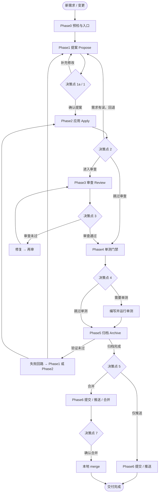

# opsx-dev-pipeline

`opsx-dev-pipeline` 是一个用于初始化 AI 开发工作流模板的 CLI。它会根据你选择的 AI 工具，在项目中生成对应的 skills、commands、rules、prompts。

## Quick Start

使用本工具前，请先安装 OpenSpec：

- [OpenSpec](https://github.com/Fission-AI/OpenSpec)
- **Node.js 20+**：用于 CLI、OpenSpec 和 Skill 脚本的结构化 JSON 校验

推荐直接使用 npx 初始化：

```bash
npx opsx-dev-pipeline@latest init
```

非交互模式示例：

```bash
npx opsx-dev-pipeline init --tool claude --yes
```

仅预览将要生成的文件：

```bash
npx opsx-dev-pipeline init --tool claude --yes --dry-run
```

卸载已安装的托管文件：

```bash
npx opsx-dev-pipeline uninstall --yes
```

## Supported AI Tools

| Tool ID  | 工具          | 生成目录 / 文件                                                    | 说明                                           |
| -------- | ----------- | ------------------------------------------------------------ | ---------------------------------------------- |
| `claude` | Claude Code | `CLAUDE.md`、`.claude/skills/`、`.claude/commands/`            | `SKILL_ROOT=.claude/skills/opsx-dev-pipeline`            |
| `cursor` | Cursor      | `.cursor/rules/`、`.cursor/commands/`、`opsx-dev-pipeline.mdc` | 按需加载；`SKILL_ROOT=.cursor/rules/opsx-dev-pipeline`    |
| `codex`  | Codex       | `.codex/prompts/`、`.codex/commands/`                         | 入口 prompt 加载 `.codex/prompts/opsx-dev-pipeline/`     |

查看当前内置适配器：

```bash
npx opsx-dev-pipeline list-tools
npx opsx-dev-pipeline list-tools --json
```

## Generated Skill & Command

初始化后，模板会安装核心流水线入口：

Skill bundle 同时包含 `agents/openai.yaml`，用于提供 OpenAI/Codex 界面显示名、简述和默认调用提示。

| 入口                  | 类型    | 用途摘要                                         |
| ------------------- | ----- | -------------------------------------------- |
| `opsx-dev-pipeline` | skill | OpenSpec + Git 需求开发全流程（提案 → 应用 → 审查 → 单测 → 归档 → 推送/合并） |

`opsx-dev-pipeline` 是唯一的流水线门禁权威，覆盖 **Phase0–6**：

| Phase| 说明                |
| ----- | ----------------- |
| 0     | 入口判断              |
| 1     | 提案编写 (Propose)    |
| 2     | 提案应用 (Apply)      |
| 3     | 代码审查 (Review)     |
| 4     | 单元测试门禁            |
| 5     | 提案归档 (Archive)    |
| 6     | 提交合并推送 (Merge & Push) |

Phase6 是流水线的最终阶段，支持 commit + push，并按决策点 5 的选择决定是否执行本地 merge。

## 研发流程



## Commands

| Command      | Example                                          | Description                                                                                     |
| ------------ | ------------------------------------------------ | ----------------------------------------------------------------------------------------------- |
| `init`       | `npx opsx-dev-pipeline init --tool claude --yes` | 初始化当前目录的模板文件                                                                                    |
| `list-tools` | `npx opsx-dev-pipeline list-tools --json`        | 查看当前内置支持的 AI 工具适配器；`--json` 输出结构化工具清单（含 destinations / markers / supports）                   |
| `doctor`     | `npx opsx-dev-pipeline doctor --json`            | 检查 manifest，对比 manifest `templateVersion` 与当前 CLI 版本并给出 upgrade 建议                              |
| `sync`       | `npx opsx-dev-pipeline sync --dry-run`           | 根据 manifest **仅**重新渲染已托管文件；若某 bundle 有部分成员已托管，会同步该 bundle 的全部成员                                |
| `upgrade`    | `npx opsx-dev-pipeline upgrade --dry-run`        | 在 sync 基础上额外采纳包内**新增**模板；执行前会对比 manifest 与 CLI 版本，manifest 偏新或无法解析时需确认（`--yes` 跳过） |
| `uninstall`  | `npx opsx-dev-pipeline uninstall --dry-run`      | 按 manifest 删除托管文件并清理空目录；部分删除时会更新 manifest                                                      |

> 提示：`init` 完成后，可在生成的 commands / skills 目录里直接使用 `opsx-dev-pipeline` 开始需求开发流程。

## License

MIT
