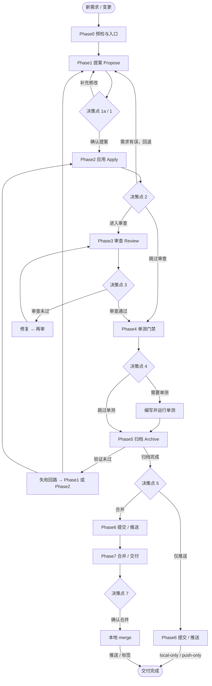

# opsx-dev-pipeline

`opsx-dev-pipeline` 是一个用于初始化 AI 开发工作流模板的 CLI。它会自动初始化 OpenSpec，并根据所选 AI 工具与项目类型生成对应的 skills、commands、schema、rules 和 prompts。

## Quick Start

运行环境：

- **Node.js 20+**
- **OpenSpec CLI 1.6.0+**：必须已安装并可通过 `PATH` 调用

```bash
npm install -g @fission-ai/openspec@latest
openspec --version
```

OpenSpec 安装方式和版本说明参见 [OpenSpec](https://github.com/Fission-AI/OpenSpec)。初始化前 CLI 会执行版本预检；未安装或版本过低时会直接终止并给出错误信息。

推荐直接使用 npx 初始化：

```bash
npx opsx-dev-pipeline@latest init
```

交互模式会提示选择 AI 工具和项目 stack，stack 默认选中 `backend`。

非交互模式示例：

```bash
npx opsx-dev-pipeline init --tool claude --stack backend --yes
```

使用 `--yes` 时，`--stack frontend|backend|fullstack` 为必填参数。

仅预览将要生成的文件：

```bash
npx opsx-dev-pipeline init --tool claude --stack frontend --yes --dry-run
```

`--dry-run` 会执行 OpenSpec 版本预检并显示完整安装计划，但不会调用 `openspec init` 或写入文件。

卸载已安装的托管文件：

```bash
npx opsx-dev-pipeline uninstall --yes
```


## Supported Stacks


| Stack ID    | 默认技术栈                                 | OpenSpec Schema               | 主要规则                       |
| ----------- | ------------------------------------- | ----------------------------- | -------------------------- |
| `frontend`  | React 18+、TypeScript、Vite             | `openspec/schemas/frontend/`  | UI/UX 影响、浏览器兼容、组件树、路由与状态管理 |
| `backend`   | Java 17+、Spring Boot 3.x、Maven/Gradle | `openspec/schemas/backend/`   | API 契约、API 设计、数据库迁移、数据模型、中间件与拦截器  |
| `fullstack` | React 18+（前端）+ Java Spring Boot（后端） | `openspec/schemas/fullstack/` | API 契约优先、前后端分离、Monorepo 约定（`frontend/` + `backend/`） |


每次 `init` 只安装一套 stack schema。所选 stack 会记录在 pipeline manifest 中，后续 `sync` 和 `upgrade` 会继续使用同一套 schema 与 config 模板。

## Supported AI Tools


| Tool ID  | 工具          | 生成目录 / 文件                                                    | 说明                                                |
| -------- | ----------- | ------------------------------------------------------------ | ------------------------------------------------- |
| `claude` | Claude Code | `CLAUDE.md`、`.claude/skills/`、`.claude/commands/`            | `SKILL_ROOT=.claude/skills/opsx-dev-pipeline`     |
| `cursor` | Cursor      | `.cursor/rules/`、`.cursor/commands/`、`opsx-dev-pipeline.mdc` | 按需加载；`SKILL_ROOT=.cursor/rules/opsx-dev-pipeline` |
| `codex`  | Codex       | `.agents/skills/`                                              | `SKILL_ROOT=.agents/skills/opsx-dev-pipeline`     |


查看当前内置适配器：

```bash
npx opsx-dev-pipeline list-tools
npx opsx-dev-pipeline list-tools --json
```


## Generated Skill & Command

初始化流程如下：

```text
OpenSpec 版本预检
  -> 收集 tool / stack
  -> openspec init --tools <tool>
  -> 安装 stack schema 与 openspec/config.yaml
  -> 安装 opsx-dev-pipeline Skill / Command
  -> 写入 pipeline manifest
```

以 Claude Code + backend 为例，核心产物如下：

```text
.claude/
├── skills/opsx-dev-pipeline/           # Pipeline Skill bundle
├── skills/opsx-grill-me/               # Interview skill
├── skills/opsx-grilling/               # Stress-test skill
├── skills/opsx-dev-spec-design/        # Design spec skill
├── commands/opsx/dev-pipeline.md       # Pipeline Command
├── commands/opsx/propose.md            # Propose Command
├── commands/opsx/apply.md              # Apply Command
├── commands/opsx/archive.md            # Archive Command
├── commands/opsx/verify.md             # Verify Command
├── commands/opsx/sync.md               # Sync Command
├── commands/opsx/explore.md            # Explore Command
├── commands/opsx/grill-me.md           # Grill-me Command
├── commands/opsx/grilling.md           # Grilling Command
└── commands/opsx/dev-spec-design.md    # Dev-spec-design Command

openspec/
├── config.yaml                         # schema: backend + Java/Spring context
└── schemas/backend/
    ├── schema.yaml
    └── templates/
        ├── proposal.md
        ├── api_design.md
        ├── design.md
        ├── spec.md
        └── tasks.md
```

初始化后可使用 OpenSpec 原生命令和 pipeline 流水线入口。下表使用 Claude Code 的命名空间形式：


| 入口                   | 类型                       | 用途摘要                                                      |
| -------------------- | ------------------------ | --------------------------------------------------------- |
| `/opsx:explore`      | OpenSpec command         | 探索问题、澄清需求和调查可行方案，不创建正式变更                                  |
| `/opsx:propose`      | OpenSpec command         | 创建变更提案，并生成 proposal、specs、design 和 tasks artifacts        |
| `/opsx:apply`        | OpenSpec command         | 按变更 artifacts 实施任务，并同步任务完成状态                              |
| `/opsx:verify`       | OpenSpec command         | 校验实现是否与变更 artifacts 和规范一致                                 |
| `/opsx:sync`         | OpenSpec command         | 将变更中的 delta specs 同步到主 specs                              |
| `/opsx:archive`      | OpenSpec command         | 完成验证后归档变更，并更新当前规范                                         |
| `/opsx:dev-pipeline` | Pipeline skill / command | 编排 OpenSpec + Git 需求开发全流程（提案 → 应用 → 审查 → 单测 → 归档 → 推送/合并） |
| `/opsx:grill-me`     | Skill                    | 通过访谈方式完善计划或设计                                            |
| `/opsx:grilling`     | Skill                    | 对计划、决策或想法进行严格质询                                          |
| `/opsx:dev-spec-design` | Skill                 | 生成系统分析与设计说明书（精简版）                                       |


这些 OpenSpec 命令由 `openspec init --tools <tool>` 安装。底层 Skill 名称与目录统一使用 `opsx-*`；用户调用语法遵循各宿主约定：Claude Code 使用 `/opsx:xxx`，Cursor 使用 `/opsx-xxx`，Codex 使用 `$opsx-xxx`。

Pipeline Skill bundle 同时包含 `agents/openai.yaml`，用于提供 OpenAI/Codex 界面显示名、简述和默认调用提示。

`opsx-dev-pipeline` 是唯一的流水线门禁权威，覆盖 **Phase0–7**：


| Phase | 说明                    |
| ----- | --------------------- |
| 0     | 入口判断                  |
| 1     | 提案编写 (Propose)        |
| 2     | 提案应用 (Apply)          |
| 3     | 代码审查 (Review)         |
| 4     | 单元测试门禁                |
| 5     | 提案归档 (Archive)        |
| 6     | 提交与源分支推送 (Commit & Push) |
| 7     | 合并与交付 (Merge & Deliver) |


Phase6 负责 commit 和源分支 push；仅 `merge` 交付模式会进入 Phase7，执行目标分支 merge、验证、push、清理和标签。

## 研发流程



## Route 分级机制

Pipeline 支持 Route 分级机制，根据变更的风险等级自动选择不同重量的工作流，避免简单变更经历不必要的流程。

### 三种 Route

| Route | 适用场景 | 执行的 Phase | 跳过的 Phase |
|-------|---------|-------------|-------------|
| **trivial** | 拼写错误、格式化、注释、import 清理 | 0, 2, 6 | 1, 3, 4, 5, 7 |
| **standard** | 功能开发、Bug 修复、重构 | 0, 1, 2, 5, 6 | 3, 4, 7 |
| **full** | 核心业务逻辑、数据库迁移、安全相关 | 0-7（全部） | 无 |

### 何时使用哪个 Route

**Trivial Route**
- 修改 README 中的拼写错误
- 调整代码格式化（缩进、空行）
- 添加或修改注释
- 清理未使用的 import

**Standard Route**
- 开发新功能
- 修复 Bug
- 代码重构
- 添加测试用例

**Full Route**
- 修改核心业务逻辑
- 数据库 schema 变更
- 安全相关的修改
- 影响多个模块的重大变更

### 配置 Route

在 `openspec/config.yaml` 中配置：

```yaml
pipeline:
  routes:
    trivial:
      description: "无行为变化的极小变更"
      phases: [0, 2, 6]
    standard:
      description: "标准变更"
      phases: [0, 1, 2, 5, 6]
    full:
      description: "高保障变更"
      phases: [0, 1, 2, 3, 4, 5, 6, 7]
```

### Route 选择流程

在 Phase 0 中，Pipeline 会自动评估变更并推荐合适的 Route：

1. 分析需求描述，判断变更类型和风险等级
2. 推荐最匹配的 Route
3. 用户确认或选择其他 Route
4. 记录选择并继续执行

如果状态文件中已存在 `route.choice` 字段（续接已有变更），则跳过评估，直接使用已记录的 Route。

### Route 升级

在执行过程中，如果发现变更的风险比预期高，可以升级 Route：

```bash
node <SKILL_ROOT>/scripts/dev-pipeline-state.mjs route <change-name> upgrade <target-route>
```

**升级规则**：
- 只能向上升级：`trivial` → `standard` → `full`
- 不允许降级
- 升级后会记录升级历史（`upgradedFrom` 和 `upgradedAt`）

**示例**：
```bash
# 从 trivial 升级到 standard
node <SKILL_ROOT>/scripts/dev-pipeline-state.mjs route fix-typo upgrade standard

# 从 standard 升级到 full
node <SKILL_ROOT>/scripts/dev-pipeline-state.mjs route add-feature upgrade full
```

### 向后兼容

对于没有 `route` 字段的旧状态文件，系统会自动使用 `full` Route，确保所有 Phase 都可以执行。

### 常见问题

**Q: 如何查看当前变更使用的 Route？**
```bash
node <SKILL_ROOT>/scripts/dev-pipeline-state.mjs get <change-name>
```
查看返回结果中的 `route.choice` 字段。

**Q: Route 选择错误怎么办？**
可以在 Phase 0 完成后使用 `route upgrade` 命令升级到更高的 Route。注意不能降级。

**Q: 旧的状态文件如何支持 Route 机制？**
无需额外操作。系统会自动识别没有 `route` 字段的旧状态文件，并使用 `full` Route 作为默认值。

## Commands


| Command      | Example                                                          | Description                                                                        |
| ------------ | ---------------------------------------------------------------- | ---------------------------------------------------------------------------------- |
| `init`       | `npx opsx-dev-pipeline init --tool claude --stack backend --yes` | 运行 OpenSpec 预检与初始化，并安装所选 stack 的 schema、config 和 pipeline 模板；非交互模式必须指定 `--stack`   |
| `list-tools` | `npx opsx-dev-pipeline list-tools --json`                        | 查看当前内置支持的 AI 工具适配器；`--json` 输出结构化工具清单（含 destinations / markers / supports）         |
| `doctor`     | `npx opsx-dev-pipeline doctor --json`                            | 检查 manifest，对比 manifest `templateVersion` 与当前 CLI 版本并给出 upgrade 建议                 |
| `sync`       | `npx opsx-dev-pipeline sync --dry-run`                           | 根据 manifest **仅**重新渲染已托管文件；若某 bundle 有部分成员已托管，会同步该 bundle 的全部成员                    |
| `upgrade`    | `npx opsx-dev-pipeline upgrade --dry-run`                        | 在 sync 基础上额外采纳包内**新增**模板；执行前会对比 manifest 与 CLI 版本，manifest 偏新或无法解析时需确认（`--yes` 跳过） |
| `uninstall`  | `npx opsx-dev-pipeline uninstall --dry-run`                      | 按 manifest 删除托管文件并清理空目录；部分删除时会更新 manifest                                          |


> 提示：`init` 完成后，可在生成的 commands / skills 目录里直接使用 `opsx-dev-pipeline` 开始需求开发流程。


### Init Options


| Option                  | Description                                                       |
| ----------------------- | ----------------------------------------------------------------- |
| `--tool <tool>`         | AI 工具 ID：`claude`、`cursor`、`codex` 或 `opencode`                |
| `--stack <stack>`       | 项目类型：`frontend`、`backend` 或 `fullstack`；`--yes` 模式必填       |
| `--tech-stack <id>`     | 技术栈细分：`java-spring-boot`、`react-vite`、`java-react`、`python-fastapi`；可选 |
| `--lang <en\|zh>`        | 文档语言，影响所有 AI 产出物（提案、代码注释、commit message 等）；默认 `zh` |
| `--feature <feature>`   | 启用可选功能（可重复使用），如 `--feature hooks` / `--feature no-hooks`（互斥） |
| `--yes`                 | 非交互执行；已有冲突文件默认跳过，不等同于覆盖                             |
| `--force`               | 覆盖冲突的托管文件                                                    |
| `--dry-run`             | 预览完整安装计划，不调用 `openspec init`，不写入文件                      |
| `--dir <dir>`           | 指定目标目录，默认当前目录                                              |


## Pipeline Hooks

`init` 默认会为支持的 AI 工具安装 PreToolUse hook 脚本，把流水线里横切且高风险的约束（危险 Bash、敏感文件写入）从提示词下沉到宿主强制层。

### 启用的工具

| 工具         | 模式 | 自动生成 | 说明 |
| ------------ | ---- | -------- | ---- |
| Claude Code  | auto | `.claude/settings.json` + `.claude/skills/opsx-dev-pipeline/scripts/hooks/` | PreToolUse 拦截 Bash + Write/Edit/MultiEdit |
| OpenCode     | auto | `.opencode/opencode.json` + `.opencode/skills/opsx-dev-pipeline/scripts/hooks/` | PreToolUse 拦截 bash + write/edit/multi_edit |
| Cursor       | manual | （不生成） | 参考 [docs/hooks/cursor.md](docs/hooks/cursor.md) 手写 `.cursor/hooks.json` |
| Codex        | manual | （不生成） | 当前 notify 钩子能力有限；参考 [docs/hooks/codex.md](docs/hooks/codex.md) |

### 阻止规则

**block-dangerous-bash.sh**

| 模式 | 拒绝原因 |
| ---- | -------- |
| `rm -rf /`、`rm -rf ~`、`rm -rf .` | `destructive-rm-blocked` |
| `git push --force` / `--force-with-lease` | `force-push-blocked` |
| `git branch -D`（强制删除） | `force-branch-delete-blocked` |
| `chmod 777` / `chmod -R 777` | `world-writable-chmod-blocked` |
| `curl <url> \| sh`、`wget <url> \| bash` | `remote-pipe-shell-blocked` |
| `mkfs.ext4 /dev/sda1` | `filesystem-format-blocked` |
| `dd if=/dev/zero of=/dev/sda` | `raw-disk-write-blocked` |

**block-sensitive-write.sh**

| 模式 | 拒绝原因 |
| ---- | -------- |
| `.env` / `.env.*` / `*.env` | `sensitive-env-blocked` |
| `*.key` / `*.pem` / `*.p12` / `*.pfx` / `*.secret` | `sensitive-key-blocked` |
| `credentials.json` / `service-account.json` | `sensitive-credentials-blocked` |
| `openspec/.pipeline-state/*.json` | `pipeline-state-write-blocked`（请用 `dev-pipeline-state.mjs` 命令） |
| `.git/` 内部文件 | `git-internal-write-blocked` |

### 关闭 / 重写规则

```bash
# 完全关闭 hooks（不生成 settings.json / opencode.json / hook 脚本）
npx opsx-dev-pipeline init --tool claude --stack backend --yes --feature no-hooks

# 同时传 hooks 与 no-hooks 会报错（互斥）
npx opsx-dev-pipeline init --tool claude --stack backend --yes --feature hooks --feature no-hooks
# Error: `hooks` 与 `no-hooks` 互斥，请只传其中一个
```

### 运行时依赖

hook 脚本是纯 Node.js（无外部依赖），要求 Node.js 20+（与 opsx-dev-pipeline 自身一致）。跨平台：macOS / Linux / Windows (WSL) 都能跑。


## License

MIT
