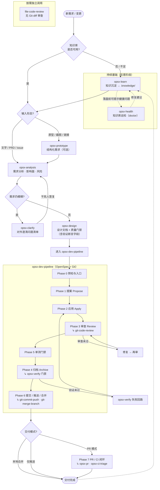

# opsx-dev-pipeline

`opsx-dev-pipeline` 是一个用于初始化 AI 开发工作流模板的 CLI。它会根据你选择的 AI 工具，在项目中生成对应的 skills、commands、rules、prompts。

## Quick Start

使用本工具前，请先安装OpenSpec：
- [OpenSpec](https://github.com/Fission-AI/OpenSpec)

推荐直接使用 npx 初始化：

```bash
npx opsx-dev-pipeline@latest init
```

也可以直接执行 init：

```bash
npx opsx-dev-pipeline init
```

非交互模式示例：

```bash
npx opsx-dev-pipeline init --tool claude --yes
```

仅预览将要生成的文件：

```bash
npx opsx-dev-pipeline init --tool claude --yes --dry-run
```

卸载已安装的托管文件（保留知识库）：

```bash
npx opsx-dev-pipeline uninstall --yes --keep-knowledge
```

开启可选能力：

```bash
# 原型 / 截图 → 结构化需求
npx opsx-dev-pipeline init --tool claude --yes --feature prototype

# 优先使用代码图谱 / LSP 等结构化检索（默认关闭）
npx opsx-dev-pipeline init --tool claude --yes --feature structural-analysis-hint

# PR 模式：创建 Pull Request + CI 闭环
npx opsx-dev-pipeline init --tool claude --yes --feature opsx-pr --feature opsx-ci-triage
```

## Supported AI Tools


| Tool ID   | 工具          | 生成目录 / 文件                                                    | 说明                                                 |
| --------- | ----------- | ------------------------------------------------------------ | -------------------------------------------------- |
| `claude`  | Claude Code | `CLAUDE.md`、`.claude/skills/`、`.claude/commands/`            | 默认推荐；skills 与 commands 分目录安装                       |
| `cursor`  | Cursor      | `.cursor/rules/`、`.cursor/commands/`、`opsx-dev-pipeline.mdc` | skills 安装为 `.cursor/rules/<skill>/SKILL.md`；`opsx-dev-pipeline.mdc` 为常驻规则 |
| `codex`   | Codex       | `.codex/prompts/`、`.codex/commands/`                         | prompts 承载 skill 入口；commands 承载快捷命令                |
| `generic` | 通用 AI 工具    | `.ai/skills/`、`.ai/commands/`、`.ai/README.md`                | 不绑定特定 IDE，适合自建 AI 工作区                              |


查看当前内置适配器：

```bash
npx opsx-dev-pipeline list-tools
npx opsx-dev-pipeline list-tools --json
```

## Generated Integrated Commands

初始化后，模板会额外安装一组面向 AI 工具的集成 skill / command 入口。下表按**推荐研发流程顺序**排列；Git / 文件审查类入口可在流水线各 Phase 中按需调用。


| 顺序  | 入口                  | 类型    | 用途摘要                                                   | 备注                                        |
| --- | ------------------- | ----- | ------------------------------------------------------ | ----------------------------------------- |
| 0   | `opsx-learn`        | skill | 渐进式知识沉淀：功能、接口、规则、FAQ、术语、配置约束、故障案例等                     | 持续进行；`init` 默认生成 `.knowledge/` 骨架         |
| 1   | `opsx-prototype`    | skill | 原型链接 / 截图 / 描述 → 结构化需求                                 | **可选**，默认不生成；`--feature prototype` 开启     |
| 2   | `opsx-analysis`     | skill | 基于知识库与仓库上下文做需求分析，输出结构化分析结果                             | 产出喂给 design / pipeline                    |
| 3   | `opsx-clarify`      | skill | 模糊需求 → 带优先级的澄清问题清单（可对外分享）                              | 与 analysis 内澄清分工：面向干系人                    |
| 4   | `opsx-design`       | skill | 设计文档撰写 + 质量门禁（相关性、影响面、验证断言、一任务一文件）                     | 验证断言字段由 `opsx-verify` 消费                  |
| 5   | `opsx-dev-pipeline` | skill | OpenSpec + Git 需求开发全流程（提案 → 应用 → 审查 → 单测 → 归档 → 推送/合并 → PR/CI） | **门禁权威**；Phase 0–7；支持 push_only / local_merge / pr 三种交付模式 |
| 6   | `opsx-verify`       | skill | 语言无关验证：解析目标 → 构建/启动 → 冒烟/契约/数据校验 → 回归                  | 能力库；Pipeline Phase 4 可加载                  |
| 7   | `opsx-health`       | skill | 知识库健康巡检：复用 `doctor` 产出报告与 P0–P3 修复建议                   | 对话内包装，不重复 doctor 规则                       |
| —   | `opsx-pr`           | skill | 创建 GitHub Pull Request（gh CLI）；不可用时降级输出 PR 模板              | **可选**，PR 模式专用；`--feature opsx-pr` 开启      |
| —   | `opsx-ci-triage`    | skill | CI 结果消费与失败分诊（code/flaky/infra/config/unknown）               | **可选**，PR 模式专用；`--feature opsx-ci-triage` 开启 |
| —   | `git-code-review`   | skill | 面向当前分支变更的 Git 审查，结合 `openspec/project.md`              | Pipeline Phase 3 审查时可复用                   |
| —   | `git-commit-push`   | skill | 提交并推送，含分支同步与敏感信息检查                                     | Pipeline Phase 6 收尾时可复用                   |
| —   | `git-merge-branch`  | skill | 按策略合并到目标分支并处理收尾                                        | Pipeline Phase 6 合并时可复用                   |
| —   | `file-code-review`  | skill | 对指定文件或代码片段独立审查                                         | 无 Git diff 场景                             |


### 能力链与单源治理

- `opsx-clarify` 与 `opsx-analysis`：**analysis** 的澄清阶段服务于分析本身；**clarify** 独立产出可发给产品 / 干系人的问题清单。
- `opsx-design` → `opsx-verify`：design 的「验证断言字段」由 verify 直接消费，形成 design→verify 质量闭环。
- `opsx-design` / `opsx-verify` 定位为**能力库**：Pipeline Phase 1 生成 design、Phase 4 执行 verify 门禁时可加载它们；**何时必须产出 design / 何时必须验证**的权威仍在 `opsx-dev-pipeline` 各 Phase。
- 四套工具 overlay（`CLAUDE.md` / Cursor rule / Codex prompt / 通用 `.ai/README.md`）均注入「知识优先」规则：任务开始前先检索 `.knowledge/`；无知识库时自动跳过、不报错。

### 常用调用示例

Claude Code 默认生成到 `.claude/commands/` 与 `.claude/skills/`；其他工具映射到各自目录（如 Cursor 的 `.cursor/commands/` / `.cursor/rules/`）。

```md
/opsx-learn 梳理用户登录模块的业务规则与接口入口
/opsx-prototype https://figma.com/... （需开启 prototype flag）
/opsx-analysis 为「导出上限」需求做影响面分析
/opsx-clarify 把这个模糊需求整理成澄清问题清单
/opsx-design 根据分析结果产出一份带质量门禁的设计
/opsx-dev-pipeline add-export-limit
/opsx-verify add-export-limit
/opsx-health
/git-code-review
/git-commit-push
/git-merge-branch
/file-code-review path/to/changed-file
```

## 研发流程最佳实践

下图按 opsx 技能**推荐先后顺序**串联一次完整需求交付；虚线表示可选或并行、循环维护的路径。




### 阶段要点


| 阶段     | 技能                                     | 何时使用                         | 产出 / 门禁                 |
| ------ | -------------------------------------- | ---------------------------- | ----------------------- |
| 知识基础   | `opsx-learn`                           | 接手存量仓库、功能不熟、排障需沉淀            | 可复用知识条目；写入追加不覆盖         |
| 原型输入   | `opsx-prototype`                       | 有 Figma / 截图 / 原型链接且无清晰 PRD  | 结构化需求 → 喂给 analysis     |
| 需求分析   | `opsx-analysis`                        | 实施前明确范围、影响面、待确认项             | 结构化分析；区分事实 / 推断 / 待确认   |
| 需求澄清   | `opsx-clarify`                         | 需求模糊或需对外确认                   | P0/P1 问题清单；平台无关         |
| 设计     | `opsx-design`                          | 分析通过后、进入 Pipeline 前或 Phase 1 | 带质量门禁的设计；验证断言供 verify   |
| 开发流水线  | `opsx-dev-pipeline`                    | 正式 change 全生命周期              | Phase 0–6；关键步骤用户决策      |
| 验证     | `opsx-verify`                          | Phase 4 门禁或变更后独立验证           | 冒烟 / 契约 / 数据 / 回归       |
| 知识治理   | `opsx-health`                          | 定期巡检或 learn 落盘前              | doctor 结构化报告 + P0–P3 建议 |
| Git 审查 | `git-code-review`                      | Phase 3 或提交前                 | 中文审查报告                  |
| 提交合并   | `git-commit-push` / `git-merge-branch` | Phase 6 或独立收尾                | 同步、敏感信息检查、合并策略          |
| 文件审查   | `file-code-review`                     | 片段审查、无分支 diff                | 独立审查报告                  |


## Commands


| Command      | Example                                          | Description                                                                                            |
| ------------ | ------------------------------------------------ | ------------------------------------------------------------------------------------------------------ |
| `init`       | `npx opsx-dev-pipeline init --tool claude --yes` | 初始化当前目录的模板文件                                                                                           |
| `list-tools` | `npx opsx-dev-pipeline list-tools --json`        | 查看当前内置支持的 AI 工具适配器；`--json` 输出结构化工具清单（含 destinations / markers / supports）                          |
| `doctor`     | `npx opsx-dev-pipeline doctor --json`            | 检查 manifest、知识库骨架与索引健康，输出 0–100 健康评分与断链 / 重复 / 老化检查；对比 manifest `templateVersion` 与当前 CLI 版本并给出 upgrade 建议；可加 `--history` 落盘快照并对比上次得分趋势，`--stale-days` 调整老化阈值 |
| `sync`       | `npx opsx-dev-pipeline sync --dry-run`           | 根据 manifest **仅**重新渲染已托管文件；若某 bundle 有部分成员已托管，会同步该 bundle 的全部成员                               |
| `upgrade`    | `npx opsx-dev-pipeline upgrade --dry-run`        | 在 sync 基础上额外采纳包内**新增** skill/command，并在无现有知识目录时自动采纳 `.knowledge` 骨架（`adoptOnUpgrade`）；执行前会对比 manifest 与 CLI 版本，manifest 偏新或无法解析时需确认（`--yes` 跳过） |
| `uninstall`  | `npx opsx-dev-pipeline uninstall --dry-run`      | 按 manifest 删除托管文件并清理空目录；`--keep-knowledge` 保留 `.knowledge`；部分删除时会更新 manifest                          |


> 提示：`init` 完成后，可在生成的 commands / skills 目录里直接使用 `opsx-learn`，把现有仓库知识逐步沉淀到知识库中；用 `opsx-health` 或 `doctor` 定期巡检 `.knowledge/` 健康度。

## License

MIT