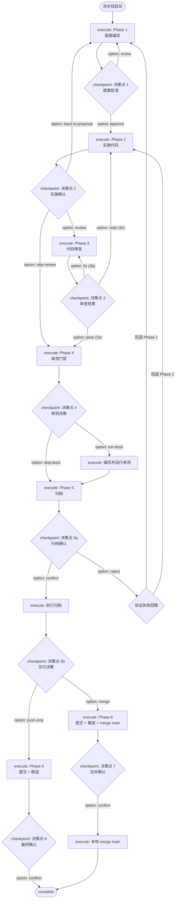

# Hermes 全流程门禁架构设计

## 为什么需要 Hermes

当前架构的核心矛盾：

```
门禁代码是存在的（dev-pipeline-state.mjs），但它是 opt-in 的。
模型绕过它的方式不是攻击，而是"不知道需要调用它"。
```

具体表现：
- `transition` 命令需要模型主动调用 → 模型直接执行 `archive.mjs -y`，根本不调用它
- 模板措辞说"不得默认跳过" → 模型可以不遵守
- `archive.mjs -y` 暴露给模型 → 谁执行都直接过，无门禁

**修复措辞和代码只能加固现有模式，不改变根本问题：模型有绕过门禁的路径。**

Hermes 的解决方案是**三层防御**，只有最后一层是代码强制的：

```
Layer 1: 入口约束（引导层）
  模型通过 /opsx-dev-pipeline 进入 → SKILL.md.hbs 加载 → 模型知道"我在跑流水线"
  防什么：模型不知道需要用门禁

Layer 2: 对话循环（粘性层）
  advance → checkpoint/execute → 模型行动 → advance → ...
  Hermes 的结构化返回就是下一步的提示，模型不需要记住"下一步该调什么"
  防什么：模型在执行中偏离流程

Layer 3: 被调用方内部门禁（强制层）
  archive.mjs 启动时检查 hasPhaseInHistory(state, 5)
  git 操作在 Hermes 内部闭环
  防什么：模型跳过 Hermes 直接操作底层工具
```

**诚实声明**：Layer 1 和 2 依赖模型协作。模型有 shell 权限，在技术上可以绕过它们。这不是疏忽——这是 LLM-agent 架构的固有限制。Hermes 的设计目标是把**意外绕过**（模型不知道、顺手用了更短路径）降到最低，而不是阻止**故意绕过**（模型明确拒绝遵守指令）。

---

## 架构对比

### 当前架构

```
Model ──→ archive.mjs -y           ← 直接执行，无门禁
Model ──→ git commit / git push    ← 直接执行，无门禁
Model ──→ (可能调用 transition)    ← opt-in，可被绕过
Model ──→ dev-pipeline-state.mjs   ← 状态机存在但非强制
```

### Hermes 架构

```
Model 可见的唯一接口：
┌──────────────────────────────────────────────────┐
│                   hermes                          │
│                                                   │
│  hermes advance <name>    ← 推进流程到下一站      │
│  hermes decide <name>     ← 在决策点做出选择      │
│  hermes reset <name>      ← 回退到之前阶段        │
│  hermes status <name>     ← 查询当前状态          │
│  hermes history <name>    ← 查询阶段历史          │
└────────────────────┬─────────────────────────────┘
                     │ Layer 3 强制层：内部执行
                     │ archive.mjs / git / 状态转换
                     ▼
┌──────────────────────────────────────────────────┐
│  dev-pipeline-state.mjs（状态机 + 门禁引擎）      │
│                                                   │
│  transition / record-phase / validateGates        │
│  allowedTransition / saveState / loadState        │
└────────────────────┬─────────────────────────────┘
                     │ 读写
                     ▼
              ┌──────────────┐
              │  state.json   │
              └──────────────┘
```

核心原则：
- **Hermes 是推荐入口**：Layer 1+2 引导模型使用 Hermes，降低意外绕过的概率
- **archive.mjs / git 内部闭环**：Layer 3 在被调用方内部检查门禁，不依赖模型遵守指令
- **Hermes 是薄壳**：不复制状态机逻辑，调用 `dev-pipeline-state.mjs` 的内部 API
- **模板继续承载指令**：Hermes 返回状态信息，创造性工作的执行指令仍在模板文件中

---

## 模型交互循环

```
┌──────────────────────────────────────────────────────────┐
│                    模型交互循环                           │
│                                                          │
│  1. 用户触发流水线                                       │
│       ↓                                                 │
│  2. 模型调用 hermes advance <name>                       │
│       ↓                                                 │
│  3. Hermes 返回：                                       │
│     - { type: "checkpoint", phase: N, step: M }          │
│       → 决策点，附带 options[]                           │
│       → 模型展示给用户，等待选择                          │
│     - { type: "execute", phase: N, step: M }             │
│       → 执行阶段，附带阶段摘要                           │
│       → 模型读取对应模板文件，按指令执行                  │
│       → 完成后再次调用 hermes advance                    │
│     - { type: "complete" }                               │
│       → 流水线完成                                       │
│       ↓                                                 │
│  4. 用户在决策点选择后，模型调用 hermes decide <name> <id>│
│       ↓                                                 │
│  5. 回到步骤 2                                           │
└──────────────────────────────────────────────────────────┘
```

---

## 命令接口设计

### `hermes advance <name>`

推进流水线到下一个"停顿点"（决策点或完成）。

**内部逻辑**：

```
advance(name):
  state = loadState(name)
  let current = deriveCurrentPhase(state)

  while true:
    // 1. 如果当前是停顿点，直接返回（不移动状态）
    stop = classifyState(current)
    if stop.type == 'checkpoint':
      loopCount = countCheckpointVisits(state, current.checkpointId)
      maxLoops = CHECKPOINT_MAX_LOOPS[current.checkpointId] ?? 3
      options = loopCount >= maxLoops
        ? stop.options.filter(o => !o.loops)
        : stop.options
      return { type: "checkpoint", phase: current.phase, step: current.step,
               options, prompt: stop.prompt, loopCount, maxLoops }

    if stop.type == 'execute':
      return { type: "execute", phase: current.phase, step: current.step,
               summary: stop.summary }

    if stop.type == 'complete':
      return { type: "complete", summary: stop.summary }

    // 2. 当前是内部状态 → 需要移动一步
    next = getNextState(state, current)

    // 3. 门禁验证 — 无条件执行，在 recordPhase 之前
    gateResult = validateGates(state, current.phase, next.phase)
    if !gateResult.passed:
      return { type: "checkpoint", blocked: true,
               phase: current.phase, step: current.step,
               missingGates: gateResult.missing }

    // 4. 通过 → 记录 → 循环继续
    recordPhase(state, next.phase, next.step)
    current = next
```

**停顿点与分支决策图**：



**停顿点汇总**：

| checkpoint | 所在位置 | options |
|------------|----------|---------|
| 决策点 1 | Phase 1 结束 | `approve` → P2 / `revise` → P1 |
| 决策点 2 | Phase 2 结束 | `review` → P3 / `skip-review` → P4 / `back-to-proposal` → P1 |
| 决策点 3 | Phase 3 结束 | `pass` (3a) → P4 / `fix` (3b) → P3 / `redo` (3c) → P2 |
| 决策点 4 | Phase 4 第 14 步 | `run-tests` → 写单测 → P5 / `skip-tests` → P5 |
| 决策点 5a | Phase 5 第 15 步 | `confirm` → 执行归档 / `reject` → 失败回路 |
| 决策点 5b | Phase 5 第 19 步 | `push-only` → P6 / `merge` → P6+merge |
| 决策点 6 | Phase 6 第 20 步 | `confirm` → complete |
| 决策点 7 | Phase 6 merge 路径 | `confirm` → 执行 merge → complete |

### 分支机制：`decide` 写入 → `getNextState` 读取

`decide` 不直接跳转，只记录选择：

```
decide(name, optionId, context):
  state = loadState(name)
  current = deriveCurrentPhase(state)

  if not isCheckpoint(current):
    return { error: "当前不在决策点" }

  // 写入决策，不移动状态
  state.decisions[current.checkpointId] = {
    option: optionId,
    context: context,
    timestamp: now()
  }
  saveState(state)

  return { type: "decided", option: optionId, next: "call advance to continue" }
```

`advance` 调用 `getNextState` 时，后者读取 `state.decisions` 决定方向：

```
getNextState(state, current):
  checkpointId = current.checkpointId

  switch (checkpointId):
    case "dp1":
      return state.decisions.dp1.option === "approve"
        ? { phase: 2, step: "start" }
        : { phase: 1, step: "start" }    // revise → 回到 P1

    case "dp3":
      option = state.decisions.dp3.option
      if option === "pass":  return { phase: 4, step: "start" }
      if option === "fix":   return { phase: 3, step: "start" }  // 再审
      if option === "redo":  return { phase: 2, step: "start" }  // 重做

    // ... 其他决策点映射
```

**核心原则**：`advance` 不需要知道"该往哪走"——`getNextState(state, current)` 替它回答这个问题。分支逻辑集中在一个纯函数里，决策历史在 `state.decisions` 中可审计。

### 循环计数器

可循环的检查点（DP1 `revise`、DP3 `fix`、DP5a `reject`）配有最大循环次数，防止无限重试：

| checkpoint | 可循环选项 | maxLoops | 达到上限时 |
|------------|-----------|----------|-----------|
| DP1 | `revise` | 3 | `revise` 移除，仅剩 `approve` |
| DP3 | `fix` | 3 | `fix` 移除，仅剩 `pass` / `redo` |
| DP5a | `reject` | 2 | `reject` 移除，仅剩 `confirm` |

**计数方式**：`countCheckpointVisits(state, checkpointId)` 统计 `state.phaseHistory` 中该 checkpoint 的出现次数。不另增字段——已有的历史记录就是计数源。

**checkpoint 返回中包含 `loopCount` 和 `maxLoops`**，模型可向用户展示："审查已进行 2/3 轮，再有一轮不通过将强制选择通过或重做。"

### 错误路径与回退

三种异常场景：

**1. 执行中发现需回退（如 Phase 3 审查发现代码需重写）**

已有 checkpoint 机制覆盖。模型汇报 → `advance` → 停在决策点 3 → 用户选 `redo` → `decide` → `advance` → `getNextState` 返回 Phase 2。无需新机制。

**2. 用户主动回退**

新增 `hermes reset`：

```
hermes reset <name> <target-phase>
```

```
reset(name, targetPhase):
  state = loadState(name)
  current = deriveCurrentPhase(state)

  // 只允许回退，不允许跳进
  if targetPhase >= current.phase:
    return { error: "reset 只能回退到之前的阶段" }

  // 清除目标阶段之后的所有决策和阶段历史
  state.decisions = filterDecisions(state.decisions, maxPhase: targetPhase)
  state.phaseHistory = state.phaseHistory.filter(h => h.phase <= targetPhase)

  recordPhase(state, targetPhase, "start")
  saveState(state)

  return { type: "reset", from: current, to: { phase: targetPhase, step: "start" } }
```

Hermes 只改状态，不执行实际回退（如 git revert）。模型拿到返回后按模板指令处理代码回退。

**3. 命令执行失败（如 `archive.mjs` 文件冲突、`git push` 被拒绝）**

不需要新命令。关键：Hermes 管理状态转换，不管理命令执行。

```
advance → { type: "execute", phase: 5 }  ← 状态已记录
→ archive.mjs 报错
→ 模型报告错误，不调用 advance
→ 状态滞留在 Phase 5 开始
→ 模型修复冲突 → 重试归档 → 成功
→ 调用 advance
→ Hermes 推进到决策点 5a
```

命令失败 = 模型不调用 advance = Hermes 不动。不存在状态不一致，不需要回滚。

### `hermes status <name>`

查询当前状态（只读）：

```
{
  pipeline: "<name>",
  currentPhase: 3,
  currentStep: 12,
  phaseHistory: [
    { phase: 0, step: "start", timestamp: "..." },
    { phase: 1, step: "start", timestamp: "..." },
    ...
  ],
  decisions: {
    dp1: { option: "approve", timestamp: "..." },
    dp2: { option: "review", timestamp: "..." },
    // dp3 尚未决定，不在此 map 中
  },
  loopCounts: {
    dp1: 1,
    dp3: 2     // 仅可循环的检查点
  }
}
```

### `hermes history <name>`

查询完整阶段历史（只读），用于审计和调试。

---

## 执行边界：Hermes 做什么 vs 模型做什么

Hermes 不是所有操作的统一入口——它只接管**确定性的、可自动化的 CLI 操作**。需要判断和创造的阶段仍由模型按模板执行。

```
Hermes 内部执行（模型不接触）：
  ├── archive.mjs          ← 在 Phase 5 确认后自动调用
  ├── git commit / push    ← 在 Phase 6 确认后自动调用
  ├── git merge main       ← 在决策点 7 确认后自动调用
  └── 所有状态转换          ← recordPhase / validateGates / getNextState

模型按模板执行（Hermes 返回 { type: "execute" }）：
  ├── Phase 1 — 提案编写
  ├── Phase 2 — 代码实施
  ├── Phase 3 — 代码审查
  ├── Phase 4 — 单测编写与运行
  └── Phase 5/6 的前置确认工作（检查归档条件、确认交付范围等）
```

**`advance` 内部执行流程**（以 Phase 5 归档为例）：

```
advance(name):
  ...
  // 到达归档执行步骤
  if current.phase == 5 && current.step == "archive-exec":
    result = execArchive(name, state)      // 内部调用 archive.mjs
    if !result.success:
      return { type: "error", phase: 5, step: "archive-exec",
               message: result.error }      // 状态不动，模型报告错误
    recordPhase(state, 5, 19)              // 归档成功 → 推进到 DP5b
    current = { phase: 5, step: 19 }
    continue                                // 循环回到 classifyState，返回 checkpoint
```

**关键：Hermes 内部执行失败 = 返回 error + 状态不动。模型不需要知道 `archive.mjs` 的存在。**

---

## Hermes 与模板的关系

Hermes 返回 `{ type: "execute", phase, step }` 后，模型的责任：

1. **读取对应模板文件**（如 `references/phase-3-review.md.hbs`）
2. **按模板指令执行**（运行代码审查、修复问题等）
3. **完成后调用 `hermes advance`** 推进到下一个停顿点

Hermes **不**返回模板内容，只返回阶段标识。模板继续承担执行指令职责。

模板中需要调整的部分：
- 所有 "执行 `transition` 命令" 的指令 → 替换为 "执行 `hermes advance <name>`"
- 所有直接调用 `archive.mjs` 的指令 → **删除**（Hermes 内部执行，模型无需感知）
- 所有直接调用 `git commit/push` 的指令 → **删除**（Hermes 内部执行，模型无需感知）
- 归档/交付阶段的模板内容 → 精简为"确认条件，调用 `hermes advance`"，不包含具体执行命令

---

## Hermes 实现结构

```
templates/common/skills/opsx-dev-pipeline/
├── scripts/
│   ├── dev-pipeline-state.mjs     ← 状态机引擎（保留，供 Hermes 调用）
│   ├── hermes.mjs                  ← 新增：Hermes CLI 入口
│   ├── hermes.test.mjs             ← 新增：Hermes 单元测试
│   └── archive.mjs                 ← 保留（Hermes 内部调用，加内部门禁）
├── references/                     ← 模板文件（保留，模型读取指令）
│   ├── phase-1-proposal.md.hbs
│   ├── phase-2-implementation.md.hbs
│   ├── phase-3-review.md.hbs
│   ├── phase-4-unit-tests.md.hbs
│   ├── phase-5-archive.md.hbs
│   └── phase-6-delivery.md.hbs
└── SKILL.md.hbs                    ← 新增 Hermes 使用约束

test/integration/
└── dev-pipeline-state.test.mjs     ← 状态机单元测试
```

### `hermes.mjs` 核心依赖

```javascript
import {
  loadState,
  saveState,
  validateGates,
  hasPhaseInHistory,
  recordPhase,
  formatLocalTime,
  SCHEMA_VERSION,
} from './dev-pipeline-state.mjs';

// Hermes 内部执行的 CLI 操作
import { execArchive } from './archive.mjs';
import { execSync } from 'child_process';
```

不复制状态机逻辑，只做编排：
- `advance`：`classifyState` → 停顿点早返回 / `getNextState` → `validateGates` → `recordPhase` → 循环
- `decide`：验证 checkpoint → 写入 `state.decisions` → `saveState`
- `reset`：验证回退方向 → 清除 `decisions` + `phaseHistory` → `recordPhase` 到目标阶段
- `status`/`history`：`loadState` → 格式化返回
- 内部执行：`archive.mjs`、`git commit/push/merge` 在 advance 循环内自动触发

---

## SKILL.md.hbs 全局约束（新增）

```markdown
## Hermes 流水线协议

所有 Phase 推进操作通过 `hermes` 命令执行：

- **推进流程**：`node <SKILL_ROOT>/scripts/hermes.mjs advance "<name>"`
  - 每次完成当前阶段的执行工作后调用
  - 到达决策点时，Hermes 返回 options 数组，必须展示给用户选择
  - 不得在用户未选择的情况下调用 `hermes decide`

- **做出决策**：`node <SKILL_ROOT>/scripts/hermes.mjs decide "<name>" <option-id>`
  - 仅在用户做出显式选择后调用
  - 不得预设选项或自动选择

- **查询状态**：`node <SKILL_ROOT>/scripts/hermes.mjs status "<name>"`
```

---

## 迁移策略

### 不做短期修复，直接上 Hermes

**理由**：Hermes 作为 `dev-pipeline-state.mjs` 的薄壳，短期修复中的改动（删除 hybrid 降级、累积门禁检查）可以直接实现在 Hermes 层，避免做两次工。

### 分两步实施

**步骤 1 — Hermes 核心 + 模板适配**

1. 创建 `hermes.mjs`（advance / decide / reset / status / history）
2. 在 `hermes advance` 中实现 while 循环 + 停顿点分类 + 累积门禁检查
3. 实现 `getNextState` 分支映射和 `classifyState` 停顿点判断
4. 实现循环计数器（`countCheckpointVisits` + `CHECKPOINT_MAX_LOOPS`）
5. 实现 `archive.mjs` 内部门禁检查（`hasPhaseInHistory(state, 5)`）
6. 更新所有模板文件（`transition` → `hermes advance`，删除 `archive.mjs`/`git` 直接调用）
7. 更新 `SKILL.md.hbs` 添加 Hermes 流水线协议

**步骤 2 — 单元测试 + 端到端验证**

1. 新增测试覆盖：
   - 各 Phase 的 checkpoint 正确返回
   - 跨 Phase 跳转被门禁拒绝
   - 门禁满足后允许通过
   - `decide` 在非决策点调用时拒绝
   - `reset` 只能回退，不能跳进
   - 循环计数器达到上限后移除循环选项
   - `archive.mjs` 在 Phase 5 之前调用时报错
2. 端到端验证：人工运行完整流水线，确认每个决策点都被触发

### 向后兼容

- `dev-pipeline-state.mjs` 保持不变，CLI 手动操作继续可用
- `executionMode` 字段保留为审计标记，不再用于门禁判断
- 已安装的 3 个副本（Claude/Cursor/Codex）在模板渲染后同步更新

---

## 与原有修复方案的关系

本文档**替代**原 `phase-3-continue-gate-bypass-analysis.md` 中的短期修复方案（修复 1-5），保留其分析价值。

| 原方案内容 | Hermes 方案处理方式 |
|-----------|-------------------|
| 修复 1: 修改 `allowedTransition` 累积门禁 | 实现在 `hermes advance` 内部，调用 `validateGates` |
| 修复 1c: 删除 hybrid 降级 | 不在 Hermes 层触发，`record-phase` 保留该逻辑但 Hermes 不使用它 |
| 修复 1d: 删除 `applyGateInference` | Hermes 不调用此函数 |
| 修复 2-4: 模板措辞修复 | 模板命令引用改为 `hermes advance`/`hermes decide` |
| 修复 5: SKILL.md.hbs 全局约束 | 替换为 Hermes 门禁协议 |
| 修复 6: 单元测试 | 扩展为 `hermes.test.mjs`，覆盖 advance/decide |
