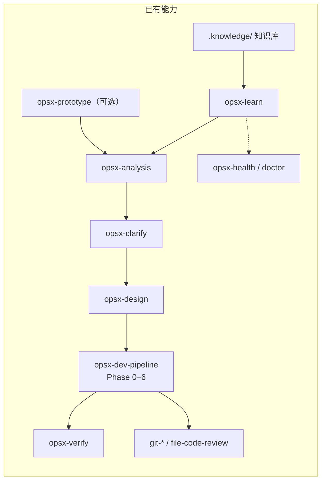
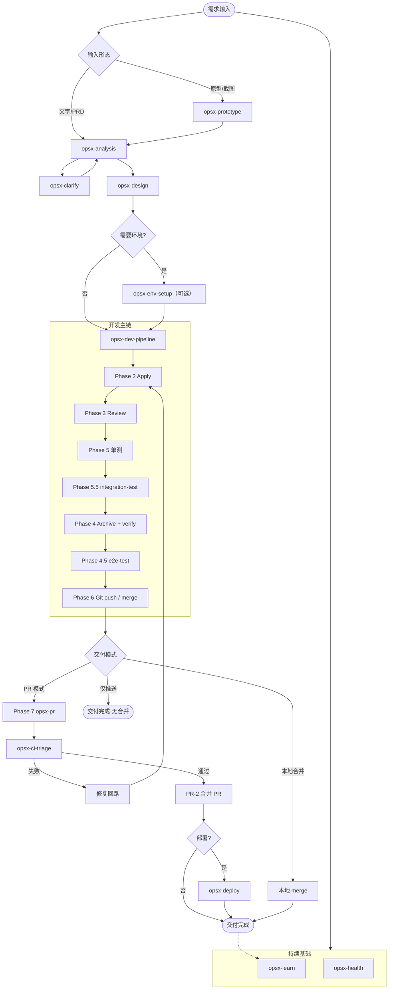
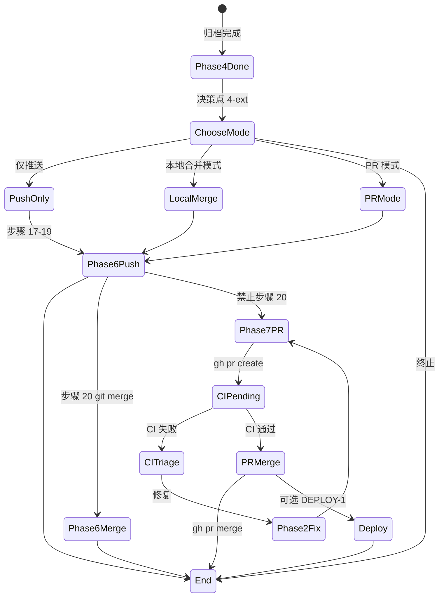

# opsx-dev-pipeline 全栈开发流水线补齐方案

> 版本：v2.0 · 面向实施收敛的修订版（2026-06）
> 目标：在现有「需求 → 设计 → OpenSpec 开发 → 审查 → 验证 → Git 交付」主链上，优先补齐全栈项目从本地开发到 PR/CI/部署前验收的交付闭环，并以可扩展 schema 约束后续能力演进。

---

## 1. 文档目标与范围

本文不是能力愿景清单，而是一份面向实施的架构与路线图文档，解决两个问题：

1. `opsx-dev-pipeline` 现在离“全栈开发流水线”还缺什么
2. 应该按什么顺序、以什么边界和契约补齐这些缺口

### 1.1 本文要解决的问题

当前 `opsx-dev-pipeline` 已经具备很强的“需求到代码提交”能力，但对全栈项目而言，真正缺失的是交付后半段的闭环能力：

- 项目级 stack-aware 执行基准
- PR 创建与 CI 结果消费
- 集成测试与 E2E 测试分层
- 异步阶段的暂停、恢复与续接
- 部署前 checklist 化验收

### 1.2 本文范围

本文优先覆盖：

- stack profile schema
- Pipeline Phase 6 / 7 交付模式状态机
- PR / CI 闭环
- 测试与验证分层
- 最小可行环境准备能力
- 部署前 checklist 化接入

### 1.3 非目标

本文明确不追求以下目标：

- 不在 P0 阶段支持所有技术栈的一键脚手架
- 不在 P0 阶段实现通用自动部署到任意云平台
- 不让 `opsx-fullstack` 元 skill 成为第二套门禁系统
- 不让任何单个 skill 复制 Pipeline 的门禁判定正文

---

## 2. 当前能力与核心缺口

### 2.1 你现在已经有什么

`opsx-dev-pipeline` 本质上是一个 AI 工作流模板分发 CLI + 一套可组合的 opsx skill 链，已经覆盖软件交付前半段的大部分关键能力。



| 层级 | 已有能力 | 成熟度 |
|------|----------|--------|
| CLI 平台 | `init` / `sync` / `upgrade` / `uninstall` / `doctor` / `list-tools` | ★★★★☆ |
| 多 IDE 适配 | Claude / Cursor / Codex / generic | ★★★★☆ |
| 知识治理 | `.knowledge/` 骨架 + learn + health | ★★★★☆ |
| 需求上游 | analysis / clarify / design / prototype | ★★★★☆ |
| 开发主链 | OpenSpec + Git Phase 0–6 | ★★★★★ |
| 质量门禁 | 单测（Phase 5）+ verify（Phase 4）+ code review（Phase 3） | ★★★☆☆ |
| Git 收尾 | commit-push / merge-branch | ★★★★☆ |
| 可选增强 | structural-analysis-hint（代码图谱） | ★★☆☆☆ |

> 注意：实际主干顺序为 Phase 3 → 5 → 4 → 6，与 `references/phase-*.md` 一致。主 `README.md` 流程图误将 P4 放在 P5 之前，实施时应一并修正。

### 2.2 当前架构最有价值的部分

当前体系已经具备一个正确且应继续保持的核心原则：

- Pipeline 是门禁权威
- skill 是能力库
- design 产出验证断言
- verify 消费运行时验证约束
- Git / PR / CI / deploy 只作为阶段能力，不各自复制一套门禁体系

这是本文后续所有扩展的前提。

### 2.3 当前核心缺口

当前流水线的终点基本仍是：

- Git 推送成功
- 或本地 merge 完成

它尚未原生覆盖：

- PR 创建与 PR 生命周期管理
- CI 绿灯等待、失败分诊与恢复
- 集成测试层
- E2E / UI 验证层
- 部署前后验证闭环
- 全流程异步状态持久化
- stack-aware 项目执行基准

其中最关键的不是 skill 数量不足，而是以下三个结构性缺口：

1. 缺少统一的 stack profile schema
2. 缺少统一的 pipeline runtime state schema
3. 缺少 Phase 6 / 7 交付模式的互斥状态机

---

## 3. 核心架构原则

### 3.1 单一门禁权威

全栈扩展后仍坚持：

- `opsx-dev-pipeline` 负责阶段推进与门禁决策
- 各 skill 负责执行、收集证据、输出结构化结论
- skill 不定义独立的推进状态机
- 任何 skill 都不得复制 verify / PR / deploy 的门禁正文

### 3.2 单一真相源

全栈流水线需要三个互补但职责不同的真相源：

1. `stack profile`
   - 描述项目运行、测试、验证、部署命令与服务结构
   - 回答“这个项目怎么跑”

2. `design verification assertions`
   - 描述本次变更应该被哪些测试/验证方式覆盖
   - 回答“这次变更要验证什么”

3. `pipeline runtime state`
   - 描述当前流水线进行到哪一步、暂停在哪、PR/CI 当前状态如何
   - 回答“这次执行现在进行到哪”

三者必须分离，不能互相混用。

### 3.3 降级不等于通过

所有阶段都必须区分：

- passed：自动化检查通过
- failed：自动化检查失败
- skipped：经显式决策跳过
- degraded_manual：未自动化执行，仅生成人工清单或人工接管说明
- not_applicable：当前变更不适用

尤其是：

- “已生成人工 UI 验收清单” 不等于 “E2E 已通过”
- “已执行 deploy 脚本” 不等于 “部署后验证已通过”

### 3.4 默认保守，不默认缩小影响面

对于 monorepo / 多服务项目：

- 当 change 元数据和路径影响面能明确定位服务时，可缩小执行范围
- 当 shared package / schema / infra 改动导致影响面不清时，默认扩大范围
- 无法可靠推断时，应优先扩大测试与验证范围，而不是默认只跑单服务

### 3.5 任何异步阶段必须可恢复

涉及等待、暂停、跨会话续接的阶段必须有显式状态持久化，至少包括：

- PR 已创建但 CI 未结束
- CI 失败待修复
- 用户暂停等待人工操作
- 已存在 PR 的续接
- 可选部署阶段的人工确认等待

不能依赖会话上下文“记住上次做到哪”。

---

## 4. 最小可行目标（MVP）与非目标

### 4.1 P0 MVP 目标

P0 的目标不是一次性做完所有全栈能力，而是先建立“可恢复的交付闭环”。

P0 最小闭环仅包括：

1. `stack profile` 最小 schema
2. `pipeline runtime state` 最小 schema
3. Phase 6 / 7 交付模式状态机
4. `opsx-pr`（PR 创建）
5. `opsx-ci-triage`（CI 结果消费与失败分诊）
6. 一个最小示例项目或外部样例仓库用于跑通 PR 闭环

### 4.2 P0 明确不做

以下能力不应与 P0 闭环强绑定：

- 通用自动 deploy
- 栈脚手架 `init --stack <profile>`
- 完整 `opsx-fullstack` 元 skill
- 重量级 security-review 体系
- 强制 E2E 作为所有项目默认门禁

### 4.3 P0.5 / P1 重点

在 PR / CI 闭环稳定之后，再逐步补齐：

- `opsx-env-setup`
- `opsx-integration-test`
- `opsx-e2e-test`
- `opsx-deploy`（以 checklist 为主）
- `opsx-api-contract`
- `opsx-db-migrate`
- `opsx-security-review`

---

## 5. 核心数据契约

本章是全栈扩展的协议层。skill 能否稳定协作，取决于这些契约先被定义清楚。

### 5.1 Stack Profile Schema

建议在 `openspec/config.yaml` 中引入 `stack` 段，并提供 schema 文件：

- `docs/stack-profile-schema.json`

建议最小结构如下：

```yaml
stack:
  id: nextjs-prisma
  languages: [typescript, sql]
  services:
    - name: web
      path: apps/web
      dev:
        command: npm run dev
        cwd: apps/web
      test:
        command: npm test
        cwd: apps/web
        required: false
      integration: null
      e2e:
        command: npm run test:e2e
        cwd: apps/web
        required: false
    - name: api
      path: apps/api
      dev:
        command: npm run dev
        cwd: apps/api
      test:
        command: npm run test
        cwd: apps/api
        required: true
      integration:
        command: npm run test:integration
        cwd: apps/api
        required: false
  infra:
    docker:
      command: docker compose up -d
      cwd: .
    db: postgresql
    migrate:
      command: npx prisma migrate dev
      cwd: apps/api
    healthCheck:
      command: curl -f http://localhost:3000/health
      cwd: .
  verify:
    build:
      command: npm run build
      cwd: .
      required: true
    smoke:
      command: curl -f http://localhost:3000/health
      cwd: .
      required: true
    contract:
      command: npm run contract:test
      cwd: .
      required: false
  deploy:
    staging:
      command: ./scripts/deploy-staging.sh
      cwd: .
    production:
      command: ./scripts/deploy-prod.sh
      cwd: .
```

#### 5.1.1 Schema 原则

- 命令配置不能只有裸字符串，至少要允许：`command`、`cwd`、`required`
- schema 要为未来扩展预留位置，例如：`timeout`、`depends_on`、`outputs`
- `stack` 是项目级基准，不记录本次 change 的影响面
- `change` 元数据中的 `stacks` 用于影响面提示，不替代 `stack profile`

#### 5.1.2 校验入口

建议增加：

- `opsx-dev-pipeline doctor --stack`

校验内容至少包括：

- 必填字段存在性
- `services[].path` 是否存在
- `cwd` 是否可解析
- `command` 字段是否为可执行字符串
- `required: true` 的关键命令是否完整

#### 5.1.3 多服务 / monorepo 规则

- 优先根据 change `stacks`、design 影响面、改动路径确定受影响 `services[]`
- 命中 shared package / schema / infra 时，默认扩大全量相关服务
- 无法定位服务时，回退仓库根命令或要求用户确认，但不能把“用户确认”作为默认主路径

### 5.2 Design Verification Assertions

建议扩展 `opsx-design` 模板，在 design 文档中加入正式的验证断言字段：

```yaml
verification:
  unit:
    - id: unit.user.create-duplicate-email
      text: UserService.create 应覆盖重复邮箱
  integration:
    - id: integration.api.create-user
      text: POST /api/users 应持久化并返回 201
  verify:
    build:
      id: verify.build.main
      text: monorepo build 无错误
    smoke:
      id: verify.smoke.health
      text: GET /health 返回 200
    contract:
      id: verify.contract.openapi
      text: OpenAPI diff 无 breaking change
  e2e:
    - id: e2e.login.dashboard
      text: 登录后可见仪表盘
```

#### 5.2.1 断言映射原则

- `unit.*` → Pipeline Phase 5
- `integration.*` → Phase 5.5 / `opsx-integration-test`
- `verify.*` → Phase 4 / `opsx-verify`
- `e2e.*` → Phase 4.5 / `opsx-e2e-test`

#### 5.2.2 断言必须可追踪

每条断言建议具备：

- assertion id
- 文本描述
- 来源需求 / 设计项（可后续扩展）
- 对应执行门禁

这样后续报告才能回答：

- 哪个断言被谁验证了
- 哪个断言被跳过了
- 哪个断言只生成了人工清单

### 5.3 Pipeline Runtime State Schema

这是当前体系最缺的一层，建议新增独立运行时状态文件，不与 change 元数据混用。

建议最小字段：

```yaml
change_id: add-user-api
branch: feature/add-user-api
current_phase: phase7_ci
last_completed_gate: pr-created
delivery_mode: pr
pr:
  number: 123
  url: https://github.com/org/repo/pull/123
ci:
  status: pending   # pending | passed | failed | unknown
  last_checked_at: 2026-06-09T10:00:00Z
pending_action:
  type: wait_user_or_ci
  detail: 等待 CI 完成后继续
results:
  unit: passed
  integration: not_applicable
  verify: passed
  e2e: degraded_manual
updated_at: 2026-06-09T10:00:00Z
```

> 实施时请修正字段名为 `delivery_mode`，上例中的 `elivery_mode` 仅用于说明结构。

#### 5.3.1 Runtime State 原则

- `change metadata` 管变更语义
- `runtime state` 管执行进度
- 二者必须分离
- runtime state 必须可被 Phase 0 读取，用于续接
- PR / CI / deploy 等异步阶段必须写入 runtime state

#### 5.3.2 最低要求

runtime state 至少要能表达：

- 当前在哪个 phase
- 当前交付模式是什么
- 是否已有 PR
- CI 当前状态如何
- 哪些门禁已通过 / 失败 / 跳过 / 降级
- 当前在等用户、等 CI 还是可继续执行

#### 5.3.3 幂等恢复

恢复时遵循：

- 已完成阶段不重复执行破坏性操作
- PR 已存在则走续接，不重新创建
- CI pending 则暂停并提示，不空转等待
- deploy 若已触发但未验证，只能进入 deploy 验证分支，不能默认重跑 deploy 脚本

---

## 6. 目标流程与状态机

### 6.1 目标端到端主流程



### 6.2 Phase 6 / 7 交付模式状态机



### 6.3 正式互斥规则

1. PR 模式下不得执行 Phase 6 步骤 20（本地 merge）
2. 本地合并模式下不得为同一变更再创建 PR 并执行 `gh pr merge`
3. 决策点 4-ext 的选择必须写入 runtime state
4. Phase 0 恢复时以 runtime state 为准，而不是重新猜测模式

### 6.4 异步恢复规则

- PR 已创建且 CI pending：暂停流水线，输出 PR URL 与续接说明
- 用户通知“CI 已完成”：恢复 Phase 7，重新读取 checks
- CI 失败：进入 triage，并产出结构化失败分类
- 已有关联 PR：走续接逻辑，不重复 `gh pr create`

---

## 7. 测试与验证分层

### 7.1 职责矩阵

| 层级 | 负责 skill | 测什么 | 不测什么 | 输入命令来源 | 通过标准 | 失败回路 | 可跳过? |
|------|------------|--------|----------|--------------|----------|----------|---------|
| 单元测试 | Pipeline Phase 5 | 函数/模块隔离逻辑 | IO、网络、UI | `stack.services[].test` 或项目基准 | 全部用例绿 | Phase 2 / 3 | 决策点 4b 显式跳过 |
| 集成测试 | `opsx-integration-test` | API + 真实/testcontainer DB、缓存 | UI、浏览器 | `stack.services[].integration` | design 断言 `integration.*` | Phase 2 / 3 | 决策点 INT-1 |
| verify | `opsx-verify` | 构建、启动、冒烟、运行时契约校验 | 完整浏览器 E2E、业务流 UI | `stack.verify.*` | design 断言 `verify.*` | Phase 2 | Phase 4 步骤 13 必经 |
| E2E/UI | `opsx-e2e-test` | 关键用户路径、跨页面验证 | 单元、纯 API 集成 | `stack.services[].e2e` | design 断言 `e2e.*` | Phase 2 | 决策点 E2E-1；UI 变更可强制 |
| 契约设计 | `opsx-api-contract` | schema 增量、Mock 建议 | 运行时执行 | 知识库 + design | 写入 design 字段 | 回 design | design 阶段 |

### 7.2 Verify 边界收口

`opsx-verify` 应明确只负责：

- build
- startup
- smoke
- runtime contract validation
- 必要的运行可用性检查

它不应成为 integration / e2e 的“兜底全集”，否则后续会重复跑测试且失败归因混乱。

### 7.3 统一结果语义

建议所有测试 / 验证阶段统一使用：

- `passed`
- `failed`
- `skipped`
- `degraded_manual`
- `not_applicable`

### 7.4 强制触发规则

建议最小规则：

- UI 变更：`opsx-e2e-test` 默认进入决策点，允许降级为人工清单，但不能标记为 passed
- API / schema / DB 变更：`opsx-integration-test` 与 `verify.contract` 默认进入决策点
- `security-sensitive` 变更：至少触发轻量安全检查

---

## 8. 新增 Skills 设计

> 命名延续 `opsx-*` 前缀；每个 skill 均遵循“能力库 + Pipeline 门禁权威”模式。

本章统一采用同一模板：

- 触发条件
- 输入契约
- 输出契约
- 降级路径
- 不负责什么

### 8.1 `opsx-pr`

触发条件：
- Phase 6 推送成功后，且决策点 4-ext 选择 PR 模式

输入契约：
- change 摘要
- base 分支
- runtime state
- git 当前分支与推送状态

输出契约：
- PR 是否创建成功
- PR URL / PR number
- PR title / body 草案或最终内容
- runtime state 更新为 `phase7_pr_created`

降级路径：
- 无 `gh` 或平台不支持时，输出平台无关 PR 模板

不负责什么：
- 不负责合并 PR
- 不负责等待 CI 完成
- 不负责定义合并策略

### 8.2 `opsx-ci-triage`

触发条件：
- PR 创建后
- 或用户主动要求消费 CI 结果

输入契约：
- PR 标识
- runtime state
- checks / actions 日志

输出契约：
- CI 总状态：`pending` / `passed` / `failed` / `unknown`
- 失败分类：
  - `code_failure`
  - `flaky_failure`
  - `infra_failure`
  - `config_permission_failure`
  - `unknown`
- 建议下一步动作
- runtime state 更新

降级路径：
- 无 `gh` / 无 Actions 时，进入“人工粘贴日志”模式

不负责什么：
- 不直接修改代码
- 不替代 Pipeline 决定是否回到 Phase 2

#### 8.2.1 CI 人机协作契约

| 场景 | 行为 |
|------|------|
| CI 仍在运行 | 暂停流水线，输出 PR URL + 预计等待说明，不空转 |
| 用户通知“CI 完成” | 恢复 Phase 7，拉取 checks 结果 |
| CI 失败且可归因为代码问题 | 回修复回路，默认最多自动重试 2 轮 |
| CI 失败但疑似基础设施波动 | 优先建议重试，不直接进入代码修复 |
| 无法获取 CI 数据 | 降级为人工日志模式 |

### 8.3 `opsx-env-setup`

触发条件：
- analysis / design 判断环境依赖未满足
- 或 Apply 前明确需要本地依赖服务

输入契约：
- `stack.infra`
- 项目健康检查定义

输出契约：
- 环境是否已就绪
- 环境摘要（依赖服务、端口、DB、迁移状态）
- 供后续 verify 消费的环境事实

降级路径：
- 无 Docker / 无 devcontainer 时，输出人工环境准备步骤

不负责什么：
- 不替代 verify
- 不证明变更正确，只证明环境可用

### 8.4 `opsx-integration-test`

触发条件：
- Phase 5 后
- design 包含 `integration.*`
- API / DB / cache 变更进入 INT-1 决策点

输入契约：
- `stack.services[].integration`
- design `verification.integration`
- 环境摘要

输出契约：
- integration 测试结果
- 覆盖的 assertion ids
- 数据隔离说明

降级路径：
- 无 testcontainer / 无集成脚本时，输出人工集成验收清单

不负责什么：
- 不测试浏览器 UI
- 不替代 verify 和 e2e

### 8.5 `opsx-e2e-test`

触发条件：
- Phase 4 verify 后
- design 包含 `e2e.*`
- UI 变更进入 E2E-1 决策点

输入契约：
- `stack.services[].e2e`
- design `verification.e2e`
- 可运行应用环境

输出契约：
- 自动 E2E 结果，或
- `degraded_manual` 的人工 UI 验收清单

降级路径：
- 项目无 E2E 框架时，仅生成人工清单

不负责什么：
- 不替代 verify 的健康检查
- 不把人工清单视为自动通过

### 8.6 `opsx-deploy`

触发条件：
- CI 通过后
- 用户在 DEPLOY-1 决策点选择部署

输入契约：
- `.knowledge/ops/deployment-checklist`
- `stack.deploy.*`
- runtime state

输出契约：
- `planned` / `triggered` / `deployed_unverified` / `deployed_verified`
- 回滚步骤
- 部署后待验证项

降级路径：
- 无自动部署脚本时，仅输出 checklist 与人工执行步骤

不负责什么：
- 不内置通用云平台凭据管理
- 不假设“脚本退出 0”就等于部署验证通过

### 8.7 `opsx-security-review`

触发条件：
- `security-sensitive` 变更
- 或用户主动要求安全审查

输入契约：
- stack profile
- 依赖清单
- diff / 设计上下文

输出契约：
- 轻量安全检查结果
- 风险分级
- 是否建议阻塞推进

降级路径：
- 无相应工具时，输出人工检查清单

不负责什么：
- 不在 P0 建立独立重量级安全体系

> 建议将安全审查拆成两层：
> - 轻量阻塞检查：secrets / 依赖漏洞 / 高风险模式
> - 深度安全 review：可选增强

### 8.8 `opsx-api-contract`

触发条件：
- design 阶段识别 API 变更

输入契约：
- 需求 / design / 既有 schema

输出契约：
- schema 增量建议
- Mock 建议
- 契约验证断言建议

降级路径：
- 无自动 schema 工具时，仅输出文档级契约建议

不负责什么：
- 不替代 verify 的 runtime contract gate

### 8.9 `opsx-db-migrate`

触发条件：
- design / apply 涉及 schema 变更

输入契约：
- stack profile
- ORM / 迁移工具信息

输出契约：
- migration 审查结果
- 回滚路径
- 数据迁移风险说明

降级路径：
- 无统一迁移工具时，输出人工迁移检查项

不负责什么：
- 不替代 integration 与 deploy 阶段的真实验证

### 8.10 `opsx-fullstack`

触发条件：
- 用户只给高层目标，希望系统自动路由

输入契约：
- 用户意图
- 项目上下文
- design / change / runtime state

输出契约：
- 路由建议
- 推荐加载 skill 组合

降级路径：
- 不存在时，以 README 路由表替代

不负责什么：
- 不定义第二套状态机
- 不复制 Pipeline 门禁正文

---

## 9. CLI / 平台配套改造

### 9.1 Feature Flags

| Feature ID | 说明 | 默认 |
|------------|------|------|
| `fullstack` | stack profile 模板 + 路由表 | off |
| `ci-pr` | 安装 `opsx-pr` + `opsx-ci-triage` | off |
| `e2e` | 安装 `opsx-e2e-test` | off |
| `deploy` | 安装 `opsx-deploy` | off |
| `security` | 安装 `opsx-security-review` | off |
| `structural-analysis-hint` | 已有 | off |
| `prototype` | 已有 | off |

示例：

```bash
npx opsx-dev-pipeline init --tool cursor --yes \
  --feature fullstack --feature ci-pr
```

### 9.2 CLI 命令建议

P0 必做：

- `opsx-dev-pipeline doctor --stack`

P1 / P2 可选增强：

- `opsx-dev-pipeline init --stack nextjs-prisma`
- `opsx-dev-pipeline status`

### 9.3 知识库骨架扩展

建议在 `.knowledge/` 中补充：

```text
.knowledge/
├── tech/
│   ├── api/
│   ├── db/
│   ├── frontend/
│   └── infra/
├── ops/
│   ├── deployment-checklist-template.md
│   ├── rollback-playbook.md
│   └── ci-troubleshooting.md
└── stacks/
    └── README.md
```

### 9.4 增量采纳与 manifest

| 项 | 做法 |
|----|------|
| 已 init 项目 | `upgrade --feature fullstack --yes` |
| manifest bundle | 新 skill 纳入 assets manifest 与 init-matrix |
| 四套 IDE | 每个 skill 提供 `templates/common/skills/<name>/` |
| CLI selftest | 扩展 `dev-pipeline-selftest.sh` 与 `test/integration/init-matrix.test.ts` |

---

## 10. 实施路线图

### 10.1 阶段 A1 — 交付闭环 MVP（2–4 周）

目标：先建立“push 之后”的可恢复闭环。

| 序号 | 任务 | 产出 |
|------|------|------|
| A1-1 | 起草 `stack profile` 最小 schema | `docs/stack-profile-schema.json` |
| A1-2 | 起草 `runtime state` schema | runtime state 文档 + 模板 |
| A1-3 | 重构决策点 4-ext 与 Phase 6 / 7 状态机 | pipeline references + `decision-point-index.md` |
| A1-4 | 实现 `opsx-pr` | skill + PR 模板 |
| A1-5 | 实现 `opsx-ci-triage` | skill + CI 分类输出 |
| A1-6 | 修正 README 流程图与续接说明 | 文档同步 |
| A1-7 | 最小样例仓库验收 | PR/CI 闭环验证脚本或样例说明 |

验收标准：

- PR 模式下不会执行本地 merge
- 已有 PR 可正确续接
- CI pending 时流水线能暂停并恢复
- `doctor --stack` 能报告最小 schema 的合法 / 非法状态

### 10.2 阶段 A2 — 质量闭环增强（2–4 周）

目标：补齐最基本的环境准备与集成验证能力。

| 序号 | 任务 | 产出 |
|------|------|------|
| A2-1 | 实现 `opsx-env-setup` 最小版本 | skill + 环境摘要 |
| A2-2 | 落地 design verification 映射 | design 模板扩展 |
| A2-3 | 实现 `opsx-integration-test` | skill + Phase 5.5 |
| A2-4 | `doctor --stack` 增强 | path/cwd/required 命令校验 |

验收标准：

- API / DB 变更能进入 integration 决策点
- env-setup 与 verify 职责边界清晰
- design 断言能映射到具体门禁结果

### 10.3 阶段 B — 前端与发布治理（4–6 周）

| 序号 | 任务 |
|------|------|
| B1 | 实现 `opsx-e2e-test` |
| B2 | 实现 `opsx-deploy`（checklist 模式） |
| B3 | 实现 `opsx-api-contract` |
| B4 | 实现 `opsx-db-migrate` |
| B5 | 实现轻量 `opsx-security-review` |
| B6 | 扩展知识库 ops / frontend / infra 骨架 |

### 10.4 阶段 C — 规模化与体验（4–8 周）

| 序号 | 任务 |
|------|------|
| C1 | `init --stack <profile>` 栈脚手架 |
| C2 | `opsx-observe` 发布后可观测性验收 |
| C3 | `opsx-perf-smoke` 可选性能门禁 |
| C4 | `opsx-fullstack` 元 skill |
| C5 | `opsx-dev-pipeline status` |
| C6 | 按栈绑定的 deploy 自动化 |

---

## 11. 风险、反模式与约束

### 11.1 架构风险

| 风险 | 缓解 |
|------|------|
| 双门禁权威 | Pipeline 决策推进；skill 只输出结构化结果 |
| change metadata 与 runtime state 混用 | 明确分离“变更语义”和“执行进度” |
| verify 边界膨胀 | 收口到 build/startup/smoke/contract runtime |
| PR 与本地 merge 双路径冲突 | 4-ext 互斥 + runtime state 持久化 |

### 11.2 工程风险

| 风险 | 缓解 |
|------|------|
| stack schema 过弱，后续大量启发式补丁 | 最小 schema 也必须具备结构化命令字段 |
| monorepo 影响面误判 | 默认保守扩大范围 |
| CI flaky 被误判成代码问题 | `opsx-ci-triage` 引入失败分类 |
| E2E 降级造成假阳性 | 明确 `degraded_manual` 不等于 `passed` |
| env-setup 与 verify 职责重叠 | env-setup 只证明环境可用，verify 证明变更可运行 |

### 11.3 产品风险

| 风险 | 缓解 |
|------|------|
| skill 数量膨胀，用户不知用哪个 | A 阶段轻量路由表；C 阶段元 skill |
| feature flag 太多，初始化复杂度提升 | P0 仅突出 `fullstack` / `ci-pr` |
| 已 init 用户升级成本高 | `upgrade --feature` 文档化 + manifest bundle |
| 外部工具依赖强 | 预检 + 优雅降级 + feature 默认 off |
| deploy 泛化困难 | P1 checklist，P2 按栈绑定 |

---

## 12. 本周可执行的 6 件事

1. 起草 `pipeline runtime state` schema 与示例状态文件
2. 起草 `docs/stack-profile-schema.json` 最小版本
3. 重写 Phase 6 / 7 交付模式与决策点 4-ext 文档
4. 起草 `opsx-pr` skill 骨架，并明确 PR 模式禁用 Phase 6 步骤 20
5. 起草 `opsx-ci-triage` skill 骨架，并定义失败分类枚举
6. 选定一个最小样例仓库，验证 PR 创建 → CI 等待 → CI 结果消费 → 合并的闭环

---

## 13. 总结

| 维度 | 现状 | 目标 |
|------|------|------|
| 需求 → 设计 | ★★★★☆ 完整 | 保持；扩展 verification assertions |
| 开发 → 审查 → 单测 | ★★★★★ 完整 | 保持 |
| 集成 / E2E 测试 | ★☆☆☆☆ 缺失 | 逐步补齐并明确职责边界 |
| verify | ★★★☆☆ 通用 | 绑定 stack profile；收口职责 |
| Git 交付 | ★★★★☆ 到 push/merge | 扩展到 PR / CI 闭环 |
| 部署 | ★☆☆☆☆ 模板化 | P1 checklist → P2 按栈自动化 |
| 安全 | ★★☆☆☆ 较弱 | 先做轻量 gate，再做深度 review |
| 编排体验 | ★★★☆☆ 靠 README 图 | 路由表 → 元 skill |

一句话总结：`opsx-dev-pipeline` 已经是一条很强的“需求到 Git 交付”AI 流水线；要成为真正可用的“全栈开发流水线”，优先级最高的不是继续堆 skill，而是先补齐三层协议与闭环：`stack profile schema`、`pipeline runtime state schema`、以及与本地 merge 互斥的 PR / CI 交付状态机。