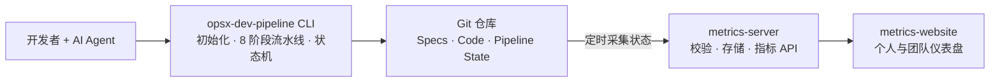
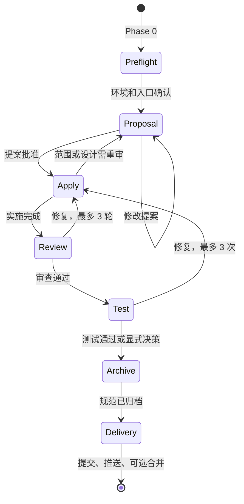

# AI 驱动研发流水线最佳实践分享

> 从 Vibe Coding 到规范驱动开发：保留 AI 的速度，用流程获得可控、可审查、可追溯的交付质量。
>
> **核心立场：Vibe Coding 本身没有问题，问题是缺少流程约束。流水线是给 Vibe 装上安全带，不是让开发者停止 Vibe。**

---

### 一. 背景：为什么需要 AI 研发流水线

#### 1.1 一个真实的翻车现场

最近我在增强一个 Agent 项目，希望它能够解析扫描件。开发过程几乎完全采用 Vibe Coding：描述问题、让 AI 修改、运行目标场景、继续追问和修复。每轮修改后，AI 都给出很强的确定性反馈。

结果是：扫描件能够解析了，但 QA 发现其他原本正常的接口被改坏了。继续让 AI 修复后，受影响的接口反而更多。最终只能放弃整个分支，从头再来。


| 发生的事情        | 表面结果    | 暴露的问题            |
| ------------ | ------- | ---------------- |
| AI 很快完成扫描件解析 | 目标场景通过  | AI 擅长解决局部问题      |
| 其他接口出现回归     | 非目标场景失败 | 修改前没有分析共享依赖和影响范围 |
| 连续对话继续修复     | 更多接口被改坏 | 上下文中缺少稳定的规范与回归基线 |
| 放弃分支重新实现     | 前期效率归零  | 质量问题被推迟到 QA 才暴露  |


这次失败不是因为 AI 不会写代码，而是研发过程缺少几个关键动作：

- 修改前，没有探索相关模块、调用链和共享依赖；
- 实施前，没有把目标、非目标、边界条件写成可验证的规范；
- 实施中，没有用任务清单限制修改范围；
- 实施后，只验证了新增场景，没有覆盖关联接口的回归；
- 连续修复没有停止条件，局部补丁逐步演变为不可控改动。

> 真正危险的不是 AI 犯错，而是 AI 用很高的速度、很强的语气，把一个未经验证的局部判断扩散到整个系统。


#### 1.2 Vibe Coding 的真实价值

Vibe Coding 的核心循环很短：**Prompt → Generate → Iterate**。开发者从逐行编写代码，转向用自然语言表达意图、审阅结果和调整方向。

它在以下场景中非常有价值：

- 快速验证一个产品想法或技术方案；
- 生成一次性脚本、样例代码和页面原型；
- 完成重复性强、边界清楚的代码工作；
- 帮助开发者理解陌生代码、比较不同实现方案；
- 缩短从想法到可运行结果的反馈周期。

因此，问题从来不是“要不要用 Vibe Coding”，而是**什么阶段可以自由探索，什么阶段必须进入工程约束**。

一个实用的边界是：


| 场景              | 推荐方式         | 原因                  |
| --------------- | ------------ | ------------------- |
| 原型、实验、一次性脚本     | 直接 Vibe      | 反馈速度优先，失败成本低        |
| 简单文案或低风险局部修改    | 轻量流程         | 影响范围明确，完整制品成本可能高于收益 |
| 多模块功能、公共能力修改    | 完整流水线        | 容易出现共享依赖和回归风险       |
| 数据、权限、支付、合规相关变更 | 完整流水线 + 人工门禁 | 错误成本高，必须可审计、可回滚     |
| 要进入生产分支的原型      | 先补 Spec 再实施  | 防止“临时原型”悄悄成为生产基座    |


#### 1.3 Vibe Coding 在企业项目中的实际问题

企业研发要求的不只是“当前能跑”，还包括可维护、可验证、可协作和可追溯。裸用 AI 时，常见风险集中在五类：

1. **理解风险**：AI 只看到当前提示，没有完整理解存量系统、隐含规则和历史决策。
2. **范围风险**：AI 能修复一个点，却未必主动分析调用方、共享模块和兼容性。
3. **质量风险**：测试、静态检查、代码规范可能被跳过，生成代码“看起来合理”但没有证据。
4. **安全风险**：可能误提交 `.env`、密钥或凭证，也可能执行过于宽泛的 Git 操作。
5. **协作风险**：关键结论只存在于某次对话，换会话、换 Agent 或换开发者后上下文丢失。

传统开发中的需求评审、技术设计、任务拆解、代码审查和测试，本质上都在制造必要的“停顿”。AI 让编码变得极其顺滑，但也容易让这些停顿一起消失。

**核心矛盾不是速度和质量二选一，而是如何让速度运行在可控边界内。**

#### 1.4 SDD：把共识写在代码之前

Spec-Driven Development（SDD，规范驱动开发）的核心是：**先形成规范，再让人和 AI 围绕同一份规范设计、实施和验证。**

典型制品链如下：

```text
需求探索
  → proposal：为什么做、做什么、不做什么
  → specs：系统必须满足哪些行为和场景
  → design：用什么技术方案实现，如何处理风险
  → tasks：按什么顺序修改哪些内容，如何验证
  → code + tests：实现与验证证据
  → archive：把本次增量规范合并为新的系统基线
```

这里的 Spec 不是一篇泛泛的需求文档，而是一组可以指导实现、支持评审、最终被验证的约束。关键场景可以使用

**EARS 语法**（Easy Approach to Requirements Syntax，源自罗尔斯·罗伊斯的安全关键系统需求写法）是让需求「AI 可读」的结构化写法，例如：

```text
WHEN 输入文件不包含可提取文本，但包含有效扫描图像
THEN 系统 SHALL 启用 OCR 解析路径
AND 返回与普通文档一致的数据结构
AND 不改变普通文档解析接口的既有行为
```

SDD 尤其适合多人协作、存量系统、多集成点和需要审计的项目，因为它提供了：

- **统一真相源**：共识不再只存在于聊天记录；
- **跨会话延续**：新会话和不同 AI 工具可以重新读取规范；
- **前置评审**：方向错误在大量代码生成前被发现；
- **变更追溯**：需求、任务、代码和测试之间可以建立关联；
- **持续演进**：Delta Specs 记录本次增加、修改和删除的内容，归档后成为下一次变更的基线。

一句话概括：**用 Vibe 探索，用 Spec 建造。**

---


### 二. 实践：opsx-dev-pipeline 全流程


#### 2.1 流水线真正拦住了什么

回到扫描件案例，如果当时使用流水线，最关键的拦截不会发生在最后的代码审查，而会发生在写代码之前：


| 流水线环节         | 应该暴露的信息            | 对扫描件案例的帮助                |
| ------------- | ------------------ | ------------------------ |
| Explore       | 相关模块、调用链、共享依赖、现有测试 | 发现多个接口共用同一解析能力           |
| Grill-Me      | 安全、性能、兼容性和异常路径     | 追问 OCR 超时、失败降级、文件大小和并发限制 |
| Specs         | 新增场景、回归场景和明确非目标    | 把普通文档接口“不应改变”写成验收条件      |
| Design        | 方案选择、边界、回滚与可观测性    | 决定 OCR 是独立适配器还是侵入原解析主链路  |
| Tasks         | 文件范围、实施顺序、每项验证方式   | 在编码前看到改动会影响多个接口          |
| Review / Test | 规范一致性和自动化证据        | 同时验证扫描件与既有文档场景           |


这揭示了一个容易被忽略的事实：

> 流水线最重要的能力不是事后替人找 bug，而是通过结构化的停顿，让人和 AI 在错误发生前看到全景图。


#### 2.2 系统全景与快速接入

opsx-dev-pipeline 由三个组件组成：




| 组件              | 职责                      | 解决的问题           |
| --------------- | ----------------------- | --------------- |
| CLI             | 初始化项目、安装模板、执行 Phase 0-7 | 把最佳实践变成可重复流程    |
| metrics-server  | 从 Git 采集状态、校验并计算指标      | 把流程执行情况转化为可分析数据 |
| metrics-website | 展示个人和团队效能               | 发现瓶颈并持续改进流程     |


当前支持 Claude Code、Cursor 和 Codex，内置 Frontend（React）与 Backend（Spring Boot）两类项目模板。项目接入只需要：

```bash
# 前置：Node.js 20+、OpenSpec CLI 1.6.0+
npm install -g @fission-ai/openspec@latest

# 在已有或新项目目录中初始化
npx opsx-dev-pipeline@latest init
```

初始化时选择 AI 工具、主技术栈和文档语言。自动化环境可使用非交互模式，正式写入前也可以先预览：

```bash
npx opsx-dev-pipeline init --tool claude --stack backend --yes --dry-run
npx opsx-dev-pipeline init --tool claude --stack backend --yes
npx opsx-dev-pipeline init --tool claude --stack fullstack --yes
```

接入后，团队获得的不只是一个命令，而是一套可版本化的资产：OpenSpec 配置、制品模板、AI 指令、Phase 规则和流水线状态。

#### 2.3 AI 辅助迭代的完整生命周期

opsx-dev-pipeline.jpg

##### 阶段一：先探索，再提案

探索不是让 AI 立即给方案，而是先回答以下问题：

- 现有实现在哪里，真实调用路径是什么？
- 哪些接口、数据结构和测试依赖它？
- 需求中的假设是否与现状一致？
- 有哪些可选方案，各自的成本与风险是什么？
- 哪些问题必须由产品、架构或安全负责人决定？

需求仍有较多未知项时，再运行 `/opsx:grill-me`。它的价值是暴露盲区，而不是替代负责人拍板。

##### 阶段二：把自然语言变成可审查制品

Phase 1 会生成四类互相约束的制品：


| 制品            | 必须回答的问题           | 评审重点              |
| ------------- | ----------------- | ----------------- |
| `proposal.md` | 为什么做、做什么、不做什么     | 价值、范围、影响面、风险      |
| `api_design.md` | 接口设计方案     | 接口设计是否合理、是否符合规范      |
| `specs/`      | 系统在什么条件下必须表现出什么行为 | 主路径、异常、边界、回归场景    |
| `design.md`   | 如何实现，为什么选择该方案     | 架构、接口、数据、安全、兼容与回滚 |
| `tasks.md`    | 谁按什么顺序改什么，如何证明完成  | 粒度、依赖、文件范围、验证步骤   |


最佳实践是把评审精力前移到 Phase 1。方向错了，后续生成越快，浪费越大。

##### 阶段三：按任务实施，用证据收口

实施阶段应保持一个 change 只处理一个可独立交付的目标。每完成一个任务就更新状态，同时执行与该任务最接近的验证。不要把所有测试推迟到最后，也不要在未更新 Spec 的情况下让实现持续漂移。

审查和测试都设置最多 3 轮自动修复。3 轮后仍未通过，通常说明问题不再是“少改一行”，而是需求、设计、测试基线或环境存在更深层矛盾。此时暂停并由人重新判断，比无限循环更可靠。

##### 阶段四：归档规范，再安全交付

归档不是整理文档，而是把本次 Delta Specs 合并到主规范，使仓库中的规范重新代表系统现状。Phase 6 执行提交与源分支推送；merge 模式再由 Phase 7 执行合并与目标分支交付，并通过敏感文件扫描和安全操作约束避免把自动化速度变成破坏力。

#### 2.4 两种研发模式怎么选

opsx-dev-pipeline 提供一键式流水线和分步骤开发两种方式。


| 维度   | 一键式流水线               | 分步骤独立开发                                                            |
| ---- | -------------------- | ------------------------------------------------------------------ |
| 入口   | `/opsx-dev-pipeline` | `/opsx:propose` → `/opsx:apply` → `/opsx:verify` → `/opsx:archive` |
| 适合   | 需求明确、范围清楚、团队流程已稳定    | 体验原生渐进式开发模式                                                        |
| 人工干预 | 在固定决策点确认             | 每个阶段之间都可修改、回退或暂停                                                   |
| 优势   | 操作简单、过程一致、自动化程度高     | 控制精细、适合多人评审与方案迭代                                                   |
| 风险   | 如果前置探索不足，可能过早进入自动推进  | 需要开发者理解各制品和命令的关系                                                   |


推荐选择原则：

- **范围清楚且已有成熟模式**：先 Explore，再走一键式流水线；
- **跨模块、跨团队或存在架构选择**：使用分步骤模式，重点评审 Spec 与 Design；
- **高风险变更**：分步骤模式，并在数据迁移、权限、部署等节点保留额外人工审批；
- **低风险小改动**：使用团队约定的轻量流程，不必机械地产生全部制品。

流程的目标是控制风险，而不是追求仪式完整。

#### 2.5 快速开始


##### 2.5.1 初始化项目

```bash
# 进入你的项目目录
cd my-project

# 交互式初始化（推荐首次使用）
npx opsx-dev-pipeline@latest init

# 版本升级
npx opsx-dev-pipeline@latest upgrade
```

交互模式会引导你选择：

1. **AI 工具**：Claude Code / Cursor / Codex
2. **项目类型**：Frontend（React+Vite）、 Backend（Spring Boot）、FullStack
3. **文档语言**：中文 / 英文

**非交互模式（适合 CI/CD）：**

```bash
# Claude Code + 后端项目
npx opsx-dev-pipeline init --tool claude --stack backend --yes

# Cursor + 前端项目
npx opsx-dev-pipeline init --tool cursor --stack frontend --yes

# Claude Code + 全栈项目
npx opsx-dev-pipeline init --tool claude --stack fullstack --yes

# 预览将要生成的文件（不实际写入）
npx opsx-dev-pipeline init --tool claude --stack backend --yes --dry-run
```

**初始化后的项目结构：**

```
my-project/
├── .claude/
│   ├── skills/opsx-dev-pipeline/    # 流水线 Skill bundle
│   │   ├── SKILL.md
│   │   ├── references/
│   │   │   ├── phase-0.md ~ phase-6.md
│   │   │   └── pipeline-state-fields.md
│   │   └── scripts/
│   │       └── dev-pipeline-state.mjs
│   └── commands/
│       └── opsx-dev-pipeline.md     # 流水线入口命令
├── openspec/
│   ├── config.yaml                  # 项目配置
│   └── schemas/backend/            # 后端 Schema 模板
│       ├── schema.yaml
│       └── templates/
│           ├── proposal.md
│           ├── api_design.md
│           ├── design.md
│           ├── spec.md
│           └── tasks.md
├── CLAUDE.md                        # AI Agent 指令
└── package.json                     # 包含 opsxDevPipeline manifest
```


##### 2.5.2 常用命令


| 命令                   | 用途      | 说明                                   |
| -------------------- | ------- | ------------------------------------ |
| `/opsx-dev-pipeline` | 启动完整流水线 | 基于探索结论，从 Phase 0 到 Phase 7 全流程       |
| `/opsx:explore`      | 需求探索    | 在正式创建变更前，深入理解需求、分析现有代码、评估技术方案        |
| `/opsx:grill-me`     | 思路拷问    | 对需求方案进行深度拷问，逐一排查决策分支、发现盲区，验证思路是否完备   |
| `/opsx:propose`      | 创建变更提案  | 生成 proposal + specs + design + tasks |
| `/opsx:apply`        | 按任务实施   | 逐条实施 tasks.md 中的任务                   |
| `/opsx:verify`       | 校验一致性   | 检查实现与规范的匹配度                          |
| `/opsx:archive`      | 归档变更    | Delta Specs 合并到主 Specs               |


**一键式开发流水线完整示例：**

```bash
# 第一步：需求探索 — 在正式创建变更前，先深入理解需求
/opsx:explore "给 Todo 添加 dueDate 字段和过期提醒功能"

# 探索阶段 AI 会：
# - 分析现有代码库中 Todo 模块的结构和数据模型
# - 调研 dueDate 字段的最佳实践和边界情况
# - 评估过期提醒的技术方案（定时任务 vs 查询时判断）
# - 确认与现有功能的兼容性和影响范围
# - 输出探索结论，为后续提案提供充分上下文

# 第二步（可选）：思路拷问 — 对方案进行深度推敲，发现盲区
/opsx:grill-me

# 拷问阶段 AI 会逐一追问每个决策分支，帮你发现"没想到的问题"
# 确认方案完备后，再进入流水线

# 第三步：基于探索结论（和拷问结果），启动完整流水线
/opsx-dev-pipeline "基于刚才的探索结果，给 Todo 添加 dueDate 字段和过期提醒功能"

# 流水线会自动执行：
# Phase 0: 检查环境（OpenSpec 版本、Git 仓库状态、依赖完整性）
# Phase 1: AI 基于探索结论生成 proposal.md + spec.md + design.md + tasks.md
#          你确认提案内容后继续
# Phase 2: AI 按 tasks.md 逐条实现代码
#          你确认实施结果后继续
# Phase 3: AI 从 5 个维度审查代码
#          发现问题自动修复（最多 3 轮）
# Phase 4: 运行单元测试
#          失败则自动修复重试（最多 3 次）
# Phase 5: 归档变更，Delta Specs 合并到主规范
# Phase 6: commit → source push
# Phase 7: merge → verify → target push（仅 merge 模式）
```

流水线在每个决策点暂停等待你确认（**详细决策点参考：附录 C**）。

### 三. 原理：流水线如何运作


#### 3.1 OpenSpec 是引擎，opsx-dev-pipeline 是整车

OpenSpec 是规范驱动开发的基础工具，负责 change、spec、校验和归档等核心能力。它通过 Delta Specs 描述一次变更增加、修改或删除的内容，完成后再合并到主 Specs。

opsx-dev-pipeline 在 OpenSpec 之上增加了完整的工程编排：


| 能力             | OpenSpec   | opsx-dev-pipeline |
| -------------- | ---------- | ----------------- |
| 规范创建、校验、归档     | 核心能力       | 复用并编排             |
| Phase 顺序和人工决策点 | 不强制固定门禁    | Phase 0-7 状态机     |
| 中断恢复           | 不记录完整流水线进度 | 持久化状态并交叉校验事实      |
| 多 AI 工具安装      | 依赖各工具配置    | CLI 统一生成原生适配产物    |
| 审查、测试与重试上限     | 由使用者组织     | 固化为流程门禁           |
| Git 安全交付       | 不负责        | 敏感文件检测与安全操作约束     |
| 团队效能指标         | 不负责        | 状态采集、指标 API 与仪表盘  |


一个形象的比喻是：**OpenSpec 提供引擎，opsx-dev-pipeline 补齐方向盘、仪表盘、刹车和安全带。**

#### 3.2 八阶段状态机：可恢复比“一次跑完”更重要

流水线将过程拆成 Phase 0-7，每个阶段都有明确输入、动作、输出和决策点。状态持久化在：

```text
openspec/.pipeline-state/<changeName>.json
```

Schema v3 用 26 个顶层字段记录变更身份、当前阶段、执行模式、决策结果、审查与测试状态、Phase 历史、创建者、机器信息、外部需求关联和指纹等信息。




状态机的价值不只是显示“进行到第几步”，而是解决长流程中的三个问题：

1. **可恢复**：会话中断、机器重启或人工暂停后，从准确断点继续；
2. **可核验**：恢复时交叉检查状态文件、Git 分支、OpenSpec change 和任务事实；
3. **可审计**：跳过测试、回退提案、选择合并策略等决策都有记录。

当状态与事实不一致时，流水线应暂停并展示差异，不能盲目信任 JSON，也不能只凭当前 Agent 的对话记忆继续执行。

#### 3.3 如何定制研发流程

流水线的约束不是写死在某个模型里，而是以配置、Markdown 规则和模板存在于项目中，因此可以被团队评审和版本管理。

##### 3.3.1 自定义项目上下文和验证规则

编辑 `openspec/config.yaml` 中的 `context` 和 `rules`，让 AI 理解项目事实并执行正确的验证命令。建议至少沉淀：

- 技术栈、目录结构和分层边界；
- 命名、异常、日志、权限与数据规范；
- 构建、单测、静态检查和集成测试命令；
- 禁止修改的区域和必须人工审批的操作；
- 前后端或多服务之间的接口契约。

原则是只写稳定、可执行、会影响判断的规则。不要把整本团队手册复制进上下文。

##### 3.3.2 自定义 Schema 增强流水线

Schema 是流水线的"语言系统"——它定义了 AI 在每个阶段生成什么制品、按什么格式输出、以及制品之间如何互相约束。

**默认Schema 的组成结构**

```
openspec/schemas/<name>/
├── schema.yaml          # 制品定义：生成什么、依赖什么、给什么指令
└── templates/           # 制品模板：每个制品的具体结构和提示
    ├── proposal.md
    ├── api_design.md
    ├── design.md
    ├── spec.md
    └── tasks.md
```

`schema.yaml` 是核心配置文件，定义了四个制品的生成规则：


| 配置项                       | 作用            | 示例                                           |
| ------------------------- | ------------- | -------------------------------------------- |
| `artifacts[].id`          | 制品标识          | `proposal`、`specs`、`design`、`tasks`          |
| `artifacts[].generates`   | 生成的文件名        | `proposal.md`、`specs/**/*.md`                |
| `artifacts[].template`    | 使用的模板文件       | `proposal.md`                                |
| `artifacts[].instruction` | 生成该制品时的 AI 指令 | 告诉 AI 该写什么、怎么写                               |
| `artifacts[].requires`    | 前置依赖制品        | `proposal` 无依赖，`tasks` 依赖 `specs` + `design` |
| `apply.requires`          | 实施阶段的前置条件     | `tasks`（必须先生成任务清单）                           |
| `apply.tracks`            | 实施阶段跟踪的文件     | `tasks.md`（按 checkbox 勾选进度）                  |


### 四. 建议与 QA


#### 4.1 AI 生成的代码还需要看吗？

需要，而且评审方式要改变。过去的评审重点通常集中在代码完成之后。AI 时代应该把精力前移：


| 阶段               | 人应该重点看什么          | 为什么              |
| ---------------- | ----------------- | ---------------- |
| Explore          | 事实是否完整，影响范围是否漏项   | 错误的系统理解会污染所有后续制品 |
| Proposal / Specs | 目标、非目标、边界和验收场景    | 方向错误的成本最高        |
| Design / Tasks   | 技术取舍、文件范围、验证方式    | 防止局部方案侵入公共能力     |
| Code Review      | 关键路径、安全、复杂逻辑和异常处理 | 自动审查不能理解全部业务语境   |
| Test / Delivery  | 测试证据、提交范围、回滚能力    | “AI 说通过”不等于真实通过  |


流水线的五维自动审查是第一道防线，不是最终责任人。AI 是副驾驶，人必须保留对需求取舍、架构决策、高风险操作和最终合入的决定权。

#### 4.2 全栈项目如何操作？

当前 `init` 一次选择一个主技术栈，但 `openspec/config.yaml` 可以描述多栈和多服务。实践上建议：

1. 选择变更主导侧初始化。数据模型、领域逻辑和 API 为主时先选后端；交互和页面为主时先选前端。
2. 在配置中补充另一侧的上下文、目录边界、验证命令和接口规范。
3. 为前后端分别设置可执行的测试与构建门禁，不能只验证主栈。
4. 在 Specs 中描述端到端行为，在 Design 中明确 API 契约，在 Tasks 中按依赖顺序拆分前后端工作。
5. 使用 `doctor` 检查初始化和配置完整性，再通过一个小 change 验证流程。

一个全栈 change 不等于把所有前后端工作塞进同一个任务。推荐按“契约 → 后端实现与测试 → 前端实现与测试 → 端到端验证”的依赖关系拆解。

当多个服务由不同团队或不同仓库维护时，应优先把接口契约作为共同 Spec，再由各仓库分别建立可独立交付的 change。

#### 4.3 需求应该如何拆分？

原则是：**一个 change 对应一个可独立交付、独立验证、失败后可独立回滚的功能单元。**

可以用以下问题判断是否需要拆分：

- 是否包含两个可以分别上线的业务目标？
- 是否跨越多个相对独立的领域或服务？
- 是否存在不同的风险等级或审批人？
- 是否无法在一组清晰的验收场景中描述完成标准？
- `tasks.md` 是否明显超过 5-15 个主要任务？
- 单次会话是否难以保持完整、干净的上下文？


| 情况            | 建议                      |
| ------------- | ----------------------- |
| 一个目标，多个紧密关联文件 | 保持一个 change，tasks 按依赖拆分 |
| 多个可独立交付的功能点   | 拆成多个 change             |
| 大型重构与新功能混在一起  | 先做行为保持型重构，再做功能 change   |
| 数据迁移与业务切换风险不同 | 拆分迁移、兼容、切换和清理阶段         |
| 几分钟完成的低风险文案修改 | 使用轻量流程，不必强制完整 SDD       |


过大的 change 会让 AI 上下文膨胀、审查失焦；过小的 change 会增加规范和归档成本。最佳粒度不是文件数量，而是一个清晰、可验证的业务结果。

#### 4.4 技术落地 FAQ


##### Q：能接入现有 CI/CD 吗？

可以。推荐把本地流水线和 CI 分层：本地负责探索、制品生成、人工决策和快速反馈；CI 重新执行 `openspec validate`、构建、测试、静态检查和安全扫描。不要因为本地状态显示通过，就跳过 CI 的独立验证。

##### Q：状态文件丢失或与实际代码不一致怎么办？

实际开发时开发者不需要关注状态文件。状态文件随 Git 版本管理，状态文件与实际代码冲突时，以可核验事实为基础暂停处理，不能简单覆盖其中一方。

##### Q：多人并行开发会冲突吗？

每个开发者应在独立 feature 分支上维护独立 change 和状态文件。只要 change name 唯一，日常执行互不影响。合并时仍可能在主 Specs、共享配置或公共代码处冲突，必须逐文件理解后解决，并重新运行验证。

同一个 change 不建议由多人在不同分支同时推进。确需协作时，应明确唯一负责人，或按可独立交付单元拆成多个 change。

##### Q：简单需求也必须走 Phase 0-7 吗？

不必。流程应与风险成比例。改文案、改注释、低风险配置等影响范围明确的变更，可以使用团队定义的轻量路径。以下任一条件成立时，建议使用完整流水线：

- 不确定会影响哪些模块或调用方；
- 涉及公共能力、数据结构或接口契约；
- 需要多人协作或后续审计；
- 错误会影响安全、资金、权限或生产稳定性。

无论采用哪种路径，所有进入生产的变更至少应有明确目标、可验证结果和代码审查。

##### Q：为什么自动修复只允许 3 轮？

因为连续失败通常说明根因不在当前补丁：可能是规范冲突、设计错误、测试环境异常或影响范围判断失误。有限重试迫使流程暂停并重新判断，避免 AI 在错误方向上持续扩大改动。

##### Q：可以使用 Vue、Django 或其他技术栈吗？

可以。内置 Frontend 和 Backend 模板是起点，不是硬编码的框架限制。通过 `openspec/config.yaml`、Schema 模板和 Phase 验证规则，可以适配其他框架。建议先用一个低风险 change 验证上下文、生成制品和测试命令，再推广到主项目。

##### Q：代码或状态会被上传吗？

流水线逻辑和状态文件在本地及项目 Git 仓库中运行。团队如果部署 metrics-server，则会按配置从目标 Git 仓库采集流水线状态并写入指标数据库；这与“上传完整代码”不是一回事，但仍应按公司安全规范配置仓库权限、网络边界、密钥和数据保留策略。

### 附录 A：命令速查


| 命令                              | 用途                             |
| ------------------------------- | ------------------------------ |
| `/opsx:explore`                 | 需求探索、代码分析、影响评估                 |
| `/opsx:grill-me`                | 挑战方案、暴露盲区，不创建 change           |
| `/opsx-dev-pipeline`            | 启动或恢复 Phase 0-7 完整流水线          |
| `/opsx:propose`                 | 创建 proposal、specs、design、tasks |
| `/opsx:apply`                   | 按 tasks 实施并更新状态                |
| `/opsx:verify`                  | 验证实现与规范的一致性                    |
| `/opsx:archive`                 | 合并 Delta Specs 并归档 change      |
| `npx opsx-dev-pipeline init`    | 交互式初始化项目                       |
| `npx opsx-dev-pipeline doctor`  | 诊断安装和配置状态                      |
| `npx opsx-dev-pipeline sync`    | 同步托管资产                         |
| `npx opsx-dev-pipeline upgrade` | 升级模板版本                         |


### 附录 B：流水线各阶段任务概览


| 阶段         | AI 的主要工作                       | 人的关键责任             | 主要产出或门禁           |
| ---------- | ------------------------------ | ------------------ | ----------------- |
| Explore    | 阅读代码、追踪依赖、比较方案、评估影响范围          | 补充业务背景，确认调查范围      | 探索结论，不创建正式 change |
| Grill-Me   | 从安全、性能、兼容性、可维护性等维度挑战方案         | 回答关键决策，不把决策权交给 AI  | 完备的约束与待决问题        |
| Phase 0 预检 | 检查环境、Git、OpenSpec 配置和未完成变更     | 选择新建、恢复或继续现有变更     | 明确入口和可信基线         |
| Phase 1 提案 | 生成 proposal、specs、design、tasks | 重点审方向、范围、场景和风险     | 提案批准后才能实施         |
| Phase 2 实施 | 按 tasks 逐条编码并更新 checkbox       | 控制范围，检查关键实现和非目标    | 代码、测试、任务完成记录      |
| Phase 3 审查 | 从正确性、安全性、性能、可维护性、规范符合度审查并修复    | 判断问题是否真实，最多 3 轮后介入 | 审查报告和修复记录         |
| Phase 4 测试 | 运行项目测试，失败后修复重试                 | 不以“AI 说通过”代替真实输出   | 测试结果，最多 3 次尝试     |
| Phase 5 归档 | 校验实现与 Spec，合并 Delta Specs      | 确认规范反映最终实现         | 主规范更新和归档记录        |
| Phase 6 提交推送 | commit、源分支 push，执行安全检查 | 确认提交范围和源分支推送 | 可追溯的源分支交付结果 |
| Phase 7 合并交付 | merge、验证、目标分支 push、清理和标签 | 确认合并策略与目标推送 | 可追溯的目标分支交付结果 |


### 附录 C：流水线各阶段任务概览

> 覆盖 Phase 0-7 全部需要人工确认的决策点。每个决策点都会被记录在状态文件中，形成完整的决策审计链。


#### Phase 0 · 入口判断


| 编号       | 决策点              | 触发条件                                      | 可选操作                                       | 记录字段                         |
| -------- | ---------------- | ----------------------------------------- | ------------------------------------------ | ---------------------------- |
| **D0.1** | 外部需求关联           | 首次创建 change 状态                            | `跳过关联` / `关联 JIRA issue（输入 featureId）`     | `featureId`, `featureUrl`    |
| **D0.2** | 状态不存在但 change 存在 | 恢复流水线时状态文件丢失                              | `按检测结果重建状态` / `选择其他 change` / `终止流程`       | `decisions.rebuiltFromFacts` |
| **D0.3** | 状态与事实不一致         | 恢复时 Git/文件系统与状态文件矛盾                       | 列出差异，暂停等待人工处理                              | `status=paused`              |
| **D0.4** | 非 pipeline 模式续接  | `executionMode` 为 `standalone` 或 `hybrid` | `从当前 Phase/Step 继续` / `重新开始完整流水线` / `终止流程` | `executionMode` 保留           |


---


#### Phase 1 · 提案编写


| 编号       | 决策点            | 触发条件           | 可选操作                                   | 记录字段                              |
| -------- | -------------- | -------------- | -------------------------------------- | --------------------------------- |
| **D1.1** | 需求理解确认（决策点 1a） | 制品生成前          | `确认需求理解，开始生成制品` / `补充/修改需求理解` / `终止流程` | `decisions.requirementsConfirmed` |
| **D1.2** | 确认提案（决策点 1）    | 制品生成后，**必过门禁** | `确认提案，开始实施` / `提案不符合预期，补充/修改` / `终止流程` | `decisions.proposalApproved`      |


---


#### Phase 2 · 提案应用


| 编号       | 决策点           | 触发条件     | 可选操作                                                | 记录字段                                                               |
| -------- | ------------- | -------- | --------------------------------------------------- | ------------------------------------------------------------------ |
| **D2.1** | 实施完成确认（决策点 2） | 所有任务实施完毕 | `进入代码审查` / `暂停流水线，手动调整后继续` / `跳过审查，继续后续流程` / `终止流程` | `decisions.implementationConfirmed`, `decisions.reviewDisposition` |


---


#### Phase 3 · 代码审查


| 编号       | 决策点              | 触发条件           | 可选操作                                                                        | 记录字段                                                 |
| -------- | ---------------- | -------------- | --------------------------------------------------------------------------- | ---------------------------------------------------- |
| **D3.1** | 审查结果处理（决策点 3）    | 审查报告生成后        | 有严重问题：`生成修复提案并应用` / `直接修复并重新审查` / `回到 Phase2 重新实施` / `暂停` / `继续后续流程` / `终止` | `decisions.reviewDisposition`, `review.currentRound` |
|          |                  |                | 仅有建议：`继续后续流程` / `生成修复提案并应用` / `暂停` / `终止`                                   |                                                      |
| **D3.2** | 修复提案批准（修复子流程 R2） | 选择"生成修复提案并应用"后 | `批准修复提案，开始实施` / `修改提案内容` / `放弃修复，回到决策点 3`                                   | `decisions.fixProposalApproved`                      |


---


#### Phase 4 · 单元测试门禁


| 编号       | 决策点           | 触发条件                    | 可选操作                                       | 记录字段                             |
| -------- | ------------- | ----------------------- | ------------------------------------------ | -------------------------------- |
| **D4.1** | 是否需要单测（决策点 4） | 进入 Phase 4 时，**不得默认跳过** | `需要：编写/补充并运行通过` / `不需要：跳过单测环节` / `暂停流水线`   | `tests.status`, `tests.detail`   |
| **D4.2** | 测试失败处理        | 测试运行失败                  | `修复代码或测试后重试` / `跳过并记录技术债务（需写明原因）` / `终止流程` | `tests.attempts`, `tech-debt.md` |


---


#### Phase 5 · 提案归档


| 编号       | 决策点                 | 触发条件                   | 可选操作                                                               | 记录字段                               |
| -------- | ------------------- | ---------------------- | ------------------------------------------------------------------ | ---------------------------------- |
| **D5.1** | verify 失败处理（决策点 5a） | `openspec validate` 失败 | `修复后重试 verify` / `回到 Phase2 修复代码` / `回到 Phase1 修改提案` / `暂停` / `终止` | `verify.status`, `verify.attempts` |
| **D5.2** | Delta spec 同步       | 存在 delta specs         | `同步到主 specs（推荐）` / `不同步，直接归档`                                      | `archivePath`                      |
| **D5.3** | 归档后操作（决策点 5b）       | 归档成功后                  | `提交代码并合并到目标分支` / `仅提交并推送（不合并）` / `终止流程`                            | `decisions.postArchiveAction`      |


---


#### Phase 6 · 提交与源分支推送 / Phase 7 · 合并与交付


| 编号        | 决策点           | 触发条件                        | 可选操作                                              | 记录字段                                                    |
| --------- | ------------- | --------------------------- | ------------------------------------------------- | ------------------------------------------------------- |
| **D6.1**  | 提交确认（决策点 6）   | 暂存区准备完毕                     | `确认提交` / `修改提交信息` / `取消暂存并重选` / `终止流程`            | `decisions.commitApproved`, `delivery.commitSha`        |
| **D6.2**  | 源分支推送确认       | commit 完成后                  | `确认推送源分支` / `暂不推送` / `终止流程`                       | `decisions.sourcePushApproved`, `delivery.sourcePushed` |
| **D6.3**  | 目标分支选择        | `postArchiveAction=merge` 时 | 从分支列表中选择目标分支                                      | `targetBranch`                                          |
| **D6.4**  | 合并策略选择（决策点 7） | 合并前                         | `Standard merge` / `Squash merge` / `No-ff merge` | `decisions.mergeStrategy`                               |
| **D6.5**  | 合并确认          | 展示 diff 后                   | `确认本地合并` / `取消`                                   | `decisions.mergeApproved`, `delivery.mergeCommitSha`    |
| **D6.6**  | 冲突处理          | 合并冲突时                       | `中止合并` / `逐文件解决` / `暂停人工处理`                       | 冲突解决记录                                                  |
| **D6.7**  | 目标分支推送确认      | 合并后验证通过                     | `确认推送目标分支` / `保留本地合并，暂不推送` / `终止流程`               | `decisions.targetPushApproved`, `delivery.targetPushed` |
| **D6.8**  | 源分支删除确认       | 合并推送成功后                     | 分别确认：删除本地源分支 / 删除远程源分支                            | `delivery.sourceBranchDeleted`                          |
| **D6.9**  | 标签创建确认        | 合并推送成功后                     | `确认创建标签` / `不创建标签` / `终止流程`                       | `delivery.tag`                                          |
| **D6.10** | 最终状态提交确认      | 流水线完成时                      | `确认提交最终流水线状态` / `终止流程`（不提供跳过选项）                   | `delivery` 全部字段                                         |


---

> **最终目标不是让 AI 写更多代码，而是让团队更快地产出可以长期维护、可信任、可追溯的软件。**
