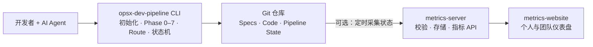
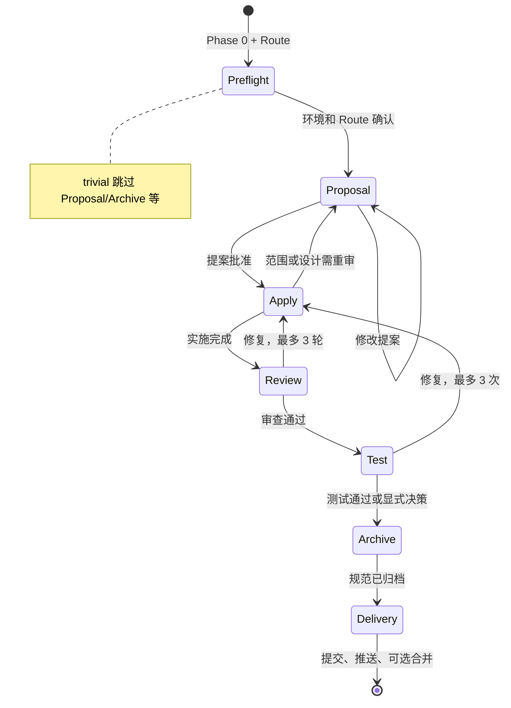

# AI 驱动研发流水线最佳实践分享（v4）

> 从 Vibe Coding 到规范驱动开发：保留 AI 的速度，用流程获得可控、可审查、可追溯的交付质量。
>
> **核心立场：Vibe Coding 本身没有问题，问题是缺少流程约束。流水线是给 Vibe 装上安全带，不是让开发者停止 Vibe。**
>
> 本文基于 `opsx-dev-pipeline` **v0.2.22** 编写，相较 [v3](./practice-guide-v3.md) 重点补充 **Route 分级**、**四种 AI 工具适配**、**Pipeline Hooks**、**多工具并存** 与 **系分 / 配置初始化** 等能力。

---

### 一. 背景：为什么需要 AI 研发流水线

#### 1.1 一个真实的翻车现场

最近我在增强一个 Agent 项目，希望它能够解析扫描件。开发过程几乎完全采用 Vibe Coding：描述问题、让 AI 修改、运行目标场景、继续追问和修复。每轮修改后，AI 都给出很强的确定性反馈。

结果是：扫描件能够解析了，但 QA 发现其他原本正常的接口被改坏了。继续让 AI 修复后，受影响的接口反而更多。最终只能放弃整个分支，从头再来。


| 发生的事情        | 表面结果    | 暴露的问题            |
| ------------ | ------- | ---------------- |
| AI 很快完成扫描件解析 | 目标场景通过  | AI 擅长解决局部问题      |
| 其他接口出现回归     | 非目标场景失败 | 修改前没有分析共享依赖和影响范围 |
| 连续对话继续修复     | 更多接口被改坏 | 上下文中缺少稳定的规范与回归基线 |
| 放弃分支重新实现     | 前期效率归零  | 质量问题被推迟到 QA 才暴露  |


这次失败不是因为 AI 不会写代码，而是研发过程缺少几个关键动作：

- 修改前，没有探索相关模块、调用链和共享依赖；
- 实施前，没有把目标、非目标、边界条件写成可验证的规范；
- 实施中，没有用任务清单限制修改范围；
- 实施后，只验证了新增场景，没有覆盖关联接口的回归；
- 连续修复没有停止条件，局部补丁逐步演变为不可控改动。

> 真正危险的不是 AI 犯错，而是 AI 用很高的速度、很强的语气，把一个未经验证的局部判断扩散到整个系统。


#### 1.2 Vibe Coding 的真实价值

Vibe Coding 的核心循环很短：**Prompt → Generate → Iterate**。开发者从逐行编写代码，转向用自然语言表达意图、审阅结果和调整方向。

它在以下场景中非常有价值：

- 快速验证一个产品想法或技术方案；
- 生成一次性脚本、样例代码和页面原型；
- 完成重复性强、边界清楚的代码工作；
- 帮助开发者理解陌生代码、比较不同实现方案；
- 缩短从想法到可运行结果的反馈周期。

因此，问题从来不是「要不要用 Vibe Coding」，而是**什么阶段可以自由探索，什么阶段必须进入工程约束**。

一个实用的边界是：


| 场景              | 推荐方式         | 原因                  |
| --------------- | ------------ | ------------------- |
| 原型、实验、一次性脚本     | 直接 Vibe      | 反馈速度优先，失败成本低        |
| 简单文案或低风险局部修改    | **trivial Route** | 影响范围明确，完整制品成本可能高于收益 |
| 多模块功能、公共能力修改    | **standard Route** | 容易出现共享依赖和回归风险       |
| 数据、权限、支付、合规相关变更 | **full Route** | 错误成本高，必须可审计、可回滚     |
| 要进入生产分支的原型      | 先补 Spec 再实施  | 防止「临时原型」悄悄成为生产基座    |


#### 1.3 Vibe Coding 在企业项目中的实际问题

企业研发要求的不只是「当前能跑」，还包括可维护、可验证、可协作和可追溯。裸用 AI 时，常见风险集中在五类：

1. **理解风险**：AI 只看到当前提示，没有完整理解存量系统、隐含规则和历史决策。
2. **范围风险**：AI 能修复一个点，却未必主动分析调用方、共享模块和兼容性。
3. **质量风险**：测试、静态检查、代码规范可能被跳过，生成代码「看起来合理」但没有证据。
4. **安全风险**：可能误提交 `.env`、密钥或凭证，也可能执行过于宽泛的 Git 操作。
5. **协作风险**：关键结论只存在于某次对话，换会话、换 Agent 或换开发者后上下文丢失。

传统开发中的需求评审、技术设计、任务拆解、代码审查和测试，本质上都在制造必要的「停顿」。AI 让编码变得极其顺滑，但也容易让这些停顿一起消失。

**核心矛盾不是速度和质量二选一，而是如何让速度运行在可控边界内。**

#### 1.4 SDD：把共识写在代码之前

Spec-Driven Development（SDD，规范驱动开发）的核心是：**先形成规范，再让人和 AI 围绕同一份规范设计、实施和验证。**

典型制品链如下：

```text
需求探索
  → proposal：为什么做、做什么、不做什么
  → specs：系统必须满足哪些行为和场景
  → design：用什么技术方案实现，如何处理风险
  → tasks：按什么顺序修改哪些内容，如何验证
  → code + tests：实现与验证证据
  → archive：把本次增量规范合并为新的系统基线
```

这里的 Spec 不是一篇泛泛的需求文档，而是一组可以指导实现、支持评审、最终被验证的约束。关键场景可以使用 **EARS 语法**（Easy Approach to Requirements Syntax）：

```text
WHEN 输入文件不包含可提取文本，但包含有效扫描图像
THEN 系统 SHALL 启用 OCR 解析路径
AND 返回与普通文档一致的数据结构
AND 不改变普通文档解析接口的既有行为
```

SDD 尤其适合多人协作、存量系统、多集成点和需要审计的项目，因为它提供了：

- **统一真相源**：共识不再只存在于聊天记录；
- **跨会话延续**：新会话和不同 AI 工具可以重新读取规范；
- **前置评审**：方向错误在大量代码生成前被发现；
- **变更追溯**：需求、任务、代码和测试之间可以建立关联；
- **持续演进**：Delta Specs 记录本次增加、修改和删除的内容，归档后成为下一次变更的基线。

一句话概括：**用 Vibe 探索，用 Spec 建造。**

---


### 二. 实践：opsx-dev-pipeline 全流程

#### 2.1 流水线真正拦住了什么

回到扫描件案例，如果当时使用流水线，最关键的拦截不会发生在最后的代码审查，而会发生在写代码之前：


| 流水线环节         | 应该暴露的信息            | 对扫描件案例的帮助                |
| ------------- | ------------------ | ------------------------ |
| Explore       | 相关模块、调用链、共享依赖、现有测试 | 发现多个接口共用同一解析能力           |
| Grill-Me      | 安全、性能、兼容性和异常路径     | 追问 OCR 超时、失败降级、文件大小和并发限制 |
| Specs         | 新增场景、回归场景和明确非目标    | 把普通文档接口「不应改变」写成验收条件      |
| Design        | 方案选择、边界、回滚与可观测性    | 决定 OCR 是独立适配器还是侵入原解析主链路  |
| Tasks         | 文件范围、实施顺序、每项验证方式   | 在编码前看到改动会影响多个接口          |
| Review / Test | 规范一致性和自动化证据        | 同时验证扫描件与既有文档场景           |


这揭示了一个容易被忽略的事实：

> 流水线最重要的能力不是事后替人找 bug，而是通过结构化的停顿，让人和 AI 在错误发生前看到全景图。


#### 2.2 系统全景与快速接入

opsx-dev-pipeline 由三个可选组件组成：




| 组件              | 职责                      | 解决的问题           |
| --------------- | ----------------------- | --------------- |
| CLI             | 初始化项目、安装模板、执行 Phase 0–7 | 把最佳实践变成可重复流程    |
| metrics-server  | 从 Git 采集状态、校验并计算指标（可选） | 把流程执行情况转化为可分析数据 |
| metrics-website | 展示个人和团队效能（可选）           | 发现瓶颈并持续改进流程     |


**当前支持的 AI 工具（Tool）**


| Tool ID    | 宿主        | 资产落地位置                              |
| ---------- | ----------- | ------------------------------------- |
| `claude`   | Claude Code | `.claude/skills/`、`.claude/commands/` |
| `cursor`   | Cursor      | `.cursor/rules/`、`.cursor/commands/`   |
| `codex`    | Codex       | `.agents/skills/`                     |
| `opencode` | OpenCode    | `.opencode/skills/`、`.opencode/commands/` |


**当前支持的 Stack 与技术栈细分**


| Stack       | 默认技术栈                              | OpenSpec Schema               |
| ----------- | ---------------------------------- | ----------------------------- |
| `frontend`  | React 18+、TypeScript、Vite          | `openspec/schemas/frontend/`  |
| `backend`   | Java Spring Boot 3.x 或 Python FastAPI | `openspec/schemas/backend/`   |
| `fullstack` | 前端 + 后端 Monorepo 组合               | `openspec/schemas/fullstack/` |


`--tech-stack` 可选细分：`java-spring-boot`、`react-vite`、`python-fastapi`、`java-react`、`python-react`。

项目接入只需要：

```bash
# 前置：Node.js 20+、OpenSpec CLI 1.6.0+
npm install -g @fission-ai/openspec@latest

# 在已有或新项目目录中初始化
npx opsx-dev-pipeline@latest init
```

初始化时选择 AI 工具、Stack、文档语言，以及可选的 Hooks。自动化环境可使用非交互模式，正式写入前也可以先预览：

```bash
npx opsx-dev-pipeline init --tool claude --stack backend --tech-stack java-spring-boot --yes --dry-run
npx opsx-dev-pipeline init --tool claude --stack backend --yes
npx opsx-dev-pipeline init --tool cursor --stack fullstack --tech-stack java-react --yes
npx opsx-dev-pipeline init --tool claude --stack backend --yes --lang en
```

**多工具并存**：同一仓库可先后为不同 Tool 执行 `init`，manifest 会记录 `tools[]` 数组；`sync` / `upgrade` 会遍历所有已安装工具重渲染资产；`uninstall --tool cursor` 可只卸载指定工具的文件。

接入后，团队获得的不只是一个命令，而是一套可版本化的资产：OpenSpec 配置、Schema 模板、AI 指令、Phase 规则、Pipeline Hooks（Claude / OpenCode 默认启用）和流水线状态协议。

#### 2.3 Route：让流程重量与风险匹配

v4 最重要的工程化改进是 **Route 分级机制**——在 Phase 0 根据变更风险选择 `trivial` / `standard` / `full`，自动跳过不适用的 Phase，避免「改个 typo 也要走完整归档」的仪式负担。


| Route      | 适用场景                    | 执行的 Phase   | 跳过的 Phase        |
| ---------- | ----------------------- | ----------- | ---------------- |
| `trivial`  | typo、格式化、注释、import 清理   | 0, 2, 6     | 1, 3, 4, 5, 7    |
| `standard` | 功能开发、Bug 修复、重构          | 0, 1, 2, 5, 6 | 3, 4, 7          |
| `full`     | 核心业务、数据库迁移、安全相关         | 0–7（全部）     | 无                |


Route 在 Phase 0 Step 2.5 由 AI 推荐、人工确认后写入状态文件；**只能向上升级**（`trivial → standard → full`），不允许降级。实施中发现风险高于预期时：

```bash
node <SKILL_ROOT>/scripts/dev-pipeline-state.mjs route <change-name> upgrade standard
```

没有 `route` 字段的旧状态文件会自动按 `full` 处理，保证向后兼容。

> Route 不是「偷懒开关」，而是把 v3 文档里「低风险走轻量流程」的建议变成了可配置、可审计的状态机行为。

#### 2.4 AI 辅助迭代的完整生命周期

##### 阶段零：预检、入口与 Route

Phase 0 不再只是「检查 OpenSpec 版本」，还负责：

- 识别入口类型：新需求、已有 change 续接、系分设计文档、或查看 change 列表；
- 外部需求关联（JIRA issue 等）——**必须显式选择**，不可由 AI 推断跳过；
- Route 评估与确认；
- 非 `pipeline` 模式（`standalone` / `hybrid`）的 gate 补偿与续接策略。

**系分设计文档入口**：若团队已用 `opsx:dev-spec-design` 产出系分文档，可在 Phase 0 选择「系分设计文档」，以其内容作为需求描述创建 change，直接进入提案阶段。

##### 阶段一：先探索，再提案

探索不是让 AI 立即给方案，而是先回答以下问题：

- 现有实现在哪里，真实调用路径是什么？
- 哪些接口、数据结构和测试依赖它？
- 需求中的假设是否与现状一致？
- 有哪些可选方案，各自的成本与风险是什么？
- 哪些问题必须由产品、架构或安全负责人决定？

需求仍有较多未知项时，再运行 **Grill-Me**。它通过 `opsx-grilling` skill 逐题访谈，暴露盲区，而不是替代负责人拍板。

对于存量项目、首次接入或 `openspec/config.yaml` 缺失上下文时，可先运行 **opsx:init**，让 AI 分析仓库并初始化/更新项目配置（技术栈、目录约定、验证命令、规则）。

##### 阶段二：把自然语言变成可审查制品

Phase 1 会生成互相约束的制品（具体集合由 Stack 的 Schema 决定）：


| 制品            | 必须回答的问题           | 评审重点              |
| ------------- | ----------------- | ----------------- |
| `proposal.md` | 为什么做、做什么、不做什么     | 价值、范围、影响面、风险      |
| `api_design.md` | 接口设计方案（backend / fullstack） | 接口设计是否合理、是否符合规范 |
| `specs/`      | 系统在什么条件下必须表现出什么行为 | 主路径、异常、边界、回归场景    |
| `design.md`   | 如何实现，为什么选择该方案     | 架构、接口、数据、安全、兼容与回滚 |
| `adr.md`      | 关键架构决策记录（可选）      | 取舍理由、替代方案、影响范围    |
| `tasks.md`    | 谁按什么顺序改什么，如何证明完成  | 粒度、依赖、文件范围、验证步骤   |


最佳实践是把评审精力前移到 Phase 1。方向错了，后续生成越快，浪费越大。

##### 阶段三：按任务实施，用证据收口

实施阶段应保持一个 change 只处理一个可独立交付的目标。每完成一个任务就更新状态，同时执行与该任务最接近的验证。不要把所有测试推迟到最后，也不要在未更新 Spec 的情况下让实现持续漂移。

审查和测试都设置最多 3 轮自动修复。3 轮后仍未通过，通常说明问题不再是「少改一行」，而是需求、设计、测试基线或环境存在更深层矛盾。此时暂停并由人重新判断，比无限循环更可靠。

##### 阶段四：归档规范，再安全交付

归档不是整理文档，而是把本次 Delta Specs 合并到主规范，使仓库中的规范重新代表系统现状。Phase 6 执行提交与源分支推送；merge 模式再由 Phase 7 执行合并与目标分支交付。

**Pipeline Hooks**（Claude Code / OpenCode 默认安装）把高风险操作从提示词下沉到宿主强制层：拦截 `git push --force`、`rm -rf /`、写入 `.env` / 密钥文件、直接修改 `.pipeline-state/*.json` 等。Cursor / Codex 需参考 `docs/hooks/` 手动配置。

#### 2.5 三种研发模式怎么选

opsx-dev-pipeline 提供一键式流水线、分步骤开发和 Route 轻量路径三种方式。


| 维度   | 一键式流水线（full Route）     | 分步骤独立开发                                                            | trivial / standard Route |
| ---- | -------------------- | ------------------------------------------------------------------ | ------------------------ |
| 入口   | `opsx:dev-pipeline`  | `opsx:propose` → `opsx:apply` → … → `opsx:archive` | 同上，但 Phase 0 选择对应 Route |
| 适合   | 高风险、需完整审查与交付          | 体验原生渐进式开发、多人评审方案迭代                                               | 低风险或标准功能，跳过部分 Phase      |
| 人工干预 | 在固定决策点确认             | 每个阶段之间都可修改、回退或暂停                                                   | 决策点更少，但关键 gate 仍保留       |
| 优势   | 过程一致、自动化程度高          | 控制精细、适合方案迭代                                                       | 速度与约束的最佳平衡               |
| 风险   | 前置探索不足时可能过早自动推进      | 需要理解各制品和命令的关系                                                    | Route 选过低可能导致 gate 不足     |


**各 Tool 的命令调用语法**（功能相同，前缀不同）：


| 能力        | Claude Code     | Cursor          | Codex           |
| --------- | --------------- | --------------- | --------------- |
| 完整流水线     | `opsx:dev-pipeline` | `/opsx-dev-pipeline` | `$opsx-dev-pipeline` |
| 探索        | `opsx:explore`  | `/opsx-explore` | `$opsx-explore` |
| 思路拷问      | `opsx:grill-me` | `/opsx-grill-me` | `$opsx-grill-me` |
| 创建提案      | `opsx:propose`  | `/opsx-propose` | `$opsx-propose` |
| 按任务实施     | `opsx:apply`    | `/opsx-apply`   | `$opsx-apply`   |
| 校验一致性     | `opsx:verify`   | `/opsx-verify`  | `$opsx-verify`  |
| 同步 Delta  | `opsx:sync`     | `/opsx-sync`    | `$opsx-sync`    |
| 归档        | `opsx:archive`  | `/opsx-archive` | `$opsx-archive` |
| 初始化项目配置   | `opsx:init`     | `/opsx-init`    | —               |
| 系分设计文档    | `opsx:dev-spec-design` | `/opsx-dev-spec-design` | —        |


推荐选择原则：

- **范围清楚且已有成熟模式**：先 Explore，再走 standard Route 或一键式流水线；
- **跨模块、跨团队或存在架构选择**：分步骤模式 + standard / full Route，重点评审 Spec 与 Design；
- **高风险变更**：full Route，并在数据迁移、权限、部署等节点保留额外人工审批；
- ** typo / 格式化 / 注释**：trivial Route，不必机械产生全部制品；
- **已有系分文档**：Phase 0 选「系分设计文档」或先 `opsx:dev-spec-design` 再进流水线。

流程的目标是控制风险，而不是追求仪式完整。

#### 2.6 快速开始

##### 2.6.1 初始化项目

```bash
# 进入你的项目目录
cd my-project

# 交互式初始化（推荐首次使用）
npx opsx-dev-pipeline@latest init

# 同步 / 升级已安装模板
npx opsx-dev-pipeline sync
npx opsx-dev-pipeline upgrade

# 诊断安装状态
npx opsx-dev-pipeline doctor
```

交互模式会引导你选择：

1. **AI 工具**：Claude Code / Cursor / Codex / OpenCode
2. **Stack**：Frontend / Backend / Fullstack
3. **Tech stack 细分**（可选）：如 `python-fastapi`、`java-react`
4. **文档语言**：中文 / 英文（`--lang`）
5. **Hooks**：默认启用（Claude / OpenCode）；`--feature no-hooks` 可关闭

**非交互模式（适合 CI/CD）：**

```bash
# Claude Code + Java 后端
npx opsx-dev-pipeline init --tool claude --stack backend --tech-stack java-spring-boot --yes

# Cursor + 前端
npx opsx-dev-pipeline init --tool cursor --stack frontend --yes

# Python FastAPI 后端
npx opsx-dev-pipeline init --tool claude --stack backend --tech-stack python-fastapi --yes

# 全栈 Monorepo（Java + React）
npx opsx-dev-pipeline init --tool claude --stack fullstack --tech-stack java-react --yes

# 预览将要生成的文件（不实际写入）
npx opsx-dev-pipeline init --tool claude --stack backend --yes --dry-run
```

**初始化后的项目结构（Claude + backend 示例）：**

```text
my-project/
├── .claude/
│   ├── skills/
│   │   ├── opsx-dev-pipeline/       # 流水线 Skill bundle（Phase 0–7）
│   │   ├── opsx-grill-me/           # 思路拷问入口
│   │   ├── opsx-grilling/           # 深度访谈引擎
│   │   ├── opsx-dev-spec-design/    # 系分设计文档
│   │   └── opsx-init/               # 项目配置初始化
│   └── commands/opsx/
│       ├── dev-pipeline.md          # 流水线入口
│       ├── explore.md / propose.md / apply.md / verify.md / sync.md / archive.md
│       ├── grill-me.md / init.md / dev-spec-design.md
│       └── ...
├── openspec/
│   ├── config.yaml                  # 项目配置（schema、context、rules、pipeline.routes）
│   ├── .pipeline-state/             # 流水线状态（按 change 分文件）
│   └── schemas/backend/
│       ├── schema.yaml
│       └── templates/
│           ├── proposal.md / api_design.md / design.md / adr.md / spec.md / tasks.md
├── CLAUDE.md                        # AI Agent 项目指令
└── package.json                     # opsxDevPipeline manifest
```

Manifest 存放在 `package.json#opsxDevPipeline`，记录 tool(s)、stack、templateVersion 和 managedAssets，是 `sync` / `upgrade` / `uninstall` 的唯一事实源。

##### 2.6.2 常用命令


| 命令（Claude Code 语法）   | 用途      | 说明                                   |
| -------------------- | ------- | ------------------------------------ |
| `opsx:dev-pipeline`  | 启动完整流水线 | 基于探索结论，从 Phase 0 到 Phase 7（受 Route 约束） |
| `opsx:explore`       | 需求探索    | 深入理解需求、分析代码、评估方案；不创建正式 change        |
| `opsx:grill-me`      | 思路拷问    | 逐题访谈，暴露盲区；不创建 change                 |
| `opsx:dev-spec-design` | 系分设计  | 生成系统分析与设计说明书（精简版）                    |
| `opsx:init`          | 配置初始化   | 分析项目并生成/更新 `openspec/config.yaml`     |
| `opsx:propose`       | 创建变更提案  | 生成 proposal + specs + design + tasks |
| `opsx:apply`         | 按任务实施   | 逐条实施 tasks.md 中的任务                   |
| `opsx:verify`        | 校验一致性   | 检查实现与规范的匹配度                          |
| `opsx:sync`          | 同步 Delta  | 将 delta specs 同步到主 specs               |
| `opsx:archive`       | 归档变更    | Delta Specs 合并并归档 change              |


**一键式开发流水线完整示例（Claude Code）：**

```bash
# 第一步：需求探索
opsx:explore "给 Todo 添加 dueDate 字段和过期提醒功能"

# 第二步（可选）：思路拷问
opsx:grill-me

# 第三步：启动完整流水线（Phase 0 会推荐 Route，通常 standard 或 full）
opsx:dev-pipeline "基于刚才的探索结果，给 Todo 添加 dueDate 字段和过期提醒功能"

# 流水线按 Route 执行，典型 full Route 路径：
# Phase 0: 预检、外部需求关联、Route 确认
# Phase 1: 生成 proposal + specs + design + tasks → 你确认提案
# Phase 2: 按 tasks 逐条实现 → 你确认实施结果
# Phase 3: 五维代码审查，自动修复（最多 3 轮）
# Phase 4: 运行单元测试，失败修复（最多 3 次）
# Phase 5: 校验 + 归档，Delta Specs 合并到主规范
# Phase 6: commit → 源分支 push（含敏感文件扫描）
# Phase 7: merge → 验证 → 目标分支 push（仅 merge 模式）
```

**分步骤模式示例：**

```bash
opsx:explore "..."
opsx:propose "..."          # executionMode=standalone，自带状态跟踪
opsx:apply <change-name>
opsx:verify <change-name>
opsx:archive <change-name>
opsx:dev-pipeline <change-name>   # 从 Phase 6 继续交付（hybrid 续接）
```

流水线在每个决策点暂停等待你确认（**详细决策点见 [附录 C](#附录-c流水线决策点) 与 [pipeline-decision-points.md](./pipeline-decision-points.md)**）。

### 三. 原理：流水线如何运作

#### 3.1 OpenSpec 是引擎，opsx-dev-pipeline 是整车

OpenSpec 是规范驱动开发的基础工具，负责 change、spec、校验和归档等核心能力。它通过 Delta Specs 描述一次变更增加、修改或删除的内容，完成后再合并到主 Specs。

opsx-dev-pipeline 在 OpenSpec 之上增加了完整的工程编排：


| 能力             | OpenSpec   | opsx-dev-pipeline |
| -------------- | ---------- | ----------------- |
| 规范创建、校验、归档     | 核心能力       | 复用并编排             |
| Phase 顺序和人工决策点 | 不强制固定门禁    | Phase 0–7 状态机     |
| Route 分级       | 不提供        | trivial / standard / full |
| 中断恢复           | 不记录完整流水线进度 | 持久化状态并交叉校验事实      |
| 多 AI 工具安装      | 依赖各工具配置    | CLI 统一生成原生适配产物    |
| 审查、测试与重试上限     | 由使用者组织     | 固化为流程门禁           |
| Git 安全交付       | 不负责        | 敏感文件检测 + Hooks 约束 |
| 团队效能指标         | 不负责        | 可选 metrics-server 采集 |


一个形象的比喻是：**OpenSpec 提供引擎，opsx-dev-pipeline 补齐方向盘、Route 选档、仪表盘、刹车和安全带。**

#### 3.2 八阶段状态机：可恢复比「一次跑完」更重要

流水线将过程拆成 Phase 0–7，每个阶段都有明确输入、动作、输出和决策点。状态持久化在：

```text
openspec/.pipeline-state/<changeName>.json
```

Schema v3 记录变更身份、当前 Phase/Step、`route.choice`、`executionMode`（`pipeline` / `standalone` / `hybrid`）、决策结果、审查与测试状态、Phase 历史、创建者、外部需求关联和指纹等信息。旧版 Schema v1 可在续接时通过 `migrate-schema` 升级。



状态机的价值不只是显示「进行到第几步」，而是解决长流程中的三个问题：

1. **可恢复**：会话中断、机器重启或人工暂停后，从准确断点继续；
2. **可核验**：恢复时交叉检查状态文件、Git 分支、OpenSpec change 和任务事实；
3. **可审计**：Route 选择、跳过测试、回退提案、合并策略等决策都有记录。

当状态与事实不一致时，流水线应暂停并展示差异，不能盲目信任 JSON，也不能只凭当前 Agent 的对话记忆继续执行。

#### 3.3 如何定制研发流程

流水线的约束不是写死在某个模型里，而是以配置、Markdown 规则和模板存在于项目中，因此可以被团队评审和版本管理。

##### 3.3.1 自定义项目上下文和验证规则

编辑 `openspec/config.yaml` 中的 `context` 和 `rules`，让 AI 理解项目事实并执行正确的验证命令。建议至少沉淀：

- 技术栈、目录结构和分层边界；
- 命名、异常、日志、权限与数据规范；
- 构建、单测、静态检查和集成测试命令；
- 禁止修改的区域和必须人工审批的操作；
- 前后端或多服务之间的接口契约。

也可运行 `opsx:init` 让 AI 基于仓库现状生成初稿，再人工审阅固化。

##### 3.3.2 自定义 Route 与 Schema

**Route 配置**（`openspec/config.yaml`）：

```yaml
pipeline:
  routes:
    trivial:
      description: "无行为变化的极小变更"
      phases: [0, 2, 6]
    standard:
      description: "标准变更"
      phases: [0, 1, 2, 5, 6]
    full:
      description: "高保障变更"
      phases: [0, 1, 2, 3, 4, 5, 6, 7]
```

**Schema** 是流水线的「语言系统」——定义 AI 在每个阶段生成什么制品、按什么格式输出、以及制品之间如何互相约束。

```text
openspec/schemas/<name>/
├── schema.yaml          # 制品定义：生成什么、依赖什么、给什么指令
└── templates/           # 制品模板
    ├── proposal.md
    ├── api_design.md    # backend / fullstack
    ├── design.md
    ├── adr.md           # 可选
    ├── spec.md
    └── tasks.md
```

| 配置项                       | 作用            | 示例                                           |
| ------------------------- | ------------- | -------------------------------------------- |
| `artifacts[].id`          | 制品标识          | `proposal`、`specs`、`design`、`tasks`          |
| `artifacts[].generates`   | 生成的文件名        | `proposal.md`、`specs/**/*.md`                |
| `artifacts[].template`    | 使用的模板文件       | `proposal.md`                                |
| `artifacts[].instruction` | 生成该制品时的 AI 指令 | 告诉 AI 该写什么、怎么写                               |
| `artifacts[].requires`    | 前置依赖制品        | `proposal` 无依赖，`tasks` 依赖 `specs` + `design` |
| `apply.requires`          | 实施阶段的前置条件     | `tasks`（必须先生成任务清单）                           |
| `apply.tracks`            | 实施阶段跟踪的文件     | `tasks.md`（按 checkbox 勾选进度）                  |

### 四. 建议与 QA

#### 4.1 AI 生成的代码还需要看吗？

需要，而且评审方式要改变。过去的评审重点通常集中在代码完成之后。AI 时代应该把精力前移：


| 阶段               | 人应该重点看什么          | 为什么              |
| ---------------- | ----------------- | ---------------- |
| Explore          | 事实是否完整，影响范围是否漏项   | 错误的系统理解会污染所有后续制品 |
| Proposal / Specs | 目标、非目标、边界和验收场景    | 方向错误的成本最高        |
| Design / Tasks   | 技术取舍、文件范围、验证方式    | 防止局部方案侵入公共能力     |
| Route 选择         | 风险分级是否匹配变更实际影响    | Route 过低会跳过必要 gate |
| Code Review      | 关键路径、安全、复杂逻辑和异常处理 | 自动审查不能理解全部业务语境   |
| Test / Delivery  | 测试证据、提交范围、回滚能力    | 「AI 说通过」不等于真实通过  |


流水线的五维自动审查是第一道防线，不是最终责任人。AI 是副驾驶，人必须保留对需求取舍、架构决策、Route 升级/降级请求、高风险操作和最终合入的决定权。

#### 4.2 全栈项目如何操作？

`init` 一次选择一个 Stack（可选 `fullstack` + `java-react` / `python-react`）。实践上建议：

1. 选择变更主导侧初始化。数据模型、领域逻辑和 API 为主时选 backend 或 fullstack；交互和页面为主时选 frontend 或 fullstack。
2. 在 `openspec/config.yaml` 中补充另一侧的上下文、目录边界、验证命令和接口规范；或运行 `opsx:init` 辅助生成。
3. 为前后端分别设置可执行的测试与构建门禁，不能只验证主栈。
4. 在 Specs 中描述端到端行为，在 Design 中明确 API 契约，在 Tasks 中按依赖顺序拆分前后端工作。
5. 使用 `doctor` 检查初始化和配置完整性，再通过一个小 change 验证流程。

推荐按「契约 → 后端实现与测试 → 前端实现与测试 → 端到端验证」的依赖关系拆解。多个服务由不同团队或仓库维护时，应优先把接口契约作为共同 Spec，再由各仓库分别建立可独立交付的 change。

#### 4.3 需求应该如何拆分？

原则是：**一个 change 对应一个可独立交付、独立验证、失败后可独立回滚的功能单元。**

可以用以下问题判断是否需要拆分：

- 是否包含两个可以分别上线的业务目标？
- 是否跨越多个相对独立的领域或服务？
- 是否存在不同的风险等级或审批人？
- 是否无法在一组清晰的验收场景中描述完成标准？
- `tasks.md` 是否明显超过 5–15 个主要任务？
- 单次会话是否难以保持完整、干净的上下文？


| 情况            | 建议                      |
| ------------- | ----------------------- |
| 一个目标，多个紧密关联文件 | 保持一个 change，tasks 按依赖拆分 |
| 多个可独立交付的功能点   | 拆成多个 change             |
| 大型重构与新功能混在一起  | 先做行为保持型重构，再做功能 change   |
| 数据迁移与业务切换风险不同 | 拆分迁移、兼容、切换和清理阶段         |
| 几分钟完成的低风险文案修改 | trivial Route，不必强制完整 SDD |


过大的 change 会让 AI 上下文膨胀、审查失焦；过小的 change 会增加规范和归档成本。最佳粒度不是文件数量，而是一个清晰、可验证的业务结果。

#### 4.4 技术落地 FAQ

##### Q：能接入现有 CI/CD 吗？

可以。推荐把本地流水线和 CI 分层：本地负责探索、制品生成、人工决策和快速反馈；CI 重新执行 `openspec validate`、构建、测试、静态检查和安全扫描。不要因为本地状态显示通过，就跳过 CI 的独立验证。

##### Q：状态文件丢失或与实际代码不一致怎么办？

状态文件随 Git 版本管理。冲突时以可核验事实为基础暂停处理，不能简单覆盖其中一方。Phase 0 支持「按检测结果重建状态」。

##### Q：多人并行开发会冲突吗？

每个开发者应在独立 feature 分支上维护独立 change 和状态文件。只要 change name 唯一，日常执行互不影响。合并时仍可能在主 Specs、共享配置或公共代码处冲突，必须逐文件理解后解决，并重新运行验证。同一个 change 不建议多人在不同分支同时推进。

##### Q：简单需求也必须走 Phase 0–7 吗？

不必。在 Phase 0 选择 **trivial Route** 即可跳过提案、审查、单测、归档和合并阶段。以下任一条件成立时，建议使用 **standard** 或 **full**：

- 不确定会影响哪些模块或调用方；
- 涉及公共能力、数据结构或接口契约；
- 需要多人协作或后续审计；
- 错误会影响安全、资金、权限或生产稳定性。

##### Q：Route 选错了怎么办？

只能向上升级，不能降级。发现风险高于预期时执行 `route upgrade` 命令，或在 Phase 0 续接前重新评估。

##### Q：Claude 和 Cursor 能同时用吗？

可以。先后对同一仓库执行 `init --tool claude` 和 `init --tool cursor`，manifest 会合并 `tools[]`。`sync` / `upgrade` 会更新所有已安装工具的资产；`uninstall --tool cursor` 只移除 Cursor 相关文件。

##### Q：为什么自动修复只允许 3 轮？

因为连续失败通常说明根因不在当前补丁：可能是规范冲突、设计错误、测试环境异常或影响范围判断失误。有限重试迫使流程暂停并重新判断，避免 AI 在错误方向上持续扩大改动。

##### Q：可以使用 Vue、Django 或其他技术栈吗？

可以。内置 Frontend 和 Backend 模板是起点，不是硬编码的框架限制。通过 `openspec/config.yaml`、Schema 模板和 Phase 验证规则，可以适配其他框架。建议先用一个低风险 change 验证上下文、生成制品和测试命令，再推广到主项目。

##### Q：代码或状态会被上传吗？

流水线逻辑和状态文件在本地及项目 Git 仓库中运行。团队如果部署 metrics-server，则会按配置从目标 Git 仓库采集流水线状态并写入指标数据库；这与「上传完整代码」不是一回事，但仍应按公司安全规范配置仓库权限、网络边界、密钥和数据保留策略。

---

### 附录 A：CLI 与命令速查


| CLI 命令                         | 用途                             |
| ------------------------------ | ------------------------------ |
| `npx opsx-dev-pipeline init`   | 交互式初始化项目                       |
| `npx opsx-dev-pipeline doctor` | 诊断安装和配置状态                      |
| `npx opsx-dev-pipeline sync`   | 同步已托管模板                         |
| `npx opsx-dev-pipeline upgrade`| 升级并采纳新增模板                      |
| `npx opsx-dev-pipeline uninstall [--tool <id>]` | 卸载托管资产          |
| `npx opsx-dev-pipeline list-tools` | 查看支持的 AI 工具适配器           |


| Agent 命令（Claude Code） | 用途                             |
| --------------------- | ------------------------------ |
| `opsx:explore`        | 需求探索、代码分析、影响评估                 |
| `opsx:grill-me`       | 挑战方案、暴露盲区，不创建 change           |
| `opsx:dev-spec-design`| 生成系分设计文档                       |
| `opsx:init`           | 分析项目并初始化 openspec 配置            |
| `opsx:dev-pipeline`   | 启动或恢复 Phase 0–7 完整流水线（受 Route 约束） |
| `opsx:propose`        | 创建 proposal、specs、design、tasks |
| `opsx:apply`          | 按 tasks 实施并更新状态                |
| `opsx:verify`         | 验证实现与规范的一致性                    |
| `opsx:sync`           | 同步 Delta Specs 到主 specs         |
| `opsx:archive`        | 合并 Delta Specs 并归档 change      |

---

### 附录 B：流水线各阶段任务概览


| 阶段         | AI 的主要工作                       | 人的关键责任             | 主要产出或门禁           | Route 说明        |
| ---------- | ------------------------------ | ------------------ | ----------------- | --------------- |
| Explore    | 阅读代码、追踪依赖、比较方案、评估影响范围          | 补充业务背景，确认调查范围      | 探索结论，不创建正式 change | 流水线外，任意 Route 前 |
| Grill-Me   | 逐题访谈，挑战方案盲区                    | 回答关键决策，不把决策权交给 AI  | 完备的约束与待决问题        | 流水线外            |
| Phase 0 预检 | 预检、入口判断、Route 评估、外部需求关联       | 确认 Route 与续接策略      | 明确入口和可信基线         | 全部 Route        |
| Phase 1 提案 | 生成 proposal、specs、design、tasks | 重点审方向、范围、场景和风险     | 提案批准后才能实施         | standard / full |
| Phase 2 实施 | 按 tasks 逐条编码并更新 checkbox       | 控制范围，检查关键实现和非目标    | 代码、测试、任务完成记录      | 全部 Route        |
| Phase 3 审查 | 五维审查并修复                        | 判断问题是否真实，最多 3 轮后介入 | 审查报告和修复记录         | 仅 full         |
| Phase 4 单测 | 运行项目测试，失败后修复重试                 | 不以「AI 说通过」代替真实输出   | 测试结果，最多 3 次尝试     | 仅 full         |
| Phase 5 归档 | 校验实现与 Spec，合并 Delta Specs      | 确认规范反映最终实现         | 主规范更新和归档记录        | standard / full |
| Phase 6 提交推送 | commit、源分支 push，执行安全检查 | 确认提交范围和源分支推送 | 可追溯的源分支交付结果 | 全部 Route        |
| Phase 7 合并交付 | merge、验证、目标分支 push、清理和标签 | 确认合并策略与目标推送 | 可追溯的目标分支交付结果 | 仅 full（merge 模式） |

---

### 附录 C：流水线决策点

Phase 0–7 共 **18 个**人工决策点，每个决策点都会写入状态文件，形成完整审计链。完整表格见独立文档：

**[pipeline-decision-points.md](./pipeline-decision-points.md)**

决策点分布概览：


| 阶段 | 决策点数量 | 关键决策 |
| ---- | ------- | -------- |
| Phase 0 · 入口 | 4 | 外部需求关联、状态恢复、Route 确认、非 pipeline 续接 |
| Phase 1 · 提案 | 2 | 需求理解确认、提案批准 |
| Phase 2 · 实施 | 1 | 进入审查 / 跳过审查 / 回退提案 |
| Phase 3 · 审查 | 2 | 审查结果处理、修复提案批准 |
| Phase 4 · 单测 | 2 | 是否需要单测、测试失败处理 |
| Phase 5 · 归档 | 3 | verify 失败、Delta 同步、归档后动作 |
| Phase 6 · 提交推送 | 2 | 提交确认、源分支推送 |
| Phase 7 · 合并交付 | 3 | 合并策略、冲突处理、目标推送与分支清理 |

---

> **最终目标不是让 AI 写更多代码，而是让团队更快地产出可以长期维护、可信任、可追溯的软件。**
