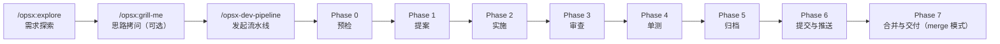
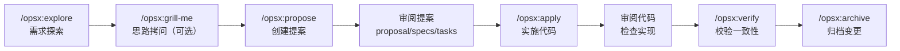
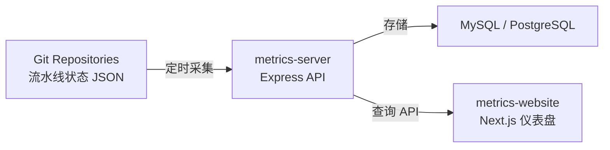

# opsx-dev-pipeline 实践指南

> 面向实际使用者，从零到一的操作指引。涵盖 CLI 初始化、流水线使用、metrics-server 部署、指标解读与进阶配置。
>
> 官网地址：[https://opsx.dsx.plus](https://opsx.dsx.plus/)

---

## 一、快速开始

### 1.1 环境准备

**前置依赖：**

- **Node.js 20+** — 运行 CLI 和服务端
- **OpenSpec CLI 1.6.0+** — 规范驱动开发的基础工具

```bash
# 安装 OpenSpec CLI
npm install -g @fission-ai/openspec@latest
openspec --version  # 确认版本 >= 1.6.0
```

### 1.2 初始化项目

```bash
# 进入你的项目目录
cd my-project

# 交互式初始化（推荐首次使用）
npx opsx-dev-pipeline@latest init
```

交互模式会引导你选择：

1. **AI 工具**：Claude Code / Cursor / Codex
2. **项目类型**：Frontend（React+Vite）或 Backend（Spring Boot）
3. **文档语言**：中文 / 英文

**非交互模式（适合 CI/CD）：**

```bash
# Claude Code + 后端项目
npx opsx-dev-pipeline init --tool claude --stack backend --yes

# Cursor + 前端项目
npx opsx-dev-pipeline init --tool cursor --stack frontend --yes

# 预览将要生成的文件（不实际写入）
npx opsx-dev-pipeline init --tool claude --stack backend --yes --dry-run
```

**初始化后的项目结构：**

```
my-project/
├── .claude/
│   ├── skills/opsx-dev-pipeline/    # 流水线 Skill bundle
│   │   ├── SKILL.md
│   │   ├── references/
│   │   │   ├── phase-0.md ~ phase-6.md
│   │   │   └── pipeline-state-fields.md
│   │   └── scripts/
│   │       └── dev-pipeline-state.mjs
│   └── commands/
│       └── opsx-dev-pipeline.md     # 流水线入口命令
├── openspec/
│   ├── config.yaml                  # 项目配置
│   └── schemas/backend/            # 后端 Schema 模板
│       ├── schema.yaml
│       └── templates/
│           ├── proposal.md
│           ├── design.md
│           ├── spec.md
│           └── tasks.md
├── CLAUDE.md                        # AI Agent 指令
└── package.json                     # 包含 opsxDevPipeline manifest
```


## 二、日常使用


### 2.1 常用命令


| 命令                   | 用途      | 说明                                   |
| -------------------- | ------- | ------------------------------------ |
| `/opsx-dev-pipeline` | 启动完整流水线 | 基于探索结论，从 Phase 0 到 Phase 7 全流程       |
| `/opsx:explore`      | 需求探索    | 在正式创建变更前，深入理解需求、分析现有代码、评估技术方案        |
| `/opsx:grill-me`     | 思路拷问    | 对需求方案进行深度拷问，逐一排查决策分支、发现盲区，验证思路是否完备  |
| `/opsx:propose`      | 创建变更提案  | 生成 proposal + specs + design + tasks |
| `/opsx:apply`        | 按任务实施   | 逐条实施 tasks.md 中的任务                   |
| `/opsx:verify`       | 校验一致性   | 检查实现与规范的匹配度                          |
| `/opsx:archive`      | 归档变更    | Delta Specs 合并到主 Specs               |


### 2.2 推荐工作流：先探索，再开发

无论选择哪种模式，都建议先执行 `/opsx:explore` 进行需求探索。

**为什么先探索？**

- **减少返工**：探索阶段分析现有代码结构、技术可行性和影响范围，避免提案阶段方向性错误
- **提升提案质量**：AI 带着探索结论进入 Phase 1，生成的 proposal/specs/design 更精准
- **降低审查轮次**：充分的上下文理解让 AI 在 Phase 2 写出更符合项目规范的代码
- **不创建变更**：探索阶段不创建正式的 OpenSpec change，可以放心大胆地调研

**探索阶段 AI 会做什么：**

1. 分析现有代码库中相关模块的结构和数据模型
2. 调研技术方案的最佳实践和边界情况
3. 评估与现有功能的兼容性和影响范围
4. 输出探索结论，为后续提案提供充分上下文

**探索之后，不确定方案是否完备？**

当你面对以下情况时，建议在探索后追加 `/opsx:grill-me` 进行思路拷问：

- 需求本身不够清晰，需要梳理想法
- 担心方案有遗漏的边界情况或盲区
- 技术选型或架构设计需要多角度推敲
- 想确认自己"没想漏什么"

**拷问阶段 AI 会做什么：**

1. 逐一追问每个决策分支的依赖关系和约束条件
2. 从安全、性能、可维护性、兼容性等维度挑战你的方案
3. 帮你发现"没想到的问题"，而不是替你决策
4. 最终达成共识，输出一份经得起推敲的方案

> `/opsx:grill-me` 不会创建任何变更，只是一个纯粹的思维碰撞环节。考问完成后再进入提案，方案质量会显著提升。

---


#### 模式一：完整流水线模式（一键式）

适合需求明确、变更范围清晰的场景，一条命令走完 Phase 0-7 全流程。




**优点：** 自动化程度高，适合标准化的功能开发，减少人工干预。

**完整示例：**

```bash
# 第一步：需求探索 — 在正式创建变更前，先深入理解需求
/opsx:explore "给 Todo 添加 dueDate 字段和过期提醒功能"

# 探索阶段 AI 会：
# - 分析现有代码库中 Todo 模块的结构和数据模型
# - 调研 dueDate 字段的最佳实践和边界情况
# - 评估过期提醒的技术方案（定时任务 vs 查询时判断）
# - 确认与现有功能的兼容性和影响范围
# - 输出探索结论，为后续提案提供充分上下文

# 第二步（可选）：思路拷问 — 对方案进行深度推敲，发现盲区
/opsx:grill-me

# 拷问阶段 AI 会逐一追问每个决策分支，帮你发现"没想到的问题"
# 确认方案完备后，再进入流水线

# 第三步：基于探索结论（和拷问结果），启动完整流水线
/opsx-dev-pipeline "基于刚才的探索结果，给 Todo 添加 dueDate 字段和过期提醒功能"

# 流水线会自动执行：
# Phase 0: 检查环境（OpenSpec 版本、Git 仓库状态、依赖完整性）
# Phase 1: AI 基于探索结论生成 proposal.md + spec.md + design.md + tasks.md
#          你确认提案内容后继续
# Phase 2: AI 按 tasks.md 逐条实现代码
#          你确认实施结果后继续
# Phase 3: AI 从 5 个维度审查代码
#          发现问题自动修复（最多 3 轮）
# Phase 4: 运行单元测试
#          失败则自动修复重试（最多 3 次）
# Phase 5: 归档变更，Delta Specs 合并到主规范
# Phase 6: commit → source push
# Phase 7: merge → verify → target push（仅 merge 模式）
```

流水线在每个决策点暂停等待你确认。

---


#### 模式二：分步骤模式（手动推进）

适合需要精细控制每个阶段的场景——你可以逐步审查每个阶段的产出，确认无误后再进入下一阶段。




**分步命令对照：**


| 步骤    | 命令                          | 产出                                        | 对应流水线阶段        |
| ----- | --------------------------- | ----------------------------------------- | -------------- |
| 1. 探索 | `/opsx:explore "需求"`        | 探索结论（代码分析、方案评估）                           | Explore        |
| 2. 拷问 | `/opsx:grill-me`（可选）       | 思路拷问与方案推敲，发现盲区、验证完备性                      | Grill          |
| 3. 提案 | `/opsx:propose "基于探索结论的需求"` | proposal.md, spec.md, design.md, tasks.md | Phase 1        |
| 4. 实施 | `/opsx:apply`               | 代码变更，任务逐条勾选完成                             | Phase 2        |
| 5. 校验 | `/opsx:verify`              | 一致性检查报告                                   | Phase 5 verify |
| 6. 归档 | `/opsx:archive`             | Delta Specs 合并到主规范                        | Phase 5        |


**完整示例：**

```bash
# 步骤 1：需求探索 — 理解需求，分析现有代码
/opsx:explore "给 Todo 添加 dueDate 字段和过期提醒功能"

# AI 输出探索结论：
# - Todo 数据模型位于 src/models/todo.ts，当前有 title/status/createdAt 字段
# - 建议 dueDate 使用 ISO 8601 格式，过期判断在查询时做而非定时任务
# - 需要修改 Todo 模型、API 接口、前端表单 3 个模块
# - 无兼容性风险，现有测试 12 个

# 步骤 2（可选）：思路拷问 — 对探索结论进行深度推敲
/opsx:grill-me

# AI 会逐条追问：
# - "过期时间用 UTC 还是用户本地时区？如果用户跨时区呢？"
# - "当 Todo 同时有 dueDate 和 reminder 时，哪个优先？"
# - "过期提醒的触发时机是什么？每次查询时判断还是定时任务？"
# - "是否需要考虑重复任务（recurring tasks）的场景？"
# 每个问题等你回答后再继续，直到没有遗漏

# 步骤 3：创建提案 — 基于探索结论和拷问结果生成规范
/opsx:propose "基于探索结论，给 Todo 添加 dueDate 字段和过期提醒功能"

# AI 生成：
# - openspec/changes/add-due-date/proposal.md   — 需求背景和技术方案
# - openspec/changes/add-due-date/spec.md       — 验收场景（WHEN/THEN 格式）
# - openspec/changes/add-due-date/design.md     — 设计决策
# - openspec/changes/add-due-date/tasks.md      — 实施任务清单
# 审阅这些文件，确认无误后进入下一步

# 步骤 4：实施代码 — 按 tasks.md 逐条实现
/opsx:apply

# AI 按 tasks.md 中的 checkbox 逐条实施：
# - [x] 1.1 Todo 模型添加 dueDate 字段
# - [x] 1.2 更新 API 接口参数校验
# - [x] 2.1 添加过期判断逻辑
# - [x] 2.2 前端表单添加日期选择器
# - [x] 3.1 更新单元测试
# 每完成一个任务自动勾选，实施完成后审阅代码变更

# 步骤 5：校验一致性 — 确认实现与规范匹配
/opsx:verify

# AI 运行 openspec validate，检查：
# - 代码实现是否满足 spec.md 中的所有 Scenario
# - Delta Specs 格式是否正确
# - 是否有遗漏的变更

# 步骤 6：归档变更 — 将 Delta Specs 合并到主规范
/opsx:archive

# AI 执行：
# - Delta Specs 合并到 openspec/specs/
# - 变更信息永久归档
# - 之后可以手动 commit → push → merge
```

**优点：** 每个阶段你都可以详细审阅产出物，发现问题及时修正，适合复杂需求或对质量要求高的场景。

**两种模式对比：**


| 维度   | 完整流水线模式    | 分步骤模式       |
| ---- | ---------- | ----------- |
| 适合场景 | 标准化功能、需求明确 | 复杂需求、需要精细控制 |
| 人工干预 | 决策点确认      | 每个阶段间可审阅修改  |
| 灵活性  | 低（按固定流程推进） | 高（可跳转、可回退）  |
| 效率   | 高（自动化程度高）  | 中（需要逐步推进）   |
| 学习成本 | 低（一条命令）    | 中（需了解各命令作用） |


### 2.4 暂停与恢复

**暂停流水线：**

在任意阶段，你可以主动暂停流水线。AI 会在暂停时记录原因：

```
流水线已暂停。
原因：需要等待后端 API 接口文档更新
状态文件：openspec/.pipeline-state/add-due-date.json
```

**恢复流水线：**

再次运行 `/opsx-dev-pipeline`，系统会自动检测待恢复的变更：

- 读取状态文件，定位暂停点
- 并行核对：OpenSpec change 状态 + Git 分支状态 + 任务完成度
- 如果状态与事实不一致，暂停并列出差异供你决策
- 恢复后从断点继续，不重复执行已完成阶段

**自动暂停触发条件：**


| 条件            | 说明         |
| ------------- | ---------- |
| 3 次审查修复仍未通过   | 可能需求或设计有问题 |
| 3 次测试尝试失败     | 需要人工介入分析   |
| 3 次 verify 失败 | 实现与规范不一致   |
| 状态与 Git 事实不一致 | 避免数据损坏     |


### 2.5 常见问题排查

**Q: 我需要安装什么才能用？**

两个东西：Node.js 20+ 和 OpenSpec CLI。然后一条命令就完成初始化：

```bash
npm install -g @fission-ai/openspec@latest
npx opsx-dev-pipeline@latest init
```

初始化后，流水线的所有脚本运行在 Node.js 上，不再需要额外依赖。

---

**Q: 我已经有一个项目了，还能用吗？**

能。`opsx-dev-pipeline init` 可以安装到任意已有项目目录。已有文件默认不会被覆盖（除非你用 `--force`），`.gitignore` 这类可追加文件会智能合并。

---


#### AI 工具

**Q: 我必须用 Claude Code 吗？Cursor 和 Codex 能用吗？**

三个都支持。初始化时选你常用的：

```bash
npx opsx-dev-pipeline init --tool claude   # Claude Code
npx opsx-dev-pipeline init --tool cursor  # Cursor
npx opsx-dev-pipeline init --tool codex   # Codex (OpenAI)
```

一套流水线逻辑，三种工具的原生体验。后续新增 AI 工具，升级 CLI 版本即可获得。

---

**Q: 这和直接在 Claude Code 里写 prompt 有什么区别？**

在聊天框里写 prompt，AI 只看到你当前的问题。它不知道你的项目规范、不记得上次变更改了什么、也不会主动跑测试。

opsx-dev-pipeline 给 AI 装了一套工程框架：它知道要先写 proposal 对齐需求、知道 spec 在哪里、知道变更完要跑测试、知道敏感文件不能提交。**不是更好的 prompt，而是让 prompt 跑在一个有约束的系统里。**

---

#### 流水线工作流

**Q: 8 个 Phase 是强制的吗？我能跳过某个阶段吗？**

部分可以。Phase 3（审查）和 Phase 4（单测）都有"跳过"选项，但每次跳过都是一次显式决策，会被记录在状态文件里。Phase 1（提案）和 Phase 5（归档）不可跳过——前者是"为什么做"的根基，后者是"做完了别失忆"的保障。

---

**Q: 流水线跑一半断了怎么办？**

这正是状态机存在的原因。每次中断都会写 `openspec/.pipeline-state/<change>.json`。重新触发流水线时，它会读取状态文件，交叉校验 Git 分支和文件系统的事实，然后从断点继续。你不需要从头来过。

---

**Q: 审查修复循环最多 3 轮——为什么是 3 轮？**

3 轮后还没通过，通常意味着需求本身有问题或者方案需要重新设计，而不是"再改一行"。此时强制暂停、呼叫人工介入，比无限循环更高效。如果你确实需要更多轮次，可以手动重置计数继续。

---

**Q: 我能自定义每个 Phase 的行为吗？**

可以，但是不建议。每个 Phase 的详细行为定义在 `references/` 目录下的 Markdown 文件中，你可以直接编辑。`openspec/config.yaml` 中的 `rules` 和 `stack.verify` 字段可以配置项目的测试命令、验证脚本和构建步骤。更深度定制通过 `sync` 和 `upgrade` 机制管理。

---


#### 技术栈

**Q: 只有 React 和 Spring Boot 两种栈？我能用 Vue 或 Django 吗？**

当前内置两套模板。但它们本质上是 OpenSpec schema + 规范模板 + 上下文配置的组合。你可以：

1. 选择最接近的内置栈（比如用 `backend` 覆盖大部分 Java/API 场景）
2. 编辑 `openspec/config.yaml` 中的 `context` 和 `rules` 适配你的实际技术栈
3. 自定义 schema 模板来匹配你的框架约定

---

**Q: 我同时有前端和后端，选哪个？**

`init` 时只能选一个主栈，但 `openspec/config.yaml` 支持多栈配置。初始化后再手动添加第二个栈的 schema 和 config，`doctor --stack` 可以校验多服务配置的完整性。

---

#### 安全与信任

**Q: 流水线会自动拒绝哪些操作？**

- `git add -A`（全量暂存）— 必须逐文件显式 `git add`
- `git push --force`（强制推送）— 直接禁用
- `git branch -D`（强制删分支）— 只允许 `-d`（安全删除）
- 敏感文件提交 — `.env`、`*.key`、`*.pem`、`credentials.json` 等会被自动检测并警告
- 合并时的全局 `--ours` / `--theirs` — 必须逐文件解决冲突

---

**Q: 如果我确实需要 force push 怎么办？**

在流水线之外手动操作。opsx-dev-pipeline 的 Phase 6 和 Phase 7 不会替你执行这些操作，但也不会阻止你在终端里自己执行。它只是确保 AI Agent 不会在自动化流程中执行破坏性命令。

---

**Q: opsx-dev-pipeline 会上传我的代码吗？**

不会。所有逻辑在你本地运行，状态文件存在你的 Git 仓库里。不依赖任何远程服务，不需要 API Key，不发送任何数据到外部。

---


#### 与其他方案对比

**Q: 和裸用 OpenSpec 有什么区别？**

OpenSpec 提供了核心的 spec 管理和 CLI 工具。opsx-dev-pipeline 在它之上构建了：

- **完整的 8 阶段门禁流程**（OpenSpec 本身不强制 Phase 顺序和决策点）
- **持久化状态机**（OpenSpec 不记录"流水线跑到哪了"）
- **AI Tool 适配**（OpenSpec 需要你手动配置 skills/commands，pipeline 一条命令完成）
- **安全交付门禁**（敏感文件检测、Git 操作约束是 pipeline 独有的）

可以理解为：OpenSpec 是引擎，opsx-dev-pipeline 是装好方向盘、刹车和安全带的整车。

---


## 三、指标观测系统

opsx-dev-pipeline 提供了一个完整的指标观测系统（opsx-metrics-server + opsx-metrics-website），帮助量化团队使用 AI 流水线的效能。

### 3.1 系统概览




### 3.2 核心功能


| 功能        | 说明                                                      |
| --------- | ------------------------------------------------------- |
| **自动采集**  | 定时从 Git 仓库采集 `openspec/.pipeline-state/*.json` 文件，解析并入库 |
| **防篡改验证** | RSA-OAEP 非对称加密签名验证，确保指标数据来自可信的流水线执行                     |
| **个人仪表盘** | 查看个人的周期时间、完成率、审查通过率、Phase 耗时分布                          |
| **团队面板**  | 团队整体效能趋势、成员对比、瓶颈识别                                      |
| **管理后台**  | 仓库管理、团队管理、组织同步、采集作业控制                                   |


### 3.3 关键指标


| 指标类别         | 典型指标                        |
| ------------ | --------------------------- |
| **周期时间**     | 平均/中位/P95 周期时间、有效周期时间（排除暂停） |
| **完成质量**     | 完成率、放弃率、逾期率（超 30 天未完成）      |
| **审查效率**     | 平均审查轮次、一次审查通过率              |
| **测试效率**     | 测试首次通过率、平均测试尝试次数            |
| **Phase 耗时** | 各阶段 P50/P95 耗时分布，识别瓶颈阶段     |


指标数据可帮助团队发现流程瓶颈、评估 AI 辅助开发的实际效果，并驱动持续改进。

## 附录：常用命令速查


#### 流水线命令：


| 命令                   | 说明                 |
| -------------------- | ------------------ |
| `/opsx:explore`      | 需求探索（先探索，再开发）      |
| `/opsx:grill-me`     | 思路拷问（探索后可选，推敲方案完备性） |
| `/opsx-dev-pipeline` | 启动完整流水线（Phase 0-7） |
| `/opsx:propose`      | 创建变更提案             |
| `/opsx:apply`        | 按任务实施              |
| `/opsx:verify`       | 校验一致性              |
| `/opsx:archive`      | 归档变更               |


#### 各 Phase 操作要点


| Phase | 名称   | AI 操作                                                                                                              | 决策点                                         | 产出物                                       |
| ----- | ---- | ------------------------------------------------------------------------------------------------------------------ | ------------------------------------------- | ----------------------------------------- |
| 0     | 预检   | 检查 OpenSpec 版本、Git 仓库状态、config.yaml 完整性；检测未完成的变更；加载 `/opsx:explore` 探索结论作为上下文                                      | 确认入口类型（新需求 / 恢复中断 / 继续现有变更）                 | 环境检查报告                                    |
| 1     | 提案   | 生成 `proposal.md`（需求背景、技术方案、影响范围、风险评估）、`spec.md`（`#### Scenario:` 验收场景）、`design.md`（设计决策）、`tasks.md`（checkbox 任务清单） | **决策点 1a/1**：确认提案内容，或补充修改后重新生成              | proposal.md, spec.md, design.md, tasks.md |
| 2     | 实施   | 按 tasks.md 中的 checkbox 列表逐条实施，每完成一个任务自动勾选 `- [x]`，变更记录到 `openspec/.pipeline-state/<changeName>.json`               | **决策点 2**：确认实施结果，决定进入审查 / 跳过审查 / 回退提案       | 代码变更，状态文件更新                               |
| 3     | 审查   | 从 5 个维度自审（正确性、安全性、性能、可维护性、规范符合度），发现问题自动修复后重新审查，最多 3 轮修复循环                                                          | **决策点 3**：确认审查通过，或继续修复                      | 审查报告，修复记录                                 |
| 4     | 单测门禁 | 运行项目配置的测试命令，失败自动修复重试（最多 3 次）                                                                                       | **决策点 4**：确认测试通过，或跳过（`skipTests`）           | 测试结果                                      |
| 5     | 归档   | `openspec validate` 校验一致性，Delta Specs 自动合并到主 Specs，变更信息永久记录                                                        | **决策点 5**：选择归档后动作（仅推送 / 合并到目标分支）            | Delta Specs 合并，归档记录                       |
| 6     | 交付   | 自动 commit（含变更摘要）、Push 到远程仓库、可选本地 merge 到目标分支、敏感文件自动扫描、禁止 force push 和破坏性操作                                         | **决策点 7**：确认合并策略（standard / squash / no-ff） | Commit, Push, Merge（可选）                   |


#### CLI 命令：


| 命令                                                               | 说明          |
| ---------------------------------------------------------------- | ----------- |
| `npx opsx-dev-pipeline init`                                     | 交互式初始化      |
| `npx opsx-dev-pipeline init --tool claude --stack backend --yes` | 非交互初始化      |
| `npx opsx-dev-pipeline init --dry-run`                           | 预览安装        |
| `npx opsx-dev-pipeline sync`                                     | 同步托管文件      |
| `npx opsx-dev-pipeline upgrade`                                  | 升级模板        |
| `npx opsx-dev-pipeline doctor`                                   | 诊断安装状态      |
| `npx opsx-dev-pipeline uninstall`                                | 卸载          |
| `npx opsx-dev-pipeline list-tools`                               | 列出 AI 工具适配器 |
