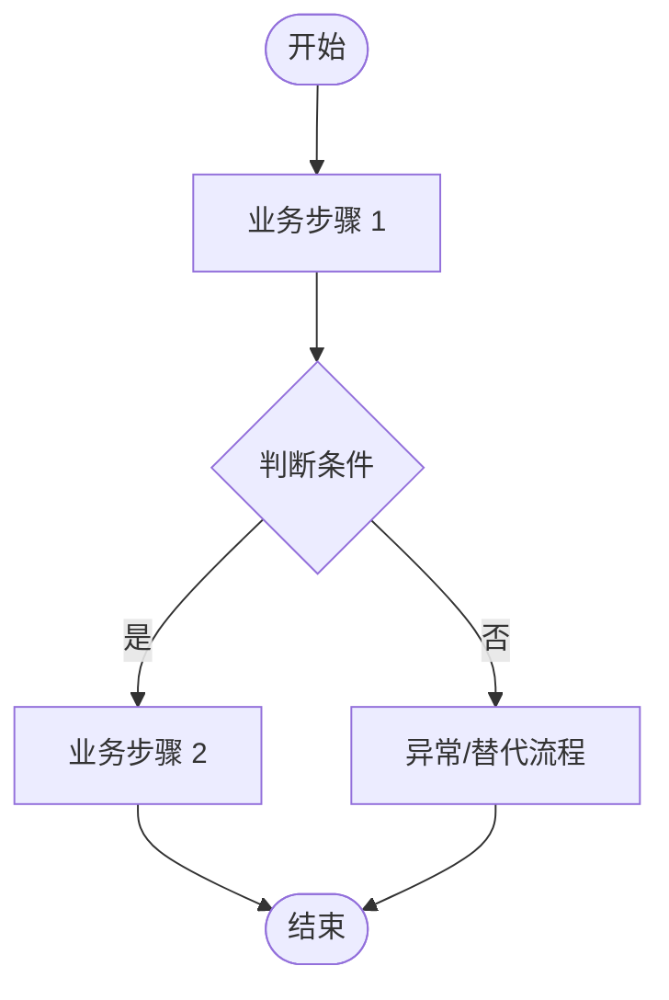
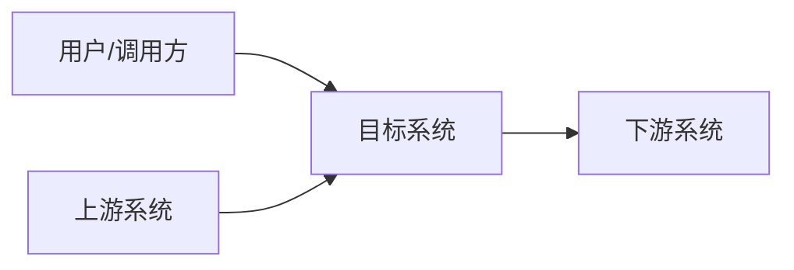
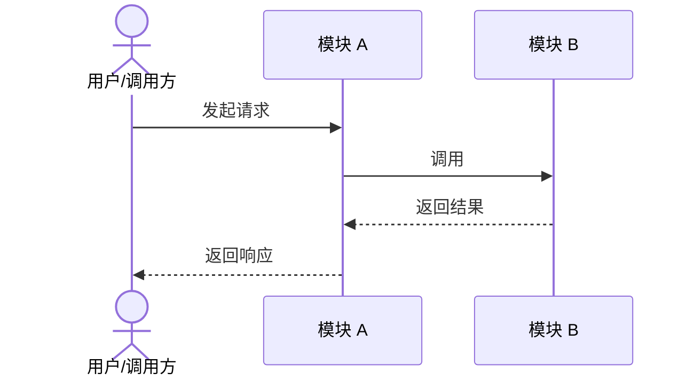
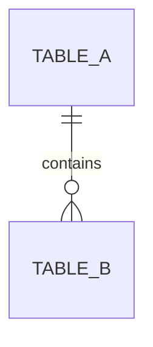

# {项目/需求名称} 系统分析与设计说明书（精简版）

<!--
适用范围：中小型需求、单系统/单模块改造、技术方案复杂度较低的项目。
填写原则：只保留与本次变更相关的内容；无关章节填写“不涉及”或直接删除。
-->

## 文档信息

| 项目 | 内容 |
| --- | --- |
| 需求/项目编号 | {填写} |
| 所属系统/模块 | {填写} |
| 作者/评审人 | {填写} |
| 文档版本 | 0.1 |
| 更新时间 | YYYY-MM-DD |

## 1. 项目概述

### 1.1 背景

<!-- 简述现状、问题和本次变更原因。 -->

{填写}

### 1.2 目标与范围

**业务目标**

- {填写：尽量包含可验证的指标}

**系统目标**

- {填写：性能、稳定性、能力建设等目标}

**本期范围**

- {填写}

**非本期范围**

- {填写}

### 1.3 相关资料

| 资料 | 地址/编号 |
| --- | --- |
| PRD | {填写} |
| 原型/UI 稿 | {填写或不涉及} |
| 其他资料 | {填写或无} |

## 2. 需求与业务分析

### 2.1 角色与用例

| 角色 | 核心用例 | 权限/边界 |
| --- | --- | --- |
| {填写} | {填写} | {填写} |

### 2.2 核心业务流程



### 2.3 需求清单

| 编号 | 功能/需求 | 优先级 | 验收标准 |
| --- | --- | --- | --- |
| FR-001 | {填写} | P0 / P1 / P2 | {填写} |

### 2.4 约束与依赖

| 类型 | 内容 | 影响/处理方式 |
| --- | --- | --- |
| 约束 / 假设 / 外部依赖 | {填写} | {填写} |

## 3. 总体设计

### 3.1 系统与应用关系

<!-- 展示本系统与用户、上游、下游及外部服务的关系。 -->



### 3.2 模块设计

| 模块 | 职责 | 输入/输出 | 依赖 |
| --- | --- | --- | --- |
| {填写} | {填写} | {填写} | {填写} |

### 3.3 关键方案与决策

| 设计项 | 方案 | 选择理由 | 影响/风险 |
| --- | --- | --- | --- |
| {填写} | {填写} | {填写} | {填写} |

## 4. 详细设计

<!-- 按业务模块复制本节。 -->

### 4.1 {模块名称}

#### 4.1.1 处理说明

<!-- 描述模块职责、核心规则、关键分支以及正常和异常处理。 -->

{填写}

#### 4.1.2 调用时序



#### 4.1.3 状态与关键规则（可选）

| 当前状态/条件 | 触发事件 | 处理结果 | 下一状态/异常处理 |
| --- | --- | --- | --- |
| {填写} | {填写} | {填写} | {填写} |

#### 4.1.4 事务与异常处理

| 关注点 | 设计说明 |
| --- | --- |
| 事务边界 | {填写或不涉及} |
| 并发/锁 | {填写或不涉及} |
| 幂等/重复处理 | {填写或不涉及} |
| 超时/重试/补偿 | {填写或不涉及} |

## 5. 接口设计

### 5.1 接口清单

| 接口名称 | 方法与地址 | 提供方 | 消费方 | 变更类型 |
| --- | --- | --- | --- | --- |
| {填写} | `POST /api/example` | {填写} | {填写} | 新增 / 修改 / 删除 |

### 5.2 {接口名称}

| 项目 | 内容 |
| --- | --- |
| 用途 | {填写} |
| 认证与权限 | {填写} |
| 幂等与超时 | {填写} |
| 兼容性说明 | {填写} |

**请求参数**

| 字段 | 位置 | 类型 | 必填 | 说明/校验 |
| --- | --- | --- | --- | --- |
| {填写} | path / query / header / body | {填写} | 是 / 否 | {填写} |

**响应参数**

| 字段 | 类型 | 是否可空 | 说明 |
| --- | --- | --- | --- |
| {填写} | {填写} | 是 / 否 | {填写} |

**请求/响应示例**

```json
{
  "exampleField": "exampleValue"
}
```

**错误码**

| 状态码/错误码 | 含义 | 触发条件 |
| --- | --- | --- |
| {填写} | {填写} | {填写} |

## 6. 数据设计

### 6.1 数据模型

<!-- 按需补充 ER 图；没有数据库变更时填写“不涉及”。 -->



### 6.2 表结构变更

| 表名 | 字段/索引 | 变更类型 | 变更说明 | 兼容/迁移方式 |
| --- | --- | --- | --- | --- |
| {填写} | {填写} | 新增 / 修改 / 删除 | {填写} | {填写} |

```sql
-- 填写数据库变更脚本；生产执行脚本应独立存放并经过审核。
```

## 7. 质量与运维设计

| 关注点 | 目标/风险 | 设计与验证方式 |
| --- | --- | --- |
| 性能与容量 | {填写} | {填写} |
| 安全与权限 | {填写} | {填写} |
| 可用性与降级 | {填写} | {填写} |
| 数据一致性 | {填写} | {填写} |
| 日志、监控与告警 | {填写} | {填写} |

## 8. 测试、发布与回滚

### 8.1 测试与验收

| 测试类型/场景 | 覆盖内容 | 通过标准 |
| --- | --- | --- |
| 单元/集成/业务验收 | {填写} | {填写} |

### 8.2 发布与回滚

| 项目 | 内容 |
| --- | --- |
| 发布步骤 | {填写} |
| 灰度/开关策略 | {填写或不涉及} |
| 发布验证 | {填写} |
| 回滚条件与步骤 | {填写} |
| 数据回滚/修复 | {填写或不涉及} |

## 9. 风险与排期

### 9.1 风险与待确认事项

| 事项 | 影响 | 处理方案/结论 | 责任人 | 状态 |
| --- | --- | --- | --- | --- |
| {填写} | {填写} | {填写} | {填写} | 待确认 / 已关闭 |

### 9.2 研发排期

| 模块/任务 | 依赖项 | 负责人 | 工作量（人日） | 完成日期 |
| --- | --- | --- | --- | --- |
| {填写} | {填写} | {填写} | {填写} | YYYY-MM-DD |

## 附录：评审检查清单

- [ ] 目标、范围、需求和验收标准清晰。
- [ ] 系统边界、模块职责及上下游依赖明确。
- [ ] 核心流程、异常流程和关键技术方案完整。
- [ ] 接口、数据变更和兼容策略可实施。
- [ ] 性能、安全、稳定性和可观测性已评估。
- [ ] 测试、发布、回滚、风险和责任人已明确。

