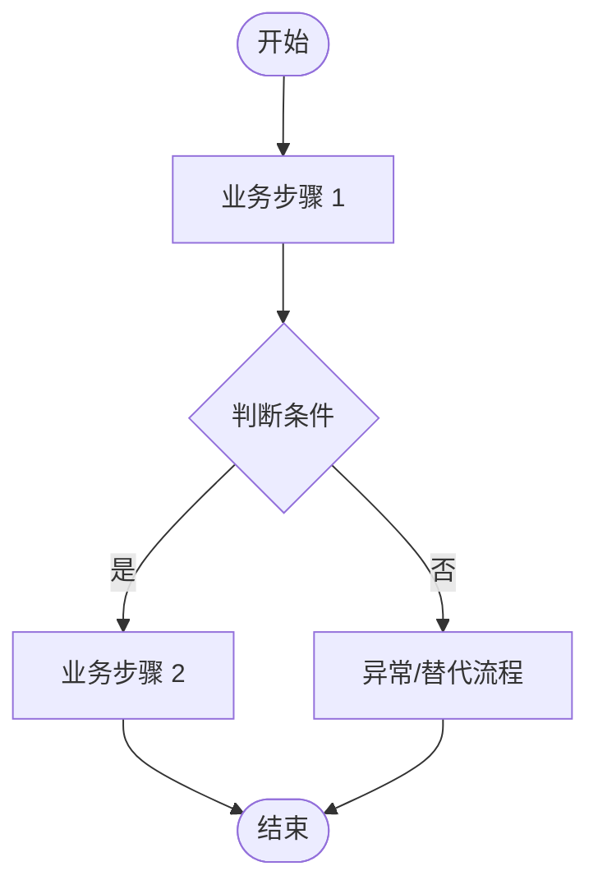
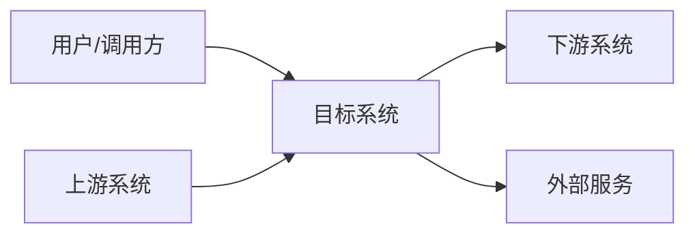
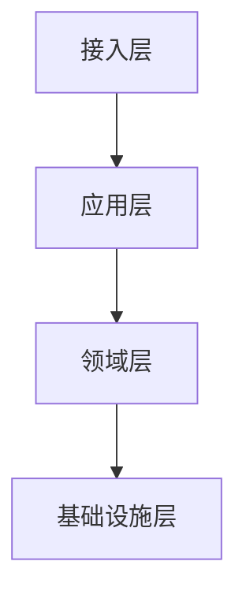
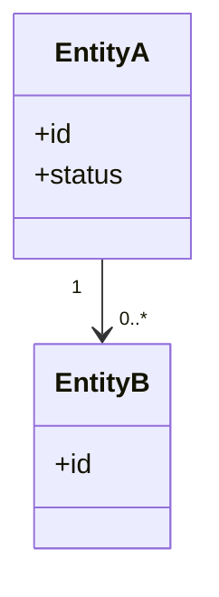
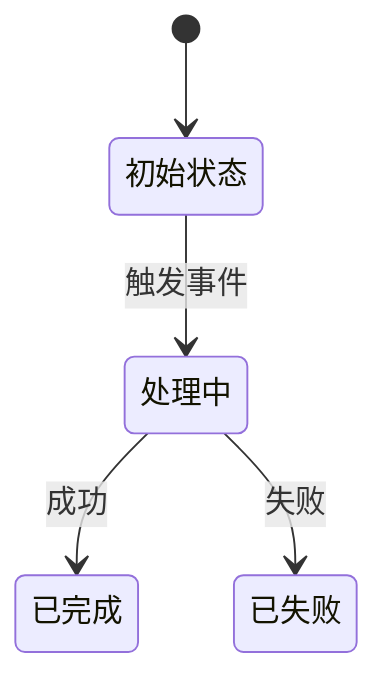
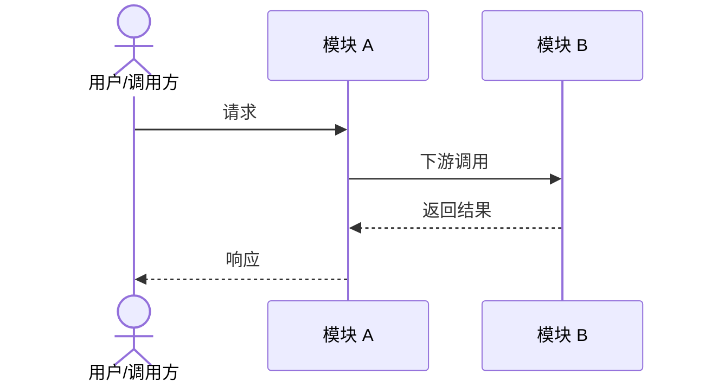
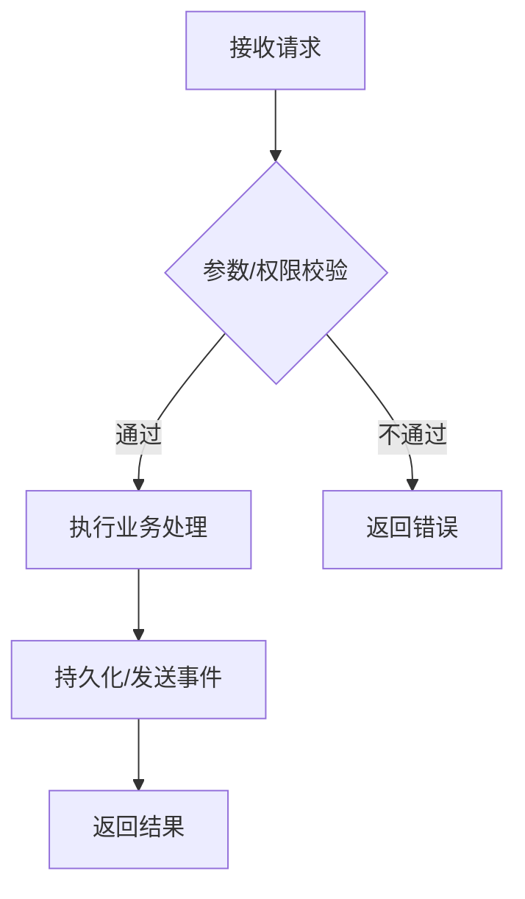
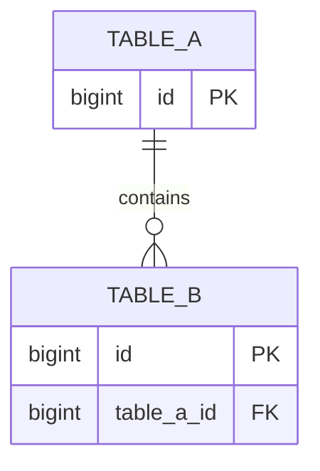

# {项目/需求名称} 系统分析与设计说明书

<!--
使用说明：
1. 本模板适用于新系统、存量系统改造、跨系统需求和重点技术改造。
2. 标注“可选”的章节按项目复杂度保留；无相关内容时填写“不涉及”并说明原因，或删除该章节。
3. 结论、约束和指标应可验证，避免使用“尽量”“较高”“较快”等模糊表述。
4. 图表推荐使用 Mermaid、PlantUML 或团队统一制图工具，并附必要的文字说明。
5. 发布前删除本注释及其他填写提示。
-->

## 文档信息

| 项目 | 内容 |
| --- | --- |
| 文档名称 | {填写：项目/需求名称} 系统分析与设计说明书 |
| 需求/项目编号 | {填写} |
| 所属系统/业务域 | {填写} |
| 文档状态 | 草稿 / 评审中 / 已定稿 / 已归档 |
| 作者 | {填写} |
| 评审人 | {填写} |
| 创建日期 | YYYY-MM-DD |
| 最后更新日期 | YYYY-MM-DD |

### 版本记录

| 版本 | 变更说明 | 作者 | 日期 |
| --- | --- | --- | --- |
| 0.1 | 初稿 | {填写} | YYYY-MM-DD |

### 评审记录

| 评审轮次 | 评审结论 | 评审人 | 遗留问题 | 日期 |
| --- | --- | --- | --- | --- |
| 1 | 通过 / 有条件通过 / 不通过 | {填写} | {填写或无} | YYYY-MM-DD |

## 1. 项目概述

### 1.1 背景与现状

<!-- 说明业务背景、现状、痛点、触发原因，以及为什么现在需要建设或变更。必要时附现状图和数据。 -->

{填写}

### 1.2 建设目标

#### 1.2.1 业务目标

| 目标 | 衡量指标 | 当前基线 | 目标值 | 验证方式 |
| --- | --- | --- | --- | --- |
| {填写} | {填写} | {填写} | {填写} | {填写} |

#### 1.2.2 系统目标

| 目标 | 衡量指标 | 当前基线 | 目标值 | 验证方式 |
| --- | --- | --- | --- | --- |
| {填写} | {填写} | {填写} | {填写} | {填写} |

### 1.3 范围

**本期范围**

- {填写：本期包含的业务、系统、模块或用户范围}

**非本期范围**

- {填写：明确不包含的内容及原因}

### 1.4 相关方与职责

| 角色/团队 | 职责 | 关注点 | 联系人 |
| --- | --- | --- | --- |
| {填写} | {填写} | {填写} | {填写} |

### 1.5 术语与缩略语

| 术语/缩写 | 定义 |
| --- | --- |
| {填写} | {填写} |

### 1.6 参考资料

| 资料 | 地址/编号 | 版本 | 说明 |
| --- | --- | --- | --- |
| PRD | {填写} | {填写} | {填写} |
| 原型/UI 稿 | {填写} | {填写} | {填写} |
| 相关技术文档 | {填写} | {填写} | {填写} |

## 2. 需求与业务分析

### 2.1 业务角色与用例

<!-- 列出所有参与角色、目标、权限边界和主要行为，避免遗漏功能点。 -->

| 角色 | 角色说明 | 主要用例 | 权限边界 |
| --- | --- | --- | --- |
| {填写} | {填写} | {填写} | {填写} |


### 2.2 核心业务流程

<!-- 描述正常主流程、关键分支和参与系统；复杂场景可按流程分别绘制。 -->



### 2.3 功能需求清单

| 需求编号 | 功能/能力 | 需求说明 | 优先级 | 验收标准 | 关联模块 |
| --- | --- | --- | --- | --- | --- |
| FR-001 | {填写} | {填写} | P0 / P1 / P2 | {填写} | {填写} |

### 2.4 非功能需求

| 类别 | 指标/约束 | 目标值 | 验证方式 |
| --- | --- | --- | --- |
| 性能 | 响应时间 / 吞吐量 / 并发量 | {填写} | {填写} |
| 可用性 | SLA / RTO / RPO | {填写} | {填写} |
| 安全 | 身份认证 / 授权 / 数据保护 | {填写} | {填写} |
| 可扩展性 | 容量增长 / 横向扩展 | {填写} | {填写} |
| 兼容性 | 客户端 / 接口 / 数据兼容 | {填写} | {填写} |
| 可维护性 | 日志 / 监控 / 配置 / 文档 | {填写} | {填写} |

### 2.5 假设、约束与依赖

| 类型 | 内容 | 影响 | 应对措施/责任人 |
| --- | --- | --- | --- |
| 假设 / 约束 / 依赖 | {填写} | {填写} | {填写} |

## 3. 总体架构设计

### 3.1 设计原则

- {填写：本方案遵循的业务和技术原则}

### 3.2 系统上下文

<!-- 展示目标系统、用户、上游、下游和外部系统的边界与关系。 -->



### 3.3 应用与模块架构

<!-- 说明应用分层、模块边界、职责和依赖方向；新建、拆分、合并应用时必须填写。 -->



| 应用/模块 | 职责 | 输入 | 输出 | 依赖 |
| --- | --- | --- | --- | --- |
| {填写} | {填写} | {填写} | {填写} | {填写} |

### 3.4 部署架构（可选）

<!-- 描述部署单元、网络区域、运行环境、存储和中间件，以及高可用和容灾关系。 -->

{填写或不涉及}

### 3.5 技术选型与关键决策

| 决策项 | 选定方案 | 候选方案 | 选择理由 | 影响 |
| --- | --- | --- | --- | --- |
| {填写} | {填写} | {填写} | {填写} | {填写} |

## 4. 领域与数据设计

### 4.1 领域划分

<!-- 描述业务域、子域、聚合和边界上下文，以及上下游协作关系。 -->

| 领域/子域 | 核心职责 | 关键能力 | 边界/依赖 |
| --- | --- | --- | --- |
| {填写} | {填写} | {填写} | {填写} |

### 4.2 领域模型



| 实体/值对象 | 含义 | 核心属性 | 关键规则 |
| --- | --- | --- | --- |
| {填写} | {填写} | {填写} | {填写} |

### 4.3 状态机（可选）



| 当前状态 | 触发事件 | 前置条件 | 下一状态 | 副作用/补偿 |
| --- | --- | --- | --- | --- |
| {填写} | {填写} | {填写} | {填写} | {填写} |

### 4.4 数据流与数据归属

| 数据对象 | 数据源/归属方 | 生产者 | 消费者 | 一致性要求 | 生命周期 |
| --- | --- | --- | --- | --- | --- |
| {填写} | {填写} | {填写} | {填写} | {填写} | {填写} |

## 5. 详细设计

<!-- 按业务模块复制 5.x 的完整结构。 -->

### 5.1 {模块名称}

#### 5.1.1 模块职责

| 项目 | 内容 |
| --- | --- |
| 目标 | {填写} |
| 职责 | {填写} |
| 输入 | {填写} |
| 输出 | {填写} |
| 依赖 | {填写} |
| 不负责 | {填写} |

#### 5.1.2 交互与页面设计（可选）

<!-- 关联原型/UI 稿，说明关键交互以及加载、空态、错误、无权限等页面状态。 -->

{填写或不涉及}

#### 5.1.3 调用时序



#### 5.1.4 核心处理流程

<!-- 明确关键分支、校验顺序、事务边界、锁、并发、幂等、超时、重试和异常处理。 -->



#### 5.1.5 关键规则

| 规则编号 | 规则说明 | 触发条件 | 处理结果 | 异常/边界情况 |
| --- | --- | --- | --- | --- |
| RULE-001 | {填写} | {填写} | {填写} | {填写} |

#### 5.1.6 异常与补偿

| 异常场景 | 识别方式 | 处理策略 | 补偿/恢复方式 | 告警方式 |
| --- | --- | --- | --- | --- |
| {填写} | {填写} | {填写} | {填写} | {填写} |

## 6. 接口设计

### 6.1 接口清单

| 接口名称 | 协议/方法 | 地址/主题 | 提供方 | 消费方 | 变更类型 |
| --- | --- | --- | --- | --- | --- |
| {填写} | HTTP POST / RPC / Event | {填写} | {填写} | {填写} | 新增 / 修改 / 删除 |

### 6.2 {接口名称}

| 项目 | 内容 |
| --- | --- |
| 用途 | {填写} |
| 协议与地址 | `POST /api/example` |
| 提供方/消费方 | {填写} |
| 认证与权限 | {填写} |
| 请求格式 | `application/json` |
| 响应格式 | `application/json` |
| 超时时间 | {填写} |
| 幂等策略 | {填写} |
| 限流策略 | {填写或不涉及} |
| 兼容性策略 | {填写} |

#### 6.2.1 请求参数

| 字段 | 位置 | 类型 | 必填 | 约束/校验 | 说明 |
| --- | --- | --- | --- | --- | --- |
| {填写} | path / query / header / body | {填写} | 是 / 否 | {填写} | {填写} |

#### 6.2.2 请求示例

```json
{
  "exampleField": "exampleValue"
}
```

#### 6.2.3 响应参数

| 字段 | 类型 | 是否可空 | 说明 |
| --- | --- | --- | --- |
| {填写} | {填写} | 是 / 否 | {填写} |

#### 6.2.4 响应示例

```json
{
  "code": "0",
  "message": "success",
  "data": {}
}
```

#### 6.2.5 错误码

| HTTP 状态码/错误码 | 含义 | 触发条件 | 调用方处理建议 |
| --- | --- | --- | --- |
| {填写} | {填写} | {填写} | {填写} |

## 7. 数据库与存储设计

### 7.1 ER 图



### 7.2 表结构设计

#### 7.2.1 {表名}

| 字段 | 类型 | 可空 | 默认值 | 键/索引 | 说明 |
| --- | --- | --- | --- | --- | --- |
| id | bigint | 否 | - | PK | 主键 |
| {填写} | {填写} | 是 / 否 | {填写} | {填写} | {填写} |

### 7.3 索引与查询设计

| 索引名称 | 字段 | 类型 | 对应查询/排序 | 数据量与选择性说明 |
| --- | --- | --- | --- | --- |
| {填写} | {填写} | 普通 / 唯一 / 联合 | {填写} | {填写} |

### 7.4 数据变更与迁移

| 变更项 | 变更方式 | 影响数据量 | 兼容策略 | 回滚方式 |
| --- | --- | --- | --- | --- |
| {填写} | DDL / DML / 数据订正 | {填写} | {填写} | {填写} |

```sql
-- 填写新增或变更数据库脚本；生产执行脚本应独立存放并经过审核。
```

### 7.5 其他存储（可选）

<!-- 描述缓存、搜索引擎、对象存储、时序库等的数据结构、键设计、TTL 和一致性策略。 -->

{填写或不涉及}

## 8. 公共技术设计

### 8.1 事务与一致性

<!-- 说明本地/分布式事务边界、最终一致性、重复消费、乱序、补偿和对账策略。 -->

{填写}

### 8.2 缓存设计（可选）

| 缓存对象/键 | 数据结构 | TTL | 更新/失效策略 | 穿透/击穿/雪崩策略 |
| --- | --- | --- | --- | --- |
| {填写} | {填写} | {填写} | {填写} | {填写} |

### 8.3 消息与异步任务（可选）

| 消息/任务 | 生产者 | 消费者 | 触发时机 | 重试/死信 | 幂等与顺序 |
| --- | --- | --- | --- | --- | --- |
| {填写} | {填写} | {填写} | {填写} | {填写} | {填写} |

### 8.4 安全与合规

| 关注点 | 设计措施 | 验证方式 |
| --- | --- | --- |
| 身份认证与授权 | {填写} | {填写} |
| 敏感数据与隐私 | {填写} | {填写} |
| 输入校验与攻击防护 | {填写} | {填写} |
| 审计与合规 | {填写} | {填写} |

### 8.5 性能与容量

| 指标 | 估算/目标 | 依据 | 压测/验证方案 |
| --- | --- | --- | --- |
| 峰值 TPS/QPS | {填写} | {填写} | {填写} |
| 并发用户/连接数 | {填写} | {填写} | {填写} |
| 数据量与增长率 | {填写} | {填写} | {填写} |
| 响应时间 | P50 / P95 / P99：{填写} | {填写} | {填写} |

### 8.6 可用性与容灾

| 故障场景 | 影响 | 降级/容错措施 | 恢复方式 | RTO/RPO |
| --- | --- | --- | --- | --- |
| {填写} | {填写} | {填写} | {填写} | {填写} |

### 8.7 可观测性

| 类型 | 内容 | 告警阈值 | 责任人/处理方式 |
| --- | --- | --- | --- |
| 日志 | {填写：关键事件、字段、脱敏要求} | {填写} | {填写} |
| 指标 | {填写：业务、系统、依赖指标} | {填写} | {填写} |
| 链路追踪 | {填写} | {填写} | {填写} |

### 8.8 配置管理（可选）

| 配置项 | 默认值 | 环境差异 | 动态生效 | 安全要求 |
| --- | --- | --- | --- | --- |
| {填写} | {填写} | {填写} | 是 / 否 | {填写} |

### 8.9 质量关注点

<!-- 汇总本项目最需要评审和验证的质量属性；每项应关联具体设计、指标或测试证据。 -->

| 关注点 | 具体要求/风险 | 设计措施 | 验证证据 | 负责人 |
| --- | --- | --- | --- | --- |
| 性能 | {填写} | {填写} | {填写} | {填写} |
| 安全 | {填写} | {填写} | {填写} | {填写} |
| 可用性/稳定性 | {填写} | {填写} | {填写} | {填写} |
| 数据一致性 | {填写} | {填写} | {填写} | {填写} |
| 可维护性/可观测性 | {填写} | {填写} | {填写} | {填写} |

## 9. 测试与验收设计

### 9.1 测试策略

| 测试类型 | 覆盖范围 | 重点场景 | 准入/通过标准 |
| --- | --- | --- | --- |
| 单元测试 | {填写} | {填写} | {填写} |
| 集成/契约测试 | {填写} | {填写} | {填写} |
| 端到端/业务验收 | {填写} | {填写} | {填写} |
| 性能/安全测试 | {填写} | {填写} | {填写} |

### 9.2 验收追踪

| 需求编号 | 验收场景 | 预期结果 | 验证方式 | 责任人 |
| --- | --- | --- | --- | --- |
| FR-001 | {填写} | {填写} | {填写} | {填写} |

## 10. 发布、迁移与回滚

### 10.1 发布计划

| 步骤 | 操作内容 | 前置条件 | 验证项 | 责任人 |
| --- | --- | --- | --- | --- |
| 1 | {填写} | {填写} | {填写} | {填写} |

### 10.2 灰度与兼容策略

<!-- 说明功能开关、灰度范围、接口/数据双写双读、版本兼容和放量条件。 -->

{填写}

### 10.3 回滚方案

| 回滚触发条件 | 回滚步骤 | 数据处理 | 预计耗时 | 验证方式 |
| --- | --- | --- | --- | --- |
| {填写} | {填写} | {填写} | {填写} | {填写} |

## 11. 风险、决策与遗留事项

### 11.1 风险清单

| 风险 | 概率 | 影响 | 应对措施 | 责任人 | 状态 |
| --- | --- | --- | --- | --- | --- |
| {填写} | 高 / 中 / 低 | 高 / 中 / 低 | {填写} | {填写} | 开放 / 已关闭 |

### 11.2 架构决策记录

| 决策编号 | 决策内容 | 决策理由 | 备选方案 | 日期 |
| --- | --- | --- | --- | --- |
| ADR-001 | {填写} | {填写} | {填写} | YYYY-MM-DD |

### 11.3 待确认事项

| 问题 | 影响 | 责任人 | 计划完成日期 | 状态/结论 |
| --- | --- | --- | --- | --- |
| {填写} | {填写} | {填写} | YYYY-MM-DD | 待确认 |

## 12. 研发排期

| 模块 | 功能/任务 | 依赖项 | 负责人 | 工作量（人日） | 计划完成日期 |
| --- | --- | --- | --- | --- | --- |
| {填写} | {填写} | {填写} | {填写} | {填写} | YYYY-MM-DD |

## 附录 A：评审检查清单

- [ ] 背景、目标、范围和非目标已明确，目标可量化或验证。
- [ ] 业务角色、核心流程、异常流程和验收标准已覆盖。
- [ ] 系统边界、模块职责、上下游依赖和数据归属清晰。
- [ ] 关键方案记录了选择理由、备选方案和取舍。
- [ ] 接口包含权限、校验、错误码、幂等、超时和兼容策略。
- [ ] 数据库变更包含索引、迁移、兼容和回滚方案。
- [ ] 事务、一致性、并发、缓存、消息和异常补偿已按需设计。
- [ ] 安全、性能、容量、可用性和可观测性指标可验证。
- [ ] 测试、发布、灰度、监控和回滚方案完整。
- [ ] 风险、遗留问题、负责人和截止日期已明确。
