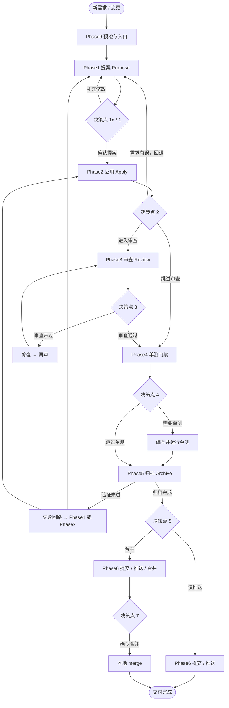

# 需求开发全流程流水线

## Input

用户的需求描述，或一个已有的 change 名称。

## 执行约束

- 开始执行前读取 `openspec/config.yaml` 的 `language` 与 `rules.language`。所有 AI 产出物必须遵循该语言约束，包括 OpenSpec 提案、设计、规格、任务、审查报告、README、CLAUDE.md、代码注释、commit message、PR 描述和审查评论。
- 用户补充需求、提案修改或实施说明后，必须在同一回复中同步当前 **Phase/ change / 下一动作**，推进到下一步或决策点。
- 除用户明确选择「终止流程」或「暂停流水线」外，不得单方结束全流程。
- 高风险决策必须显式确认；推荐项不等于自动代选。
- 决策点首选 **AskUserQuestion** tool；不可用时改用编号选项列表并等待用户回复，不得自动代选。
- 任务跟踪首选宿主提供的任务工具；不可用时在回复中维护等价 Markdown 清单，并将阶段、决策和门禁结果写入流水线状态文件。
- 未经决策点 1 用户明确选择「确认提案，开始实施」，禁止进入 Phase2。
- 代码审查修复循环最多 3 轮，超过后强制暂停。
- 暂停/终止时展示：change 名称、中断阶段、各 Phase完成状态、恢复指引（重新触发技能并传入 change 名称即可续跑）。
- 进入 Phase 时先读取对应 reference；完成决策或门禁后先写入状态，再执行阶段迁移。
- 以 `openspec/.pipeline-state/<change>.json` 为恢复权威，并用 OpenSpec/Git 事实校验；不一致时暂停，不得猜测。

**`<SKILL_ROOT>`**：本技能安装根目录（内含 `scripts/`）。命令在目标 git 仓库根目录执行。
- 对于 Claude Code 安装：`<SKILL_ROOT>` = `.claude/skills/opsx-dev-pipeline`
- 若宿主将 Skill 安装到其他位置，`<SKILL_ROOT>` = 当前 `SKILL.md` 所在目录；不要假设当前工作目录就是 Skill 根目录。
- 脚本路径示例：`node .claude/skills/opsx-dev-pipeline/scripts/preflight.mjs`
- 引用前先确认目录存在：`test -d "<SKILL_ROOT>/scripts" || echo "scripts not found"`
- 状态命令示例：`node <SKILL_ROOT>/scripts/dev-pipeline-state.mjs get "<change>"`

## 状态协议

- 新 change：先按 Phase0 获取用户明确的需求关联决定，再运行 `init "<change>" "<source-branch>" --feature-id "<featureId>"`（有 URL 时追加 `--feature-url "<featureUrl>"`）或 `init "<change>" "<source-branch>" --skip-feature-association`
- 读取状态：`node <SKILL_ROOT>/scripts/dev-pipeline-state.mjs get "<change>"`
- 确认迁移 v1：先运行 `migrate-schema "<change>"` 获取确认提示，用户同意后运行 `migrate-schema "<change>" --confirm`
- 阶段审计开始：`node <SKILL_ROOT>/scripts/dev-pipeline-state.mjs record-phase "<change>" <phase> <step> <executed-by> --start`
- 阶段审计完成：`node <SKILL_ROOT>/scripts/dev-pipeline-state.mjs record-phase "<change>" <phase> <step> <executed-by> [bypassed-gates...]`
- 阶段审计放弃：`node <SKILL_ROOT>/scripts/dev-pipeline-state.mjs record-phase "<change>" <phase> <step> <executed-by> --abandon`
- 记录决策：`node <SKILL_ROOT>/scripts/dev-pipeline-state.mjs decision "<change>" <key> <json-value>`
- 记录结果：`node <SKILL_ROOT>/scripts/dev-pipeline-state.mjs set "<change>" <field> <json-value>`
- 记录尝试：`node <SKILL_ROOT>/scripts/dev-pipeline-state.mjs attempt "<change>" <review|tests|verify> <status>`
- 阶段迁移：`node <SKILL_ROOT>/scripts/dev-pipeline-state.mjs transition "<change>" <phase> <step>`
- 暂停流程：`node <SKILL_ROOT>/scripts/dev-pipeline-state.mjs pause "<change>" "<reason>"`
- 完成交付：`node <SKILL_ROOT>/scripts/dev-pipeline-state.mjs complete "<change>"`

Schema v2 使用 `_version` 做乐观锁，`executionMode` 区分 `pipeline` / `standalone` / `hybrid`，并以 `phaseHistory` 和 `gatesBypassed` 提供独立命令审计。任何状态命令返回 exit code 10/11/12 时，按“状态不存在 / 非法迁移或 gate / I/O 或并发冲突”处理；并发冲突只重载重试一次，仍失败则暂停。写入后必须用 `get` 对比预期关键字段。

## Phase引用表

| Phase| 说明 | 引用文件 | 关键决策点 |
| ----- | ---- | -------- | ---------- |
| 0 | 入口判断 | `references/phase-0-entrance.md` | 续接确认 |
| 1 | 提案编写 (Propose) | `references/phase-1-propose.md` | 决策点 1a、决策点 1 |
| 2 | 提案应用 (Apply) | `references/phase-2-apply.md` | 决策点 2 |
| 3 | 代码审查 (Review) | `references/phase-3-review.md` | 决策点 3 |
| 4 | 单元测试门禁 | `references/phase-4-unit-tests.md` | 决策点 4 |
| 5 | 提案归档 (Archive) | `references/phase-5-archive.md` | 决策点 5a（verify 失败回路可到 Phase1 或 Phase2）、决策点 5b（merge vs 仅推送） |
| 6 | 提交合并推送 | `references/phase-6-merge-push.md` | 决策点 6、决策点 7、标签创建（可选） |

## 流程概览

## 错误处理速查

| 场景 | 处理 |
|------|------|
| openspec CLI 不可用 / 非 git 仓库 | 提示安装/初始化并退出 |
| openspec 未初始化（`openspec list` 失败） | 提示执行 `openspec init` 并退出 |
| git user.name / user.email 未配置 | 警告，确认后继续（提交前必须配置） |
| node 不可用 | 提示安装 Node.js 20+ 并退出 |
| change 不存在 | 列出可用 change 让用户选择 |
| apply 返回 `blocked` | 回到 Phase1 补充制品 |
| 实施中发现需求有误 | 回到 Phase1 修改提案 |
| 审查时无变更可审 | 提示后进入 Phase4 |
| 修复循环达 3 轮上限 | 强制暂停，提示人工介入 |
| verify 无法解析 | 查候选命令，仍不确定则询问用户 |
| verify 失败（可能是需求问题） | 修复后重试 / 回到 Phase2 修复代码 / 回到 Phase1 修改提案 |
| 无法确定测试命令 | 列出候选请用户选择 |
| 单元测试失败 | 修复后重试 / 跳过并记录技术债务 / 终止 |
| pre-commit hook 失败 | 查看 hook 输出，修复后重试或 `--no-verify`（需确认） |
| 分支落后/分叉 | 先 fetch；仅允许 fast-forward，同步失败则暂停并让用户决定 |
| 推送失败（权限/网络） | 保留本地状态，修复权限/网络后重试或终止 |
| `git ls-remote` 不可达 | 检查网络/权限 / 仅本地提交 / 终止 |
| 合并冲突 | 列出冲突文件；中止或逐文件手动解决，禁止全局 ours/theirs |
| 合并编辑器卡死（非交互环境） | 所有 merge 强制使用 `--no-edit` |
| 敏感文件检测 | 警告并确认是否排除 |
| 审查报告路径含特殊字符 | 分支名 `/` 替换为 `-` |
