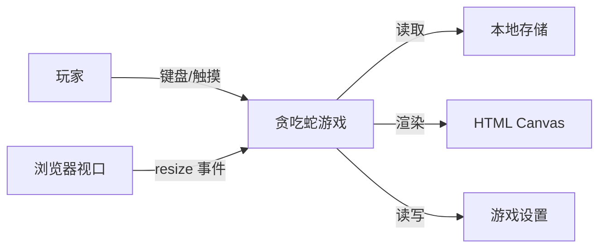
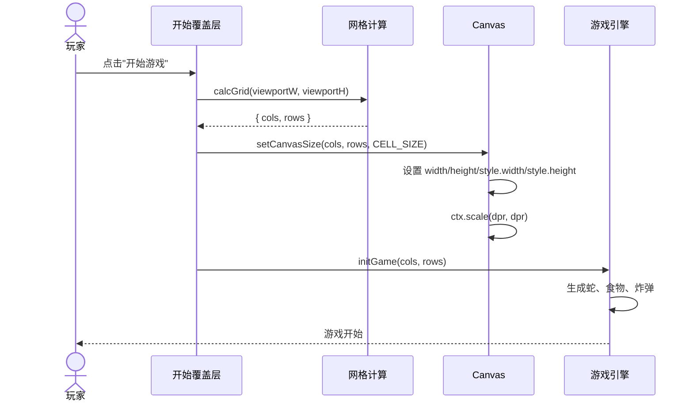
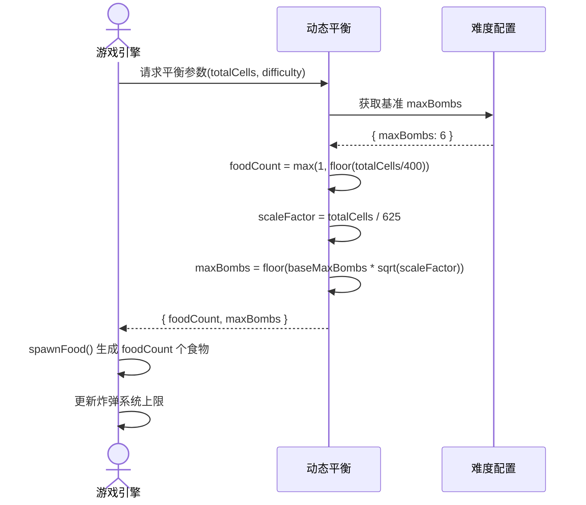

# 贪吃蛇全屏地图 系统分析与设计

## 文档信息


| 项目      | 内容                   |
| ------- | -------------------- |
| 需求/项目编号 | snake-fullscreen-map |
| 所属系统/模块 | 贪吃蛇游戏 — 渲染与布局模块      |
| 作者/评审人  | 已确认                  |
| 文档版本    | 0.1                  |
| 更新时间    | 2026-08-01           |


## 1. 项目概述

### 1.1 背景

当前贪吃蛇游戏地图为固定 25×25 网格（500×500px），居中显示在页面中。桌面端大屏幕上大量空间未被利用，移动端也无法适配不同屏幕尺寸。游戏体验受限于固定尺寸，无法充分发挥不同设备的显示能力。

### 1.2 目标与范围

**业务目标**

- 游戏地图铺满浏览器视口，充分利用屏幕空间
- 在不同设备（桌面、平板、手机）上提供一致且适配的游戏体验
- 保留经典贪吃蛇的离散网格、四方向移动的核心手感

**系统目标**

- 网格尺寸根据视口动态计算，固定格子像素大小（CELL_SIZE），动态调整行列数
- 游戏中途不因窗口 resize 改变网格，新游戏开始时重新计算
- 食物、炸弹等游戏元素数量随地图面积动态调整，保持游戏节奏

**本期范围**

- Canvas 布局从固定尺寸改为全屏铺满
- 网格尺寸动态计算（CELL_SIZE 固定 → COLS/ROWS 动态）
- 浮动半透明 HUD（顶栏信息 + 底栏操作），叠加在游戏地图之上
- 食物数量、炸弹数量随地图面积动态调整
- 开始/暂停/结束覆盖层适配全屏
- D-pad 改为浮动定位（仅触摸设备显示）
- 窗口 resize 处理：锁定网格 / 重新计算策略

**非本期范围**

- 连续移动模式（如 slither.io 风格的 360° 自由转向）
- 地图滚动/摄像机跟随（蛇永远在可见区域内，通过网格铺满实现）
- 多人联机
- 新增游戏模式


### 1.3 相关资料


| 资料      | 地址/编号                            |
| ------- | -------------------------------- |
| PRD     | 不涉及                              |
| 原型/UI 稿 | 不涉及                              |
| 现有代码    | `index.html`（单文件，~5080 行）        |
| 探索讨论    | `/opsx:explore` 会话记录（2026-08-01） |


## 2. 需求与业务分析


### 2.1 角色与用例


| 角色  | 核心用例               | 权限/边界           |
| --- | ------------------ | --------------- |
| 玩家  | 在全屏地图上玩贪吃蛇游戏       | 只能操控蛇的方向，不可改变地图 |
| 玩家  | 在任意设备上体验自适应地图尺寸    | 屏幕最小宽度 320px    |
| 玩家  | 游戏中途缩放窗口时，当前游戏网格不变 | 新一局开始时应用新尺寸     |


### 2.2 核心业务流程

```mermaid
flowchart TD
    Start([页面加载]) --> Welcome[欢迎界面]
    Welcome --> StartOverlay[开始覆盖层]

    StartOverlay --> InitGame[初始化游戏]
    InitGame --> CalcGrid[计算网格尺寸: COLS/ROWS = floor(视口 / CELL_SIZE)]
    CalcGrid --> ResizeCanvas[调整 Canvas 物理与 CSS 尺寸]
    ResizeCanvas --> SpawnItems[按面积比例生成食物与炸弹]
    SpawnItems --> GameLoop[游戏循环]

    GameLoop --> ResizeEvent{窗口 resize?}
    ResizeEvent -->|否| Continue[继续渲染]
    ResizeEvent -->|是, 游戏中| LockGrid[锁定网格, 居中显示, 填充背景]
    ResizeEvent -->|是, 未开始/已结束| CalcGrid

    LockGrid --> Continue
    Continue --> GameLoop
```


### 2.3 需求清单


| 编号     | 功能/需求           | 优先级 | 验收标准                                                                      |
| ------ | --------------- | --- | ------------------------------------------------------------------------- |
| FR-001 | Canvas 铺满浏览器视口  | P0  | 页面无滚动条，Canvas 占据整个视口，四周无边距                                                |
| FR-002 | 网格尺寸动态计算        | P0  | CELL_SIZE 固定 20px；COLS = floor(视口宽度/20)，ROWS = floor(视口高度/20)；最小值 15×20 格 |
| FR-003 | 浮动 HUD 顶栏       | P0  | 半透明背景，显示得分、时间、护盾状态；不遮挡游戏区域                                                |
| FR-004 | 浮动 HUD 底栏       | P0  | 半透明背景，包含设置、静音、皮肤等按钮；不遮挡游戏区域                                               |
| FR-005 | 游戏中 resize 锁定网格 | P0  | resize 后当前游戏网格尺寸不变，棋盘居中，边缘填充背景色或装饰                                        |
| FR-006 | 新游戏重新计算网格       | P0  | 点击"开始"或"再来一局"时基于当前视口重新计算网格                                                |
| FR-007 | 食物数量动态调整        | P1  | foodCount = max(1, floor(totalCells / 400))                               |
| FR-008 | 炸弹数量动态调整        | P1  | maxBombs 按 totalCells / 625 的比例缩放基准值                                      |
| FR-009 | 覆盖层适配全屏         | P0  | 开始、排行榜、游戏结束、暂停覆盖层覆盖整个视口                                                   |
| FR-010 | D-pad 浮动化       | P1  | 仅触摸设备显示；位置在屏幕下方，半透明，不遮挡蛇的视野                                               |
| FR-011 | 设备旋转适配          | P1  | 旋转时若游戏未运行则重算网格；若游戏中则锁定                                                    |


### 2.4 约束与依赖


| 类型  | 内容                                      | 影响/处理方式                             |
| --- | --------------------------------------- | ----------------------------------- |
| 约束  | 单文件架构，HTML/CSS/JS 均在同一文件                | 改动集中在同一文件，需注意模块边界                   |
| 约束  | 必须兼容触屏和桌面端                              | D-pad 仅在触屏显示；键盘操作不变                 |
| 约束  | CELL_SIZE 最小 16px，COLS 最小 15，ROWS 最小 20 | 极小屏幕下保证基本可玩性                        |
| 约束  | 不支持 IE11                                | 可使用 CSS Grid、ResizeObserver 等现代 API |
| 假设  | 用户不会在游戏进行中频繁缩放窗口                        | resize 锁定策略已足够；无需实时网格重排             |


## 3. 总体设计


### 3.1 系统与应用关系




本变更为纯前端改造，不涉及服务端、数据库或外部 API。

### 3.2 模块设计


| 模块          | 职责                            | 输入/输出                                                         | 依赖          |
| ----------- | ----------------------------- | ------------------------------------------------------------- | ----------- |
| 网格计算模块      | 根据视口尺寸计算 COLS、ROWS            | 输入: viewportWidth, viewportHeight, CELL_SIZE；输出: {cols, rows} | 无           |
| Canvas 尺寸管理 | 设置 Canvas 物理尺寸与 CSS 尺寸，处理 DPR | 输入: {cols, rows, cellSize}；输出: Canvas 属性更新                    | 网格计算模块      |
| resize 处理模块 | 监听窗口 resize，决定锁定/重算策略         | 输入: resize 事件；输出: 调用网格计算或锁定布局                                 | 网格计算模块、游戏状态 |
| 浮动 HUD 模块   | 渲染半透明顶栏和底栏                    | 输入: score, timeRemaining, shieldActive 等状态；输出: DOM 更新         | 游戏状态        |
| 动态平衡模块      | 按网格面积计算食物/炸弹数量                | 输入: totalCells, difficulty；输出: foodCount, maxBombs            | 难度配置        |
| 覆盖层适配模块     | 使覆盖层铺满视口                      | 输入: 覆盖层 DOM 元素；输出: CSS 更新                                     | 无           |


### 3.3 关键方案与决策


| 设计项        | 方案                                          | 选择理由                                              | 影响/风险                   |
| ---------- | ------------------------------------------- | ------------------------------------------------- | ----------------------- |
| 网格策略       | 动态格数 + 固定格子大小                               | 不同设备手感一致；大屏 = 更多探索空间；天然响应式                        | 极端宽屏网格可能过大，需设上限         |
| CELL_SIZE  | 保持 20px                                     | 当前渲染逻辑（蛇段 padding、食物粒子、眼球偏移）均基于 20px 硬编码；改动成本最低   | 手机竖屏 375px 宽 ≈ 18 格，可接受 |
| 游戏中 resize | 锁定网格，居中显示，背景填充                              | 避免蛇/食物位置在游戏中途因 resize 而位于边界之外                     | 需实现背景填充绘制               |
| HUD 布局     | 半透明浮动层，CSS `position: fixed` 叠加             | 不占用 Canvas 绘制区域；与 Canvas 解耦                       | HUD 元素可能遮挡蛇或食物          |
| D-pad 位置   | Canvas 区域内浮动，四角可选                           | 触屏设备必需；浮动避免遮挡游戏                                   | 需处理 D-pad 与游戏触摸滑动的冲突    |
| 食物数量公式     | foodCount = max(1, floor(totalCells / 400)) | 当前 25×25=625 格 → 1 个食物；大屏 ~4000 格 → 10 个食物；保持探索密度 | 需实际测试调优                 |


## 4. 详细设计


### 4.1 网格计算模块


#### 4.1.1 处理说明

在游戏初始化时，根据当前视口尺寸计算网格行列数：

```
COLS = floor(viewportWidth  / CELL_SIZE)
ROWS = floor(viewportHeight / CELL_SIZE)
```

约束：

- CELL_SIZE = 20（常量，与当前一致）
- COLS 最小值 15，ROWS 最小值 20
- COLS 最大值 120（对应 2400px 宽屏），ROWS 最大值 80
- 计算后的 Canvas 逻辑尺寸 = COLS × CELL_SIZE 宽，ROWS × CELL_SIZE 高

Canvas 物理尺寸 = 逻辑尺寸 × DPR（DPR 上限 2，与当前一致）。

Canvas CSS 尺寸 = 逻辑尺寸（px），但需确保不超出视口——实际上由于 COLS/ROWS 由视口反推，Canvas CSS 尺寸一定 ≤ 视口。

计算时机：

1. 页面加载（欢迎界面之后、initGame 之前）
2. 用户点击"开始游戏"时
3. 用户点击"再来一局"时
4. 窗口 resize 且游戏未运行时


#### 4.1.2 调用时序




#### 4.1.3 状态与关键规则


| 当前状态/条件                 | 触发事件                 | 处理结果                        | 下一状态/异常处理     |
| ----------------------- | -------------------- | --------------------------- | ------------- |
| 游戏未开始 (isRunning=false) | 窗口 resize            | 重新计算网格，更新 Canvas            | Canvas 尺寸更新完成 |
| 游戏进行中 (isRunning=true)  | 窗口 resize            | 锁定当前网格，Canvas CSS 居中，边缘填充背景 | 游戏继续，网格不变     |
| 游戏结束/暂停                 | 窗口 resize            | 重新计算网格                      | Canvas 尺寸更新完成 |
| 设备旋转                    | orientationchange 事件 | 同 resize 逻辑                 | —             |


#### 4.1.4 事务与异常处理


| 关注点      | 设计说明                                    |
| -------- | --------------------------------------- |
| 事务边界     | 不涉及——纯前端计算，无持久化                         |
| 并发/锁     | 不涉及——JavaScript 单线程                     |
| 幂等/重复处理  | resize 事件使用 debounce（200ms），避免频繁触发的重复计算 |
| 超时/重试/补偿 | 不涉及                                     |


### 4.2 浮动 HUD 模块


#### 4.2.1 处理说明

将当前位于 Canvas 上方的 header（得分面板）和下方的 bottom toolbar（设置/静音/帮助按钮）改造为浮动叠加层。

**顶栏**（替代当前 `.header` 和 `.score-panel`）：

- 位置：视口顶部，`position: fixed; top: 0; left: 0; right: 0`
- 背景：`rgba(15, 23, 42, 0.6)` + `backdrop-filter: blur(8px)`
- 高度：约 48px，触摸设备 56px
- 内容：得分（左）、计时器（中，仅计时模式）、护盾状态（右）
- 游戏开始 5 秒后可自动半透明淡化（opacity 0.4），鼠标悬停恢复

**底栏**（替代当前 `.skin-selector` / `#bottomToolbar`）：

- 位置：视口底部，`position: fixed; bottom: 0; left: 0; right: 0`
- 背景：与顶栏相同
- 高度：约 48px
- 内容：帮助按钮、静音按钮、设置按钮、皮肤切换；水平居中排列
- 同样支持自动淡化

**D-pad**：

- 仅当 `(pointer: coarse) 或 window.innerWidth <= 600` 时显示
- 位置：Canvas 区域内，默认右下角
- 样式：半透明圆形按钮，`opacity: 0.5`，触摸时升至 0.9
- 后续可扩展为四角拖拽定位

**现有覆盖层**（开始、排行榜、游戏结束、暂停、设置面板）：

- 保持全屏覆盖，Z-index 高于 HUD
- 现有的模式选择、昵称输入等功能不变


#### 4.2.2 布局示意

```
┌──────────────────────────────────────────────────┐
│ ░░░░░░░░░░░░░░ 顶栏 (fixed, top:0) ░░░░░░░░░░░░░░ │
│  🍎 42          ⏱ 45s              🛡️ ACTIVE    │
│ ░░░░░░░░░░░░░░░░░░░░░░░░░░░░░░░░░░░░░░░░░░░░░░░░ │
│                                                    │
│                                                    │
│                   GAME CANVAS                       │
│              (铺满整个视口)                          │
│                                                    │
│                                                    │
│                                    ┌───┬───┬───┐   │
│                                    │ ▲ │ ▼ │ ► │   │
│                                    └───┴───┴───┘   │
│                                      D-pad (浮动)   │
│                                                    │
│ ░░░░░░░░░░░░░░ 底栏 (fixed, bottom:0) ░░░░░░░░░░░░ │
│           ? 帮助   🔇 静音   ⚙️ 设置               │
│ ░░░░░░░░░░░░░░░░░░░░░░░░░░░░░░░░░░░░░░░░░░░░░░░░░░ │
└──────────────────────────────────────────────────┘
```


#### 4.2.3 状态与关键规则


| 当前状态/条件        | 触发事件   | 处理结果                     | 下一状态/异常处理            |
| -------------- | ------ | ------------------------ | -------------------- |
| 游戏运行中，5s 无交互   | 计时器触发  | 顶栏/底栏 opacity 降至 0.4     | 鼠标移动或触摸时恢复 opacity 1 |
| 触摸设备           | 页面加载   | D-pad 显示，顶栏/底栏高度增大至 56px | —                    |
| 覆盖层打开（设置/排行榜等） | 用户点击按钮 | HUD 保持在底层，覆盖层在上          | 覆盖层关闭后 HUD 恢复交互      |


### 4.3 动态平衡模块


#### 4.3.1 处理说明

全屏地图格数可能从 625（25×25）变化到 4000+（大屏），需要按面积调整游戏元素密度。

**食物数量**：

```
foodCount = max(1, floor(totalCells / 400))
```

- 基准：625 格 → 1 个食物（与当前一致）
- 桌面 1920×1080 → ~4263 格 → 10 个食物
- 手机 375×667 → ~510 格 → 1 个食物

**炸弹最大数量**（仅困难/普通模式）：

```
scaleFactor = totalCells / 625
maxBombs = floor(currentDifficulty.maxBombs * scaleFactor)
```

- 基准（普通）：625 格 → 6 个炸弹
- 桌面 1920×1080 → ~4263 格 → scaleFactor 6.82 → 40 个炸弹 — 过多
- **修正**：使用平方根缩放

```
maxBombs = floor(currentDifficulty.maxBombs * sqrt(scaleFactor))
// 4263 格 → sqrt(6.82) = 2.61 → 6 × 2.61 ≈ 15 个炸弹
```

**炸弹生成间隔**：保持不变（由 `bombSpawnMin/Max` 控制），频率不变但最大数量增加。

**速度曲线**：不变——蛇速仍由难度和分数决定，不受地图尺寸影响。

#### 4.3.2 数据流




### 4.4 resize 处理模块


#### 4.4.1 处理说明

使用 `ResizeObserver`（优于 window.resize 事件，可监听容器变化）或 debounced `window.resize` 监听视口变化。

核心逻辑：

```
function handleResize() {
    if (isRunning) {
        // 锁定模式：Canvas 居中，填充背景
        applyLetterbox();
    } else {
        // 重算模式：重新计算网格并调整 Canvas
        const { cols, rows } = calcGrid(viewportW, viewportH);
        setCanvasSize(cols, rows);
        // 如果游戏已初始化但未开始（如开始覆盖层显示中），也需要更新相关状态
    }
}
```

**Letterbox 效果**：

- Canvas 保持原有尺寸，CSS 定位居中
- Canvas 外部区域填充当前皮肤的背景色
- 可选：绘制装饰性网格延伸图案


## 5. 接口设计

本变更不涉及后端 API。所有改动为前端 UI 和 Canvas 渲染逻辑。


| 接口名称 | 方法与地址 | 提供方 | 消费方 | 变更类型 |
| ---- | ----- | --- | --- | ---- |
| 不涉及  | —     | —   | —   | —    |


## 6. 数据设计


### 6.1 数据模型

不涉及数据库变更。相关运行时状态变更：


| 变量                           | 当前定义                        | 变更                                 |
| ---------------------------- | --------------------------- | ---------------------------------- |
| `COLS`                       | `const COLS = 25`           | 改为 `let COLS = 25`，由 calcGrid() 赋值 |
| `ROWS`                       | `const ROWS = 25`           | 改为 `let ROWS = 25`，由 calcGrid() 赋值 |
| `CELL_SIZE`                  | `const CELL_SIZE = 20`      | 保持 `const`，值不变                     |
| `GRID_SIZE`                  | `const GRID_SIZE = 20`（未使用） | 移除                                 |
| `foodCount`                  | 不存在（当前恒为 1）                 | 新增，由动态平衡模块赋值                       |
| `canvasWidth`/`canvasHeight` | `const`                     | 改为 `let`，`setCanvasSize()` 中赋值     |


### 6.2 本地存储

不涉及 localStorage 格式变更。现有设置项（难度、皮肤、音效、昵称、网格线）保持不变。

## 7. 质量与运维设计


| 关注点      | 目标/风险                                                     | 设计与验证方式                                  |
| -------- | --------------------------------------------------------- | ---------------------------------------- |
| 性能与容量    | 全屏 Canvas 物理像素可能很大（2x DPR × 1920×1080 = 3840×2160），渲染压力增加 | DPR 上限保持 2x；监测 FPS，若大屏出现掉帧则降低 DPR 上限至 1x |
| 安全与权限    | 不涉及                                                       | —                                        |
| 可用性与降级   | 极小屏幕（<320px）或极低 DPI 设备                                    | COLS 最小值 15，ROWS 最小值 20，保证基本可玩           |
| 数据一致性    | 不涉及                                                       | —                                        |
| 日志、监控与告警 | 开发阶段需观察 resize 行为                                         | 在控制台输出网格计算日志（开发模式）；正式版移除                 |


## 8. 测试、发布与回滚


### 8.1 测试与验收


| 测试类型/场景 | 覆盖内容                                       | 通过标准                        |
| ------- | ------------------------------------------ | --------------------------- |
| 功能测试    | 桌面端 Chrome/Firefox/Safari 全屏地图正常渲染         | 无滚动条，Canvas 铺满视口            |
| 功能测试    | 移动端（iOS Safari / Android Chrome）触摸操作正常     | D-pad 显示且可操作；滑动方向控制正常       |
| 功能测试    | 游戏中 resize 窗口 → 网格锁定，新游戏 → 网格更新            | 锁定/更新行为符合设计                 |
| 功能测试    | 食物数量随地图尺寸变化                                | 625 格 = 1 食物，4263 格 ≈ 10 食物 |
| 兼容性测试   | 不同分辨率：1920×1080、2560×1440、375×667、768×1024 | 所有分辨率下游戏可玩，无布局异常            |
| 回归测试    | 现有功能：模式选择、皮肤切换、音效、排行榜、设置面板                 | 所有现有功能正常                    |
| 性能测试    | 大屏（2560×1440, DPR 2x）下 FPS                 | 保持 60fps                    |


### 8.2 发布与回滚


| 项目      | 内容                                   |
| ------- | ------------------------------------ |
| 发布步骤    | 1. 合并 feature 分支到 main；2. 部署静态文件到服务器 |
| 灰度/开关策略 | 不涉及——单一 HTML 文件直接替换                  |
| 发布验证    | 打开页面验证全屏地图渲染；快速玩一局确认核心循环正常           |
| 回滚条件与步骤 | 若出现严重渲染或性能问题，回滚到上一版本的 index.html     |
| 数据回滚/修复 | 不涉及——localStorage 格式不变               |


## 9. 风险与排期


### 9.1 风险与待确认事项


| 事项                         | 影响             | 处理方案/结论                                           | 责任人 | 状态  |
| -------------------------- | -------------- | ------------------------------------------------- | --- | --- |
| 单文件 5080 行，改动触及多处          | 合并冲突风险高，改动容易遗漏 | 按模块分步骤改动；先 CSS 布局，再 JS 逻辑，最后渲染调优                  | 待确认 | 待确认 |
| 全屏 Canvas 在大屏高 DPR 下性能     | 可能掉帧           | 监测并设置 DPR 上限（当前已为 2x）；必要时对大屏降为 1x                 | 待确认 | 待确认 |
| 食物数量和炸弹数量公式需要实际调优          | 游戏平衡性不佳        | 预留参数调整的灵活性；实际测试后微调                                | 待确认 | 待确认 |
| 浮动 HUD 遮挡蛇或食物              | 玩家体验受损         | HUD 透明度可调；考虑智能避让（检测蛇头位置，临时隐藏附近 HUD）——本期不实现，作为后续优化 | 待确认 | 待确认 |
| 触屏设备 D-pad 与 Canvas 滑动手势冲突 | 方向控制异常         | D-pad 区域内的触摸事件不冒泡到 Canvas                         | 待确认 | 待确认 |


### 9.2 研发排期


| 模块/任务                            | 依赖项    | 负责人 | 工作量（人日） | 完成日期 |
| -------------------------------- | ------ | --- | ------- | ---- |
| CSS 布局重构                         | 无      | 待确认 | 1       | 待确认  |
| 网格动态计算 + Canvas 尺寸管理             | CSS 布局 | 待确认 | 0.5     | 待确认  |
| resize 处理 + Letterbox            | 网格计算   | 待确认 | 0.5     | 待确认  |
| 浮动 HUD（顶栏 + 底栏）                  | CSS 布局 | 待确认 | 1       | 待确认  |
| D-pad 浮动化                        | 浮动 HUD | 待确认 | 0.5     | 待确认  |
| 动态平衡（食物 + 炸弹）                    | 网格计算   | 待确认 | 0.5     | 待确认  |
| 覆盖层适配                            | CSS 布局 | 待确认 | 0.5     | 待确认  |
| 渲染逻辑适配（蛇/食物/炸弹等基于 CELL_SIZE 的绘制） | 网格计算   | 待确认 | 0.5     | 待确认  |
| 测试与调优                            | 全部     | 待确认 | 1       | 待确认  |
| **合计**                           |        |     | **6**   |      |


## 附录：评审检查清单

- [x] 目标、范围、需求和验收标准清晰。
- [x] 系统边界、模块职责及上下游依赖明确。
- [x] 核心流程、异常流程和关键技术方案完整。
- [x] 接口、数据变更和兼容策略可实施。（不涉及接口变更）
- [x] 性能、安全、稳定性和可观测性已评估。
- [ ] 测试、发布、回滚、风险和责任人已明确。（责任人待确认）