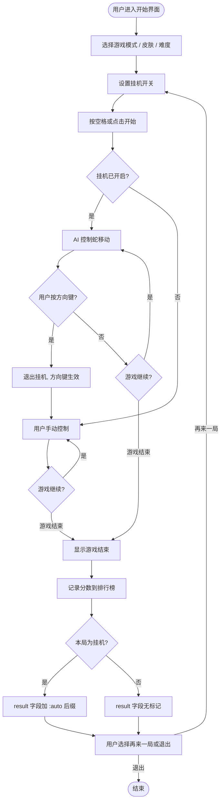
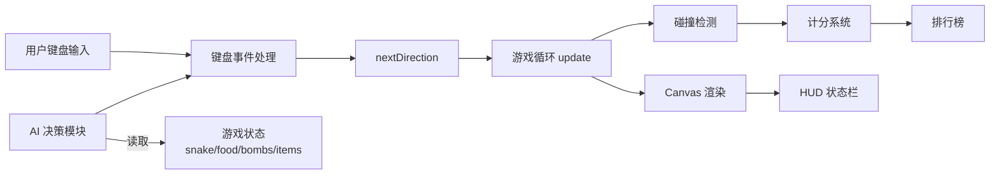
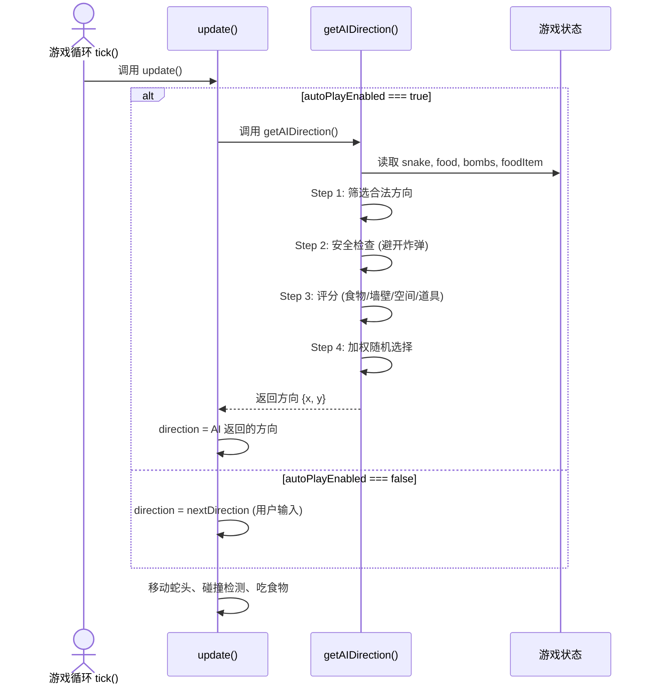
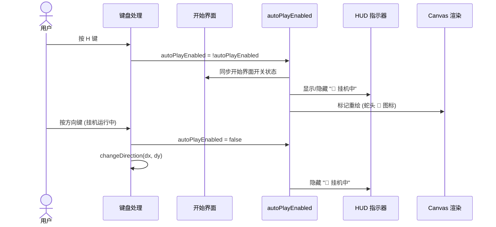

# 贪吃蛇挂机模式 系统分析与设计

## 文档信息

| 项目 | 内容 |
| --- | --- |
| 需求/项目编号 | snake-auto-play |
| 所属系统/模块 | 贪吃蛇前端游戏 (index.html) |
| 作者/评审人 | 大師兄丶 |
| 文档版本 | 0.1 |
| 更新时间 | 2026-08-02 |

## 1. 项目概述

### 1.1 背景

当前贪吃蛇游戏（单文件 `index.html`，约 5179 行）包含经典无限模式和计时模式，支持四种皮肤、炸弹系统（休眠/不稳定）、特殊道具（金苹果/闪电/护盾），以及排行榜和设置系统。欢迎界面上有一个迷你 AI 蛇作为装饰，但主游戏完全依赖用户手动操作。

开发新功能时需要反复手动测试游戏流程（验证碰撞、道具效果、炸弹交互等），每次测试都需手动操控蛇移动和吃道具，效率低下。引入挂机模式后，系统将自动控制蛇的移动和道具收集，让开发者专注于观察和验证功能行为。

此外，迷你 AI 蛇（`miniGetAIDirection`）的算法简单，仅处理墙壁规避和随机转向，缺少对炸弹、护盾、道具等主游戏系统的感知，无法直接复用于主游戏场景。

### 1.2 目标与范围

**业务目标**

- 减少功能测试时的手动操作成本，让开发者只需观察游戏行为
- 提供一键切换的零摩擦体验，不影响正常游戏流程

**系统目标**

- AI 能够在经典和计时两种模式下自主运行，处理炸弹、道具等所有游戏元素
- 挂机模式下所有游戏系统（碰撞、计分、排行榜）行为不变
- 用户随时可通过方向键取回控制权

**本期范围**

- 核心 AI 决策算法（加权评分 + 一步前瞻 + 洪水填充空间评估）
- 挂机模式开关（开始界面选择器 + 游戏中 H 键切换）
- HUD 状态指示器（顶栏文字 + 蛇头视觉标记）
- 暂停覆盖层挂机提示
- 排行榜挂机成绩标注（`:auto` 后缀 + 🤖 标记）
- 用户方向键/WASD 输入自动退出挂机

**非本期范围**

- BFS/A* 全图寻路算法
- 挂机专属难度预设
- 游戏回放/录制功能
- 排行榜"隐藏挂机成绩"筛选
- 移动端挂机模式（移动端 D-pad 不支持挂机，本功能仅桌面端）

### 1.3 相关资料

| 资料 | 地址/编号 |
| --- | --- |
| 主游戏代码 | `index.html` |
| 迷你 AI 蛇参考 | `index.html:1960` `miniGetAIDirection()` |
| PRD | 不涉及 |
| 原型/UI 稿 | 不涉及 |

## 2. 需求与业务分析

### 2.1 角色与用例

| 角色 | 核心用例 | 权限/边界 |
| --- | --- | --- |
| 开发者 | 开启挂机模式观察功能行为，验证新功能是否正确 | 全部功能可用；挂机仅桌面端 |
| 普通玩家 | 可选开启挂机模式体验自动玩法 | 挂机成绩标注 🤖；方向键随时取回控制 |

### 2.2 核心业务流程



### 2.3 需求清单

| 编号 | 功能/需求 | 优先级 | 验收标准 |
| --- | --- | --- | --- |
| FR-001 | 挂机模式开关 | P0 | 开始界面可选开关；游戏中按 H 键切换；状态跨局保持 |
| FR-002 | AI 自动移动与吃道具 | P0 | AI 控制蛇在网格内移动，自动寻找并吃掉食物 |
| FR-003 | 炸弹安全避让 | P0 | AI 不主动走向不稳定炸弹及其爆炸范围 |
| FR-004 | 休眠炸弹规避 | P1 | AI 尽量避开休眠炸弹，但不作为硬约束 |
| FR-005 | 道具优先追求 | P1 | AI 有意识朝向护盾和闪电道具移动 |
| FR-006 | 方向键退出挂机 | P0 | 用户按任意方向键/WASD 时，挂机立即退出，方向输入生效 |
| FR-007 | 暂停交互 | P1 | 空格暂停/继续时挂机状态保持不变；暂停覆盖层显示挂机状态 |
| FR-008 | HUD 状态指示 | P1 | 挂机运行时顶栏显示 "🤖 挂机中"；蛇头上方绘制半透明 🤖 标记 |
| FR-009 | 排行榜标注 | P2 | 挂机成绩 `result` 字段追加 `:auto` 后缀，排行榜渲染显示 🤖 标记 |
| FR-010 | 挂机状态跨局保持 | P1 | 游戏结束后"再来一局"，挂机状态不清除 |

### 2.4 约束与依赖

| 类型 | 内容 | 影响/处理方式 |
| --- | --- | --- |
| 约束 | 仅修改 `index.html`，不新增外部文件 | 所有 CSS/HTML/JS 内联 |
| 约束 | 不改变现有游戏循环、碰撞检测、计分、排行榜逻辑 | AI 仅替换方向输入源 |
| 约束 | 移动端 D-pad 控制不触发挂机（仅键盘） | `changeDirection` 调用点加 `autoPlayEnabled` 检查 |
| 依赖 | `floodFillCount` 需要访问当前蛇身、炸弹位置、网格尺寸 | 均可从现有全局状态变量获取 |
| 假设 | 用户主要使用桌面浏览器进行功能测试 | 挂机入口和快捷键仅桌面端有效 |

## 3. 总体设计

### 3.1 系统与应用关系



挂机模式的核心设计原则：**AI 只是 `nextDirection` 的另一个来源**。游戏循环 `update()` 不关心方向来自用户按键还是 AI——它只读取 `nextDirection`。这确保所有现有系统（碰撞、道具、炸弹、计分）的行为完全不变。

### 3.2 模块设计

| 模块 | 职责 | 输入/输出 | 依赖 |
| --- | --- | --- | --- |
| 挂机状态管理 | 维护 `autoPlayEnabled` 布尔值；提供 `toggleAutoPlay()` 切换函数；刷新 UI 指示器 | 输入：H 键、开始界面开关；输出：状态变量 | 无 |
| AI 决策引擎 | 根据游戏状态计算最优移动方向；每次 `update()` 时被调用一次 | 输入：`snake[]`、`food`、`bombs[]`、`foodItem`、`COLS`、`ROWS`；输出：`{x, y}` 方向向量 | `floodFillCount` 空间评估函数 |
| UI 指示层 | 开始界面挂机开关、HUD 顶栏指示器、蛇头 🤖 标记、暂停覆盖层文字 | 输入：`autoPlayEnabled`、`isPaused`；输出：DOM/CSS 更新、Canvas 绘制 | 挂机状态管理 |
| 排行榜标注 | 游戏结束时根据 `autoPlayEnabled` 在 `result` 字段追加 `:auto`；渲染时显示 🤖 | 输入：`autoPlayEnabled`、`reason`；输出：带标记的排行榜记录 | LeaderboardStore |

### 3.3 关键方案与决策

| 设计项 | 方案 | 选择理由 | 影响/风险 |
| --- | --- | --- | --- |
| AI 算法 | 加权评分 + 一步前瞻 | 代码量少（~80 行），与现有迷你蛇 AI 风格一致；一步前瞻足以处理炸弹威胁 | 极复杂场景（蛇身极长时）AI 可能不如 BFS 聪明，但概率极低 |
| 空间评估 | 简化洪水填充（深度限制 50 步） | 防止 AI 走入死胡同；深度限制避免性能问题 | 极端密集场景下评估可能不精确，不影响安全性 |
| 方向保持 | 80% 概率保持当前方向 | 减少 AI 运动抖动，外观更自然 | 个别情况下可能错过就近食物，可接受 |
| 方向键交互 | 用户按方向键立即退出挂机 | 最自然的交互——用户想接管时不需要额外的"退出挂机"步骤 | 误触会退出挂机，需重新按 H 键开启 |
| 排行榜策略 | 正常计入，`result` 字段加 `:auto` 后缀 | 非破坏性——不改变现有解析逻辑；UI 渲染时显示 🤖 图标 | `result` 字段格式变为 `collision:auto` 等，需确认无下游依赖 |
| 挂机状态持久性 | 跨局保持（再来一局不清除） | 减少重复操作；开发者可连续测试 | 用户需手动关闭，否则一直挂机 |
| 实现位置 | 仅修改 `index.html` | 单文件项目，无构建工具；所有代码内联 | 文件长度从 ~5179 → ~5360 行，仍可管理 |

## 4. 详细设计

### 4.1 AI 决策引擎

#### 4.1.1 处理说明

`getAIDirection()` 是挂机模式的核心函数，在 `update()` 中当 `autoPlayEnabled === true` 时被调用，替代 `nextDirection` 来源。

算法分为四步：

**Step 1 — 收集候选方向：** 遍历上下左右四个方向，排除 180° 反向（蛇长 >1）、撞墙和撞自身的方向。剩余方向作为候选。

**Step 2 — 安全检查：** 对每个候选方向模拟移动一步，检查目标位置是否在不稳定炸弹上或在其 3×3 爆炸半径内。如果存在安全方向，只保留安全方向；如果所有方向都危险，保留全部（选最不坏的）。

**Step 3 — 评分：** 对每个安全方向计算加权评分：

| 评分项 | 权重 | 计算方式 |
| --- | --- | --- |
| 食物引力 | +5 | 新位置比当前位置更靠近食物（曼哈顿距离减少） |
| 墙壁安全 | +3 | 新位置距边界 >2 格 |
| 炸弹规避 | +4 | 新位置 2 格内无休眠炸弹 |
| 空间充裕 | +2 | 洪水填充连通区域 ≥30 格 |
| 空间狭窄惩罚 | -3 | 洪水填充连通区域 <10 格 |
| 道具吸引 | +3 | 食物为护盾或闪电且新位置更靠近 |

**Step 4 — 加权随机选择：** 80% 概率保持当前方向（如果安全），20% 概率按评分加权随机选择新方向。

#### 4.1.2 调用时序



#### 4.1.3 状态与关键规则

| 当前状态/条件 | 触发事件 | 处理结果 | 下一状态/异常处理 |
| --- | --- | --- | --- |
| 挂机运行中 | 候选方向数为 0 | 保持当前方向 | 蛇将撞墙/撞自身 → gameOver 正常触发 |
| 挂机运行中 | 所有方向都在爆炸范围内 | 保留全部方向参与评分 | 选择评分最高（最安全的危险方向） |
| 挂机运行中 | 用户按方向键/WASD | `autoPlayEnabled = false` | 方向键输入生效，切换为手动控制 |
| 挂机关闭 | 用户按 H 键 | `autoPlayEnabled = true` | AI 从下一帧开始接管方向控制 |
| 挂机运行中 | 空格暂停 | `isPaused = true`，挂机标志不变 | 暂停恢复后自动继续挂机 |
| 游戏结束 | `autoPlayEnabled === true` | `gameOver(reason)` 中 `result` 加 `:auto` | 排行榜渲染显示 🤖 标记 |

#### 4.1.4 事务与异常处理

| 关注点 | 设计说明 |
| --- | --- |
| 事务边界 | 不涉及（纯前端单线程） |
| 并发/锁 | 不涉及。`getAIDirection()` 在 `requestAnimationFrame` 回调中同步执行 |
| 幂等/重复处理 | `update()` 每帧最多调用一次 `getAIDirection()`，不存在重复调用 |
| 超时/重试/补偿 | 洪水填充深度限制 50 步，防止极罕见情况下的长时间计算 |

### 4.2 挂机状态管理

#### 4.2.1 处理说明

`autoPlayEnabled` 是全局布尔变量，默认 `false`。`toggleAutoPlay()` 切换状态并调用 `updateAutoPlayUI()` 刷新所有 UI 指示器。

开始界面挂机开关为下拉选择器（关闭 / 开启·经典模式 / 开启·计时模式），选择"开启"时同步设置 `autoPlayEnabled = true` 并切换到对应模式。

#### 4.2.2 调用时序



#### 4.2.3 状态与关键规则

| 当前状态/条件 | 触发事件 | 处理结果 | 下一状态/异常处理 |
| --- | --- | --- | --- |
| `autoPlayEnabled = false` | 按 H 键 | 切换为 `true`，HUD 显示指示器 | 下一帧开始 AI 控制 |
| `autoPlayEnabled = true` | 按 H 键 | 切换为 `false`，HUD 隐藏指示器 | 下一帧使用用户输入 |
| `autoPlayEnabled = true` | 方向键/WASD 输入 | 切换为 `false`，方向输入生效 | 用户接管控制 |
| `autoPlayEnabled = true` | 游戏结束 → 再来一局 | 保持 `true` | 新游戏自动开始挂机 |
| 开始界面 | 开关选择"开启" | `autoPlayEnabled = true` | 同步切换游戏模式 |

### 4.3 UI 指示层

#### 4.3.1 开始界面挂机开关

在模式卡片下方新增挂机模式开关行：

```
┌─────────────────────────────────────────────┐
│  🤖 挂机模式   系统自动控制蛇移动和吃道具   │
│                                      [关闭 ▼]│
└─────────────────────────────────────────────┘
```

下拉选项：
- **关闭** — 正常手动模式
- **开启（经典模式）** — 自动切换到经典模式并启用挂机
- **开启（计时模式）** — 自动切换到计时模式并启用挂机

CSS 样式与现有模式卡片和设置面板风格一致（圆角卡片、半透明背景、`backdrop-filter`）。

#### 4.3.2 HUD 顶栏指示器

挂机运行时在 HUD 顶栏分数右侧显示：

```
🍎 42  🤖 挂机中                🛡️ 护盾
```

使用与 `hud-score-item` 相同的样式，颜色使用青色（`var(--accent)`）与计时器颜色呼应。

#### 4.3.3 Canvas 蛇头标记

挂机运行时蛇头上方绘制半透明 🤖 图标：

- 在 `draw()` 函数蛇头渲染之后
- 使用与护盾光晕类似的径向渐变背景
- 文字 "🤖" 居中绘制，大小约 `CELL_SIZE * 0.6`
- 透明度 0.7，轻微浮动动画 (`Math.sin(now/800) * 0.1 + 0.7`)

#### 4.3.4 暂停覆盖层

`isPaused && autoPlayEnabled` 时在暂停文字下方追加一行：

```
       已暂停
    按空格键继续
  🤖 挂机模式已激活
```

最后一行使用 12px 字号、次要文本颜色（`cs.pauseSubtext`）。

## 5. 接口设计

不涉及。本次变更不新增或修改任何 API 接口。所有交互均为前端内部逻辑。

## 6. 数据设计

### 6.1 数据模型

本次变更不新增数据库表。涉及的数据变更为：

- **LeaderboardStore 记录字段扩展**：`result` 字段格式从 `{reason}` 变为 `{reason}[:auto]`。`:auto` 后缀为可选，仅挂机产生的记录携带。
- **内存状态新增**：`autoPlayEnabled` (boolean)，不持久化（挂机状态随页面刷新重置为关闭）。

### 6.2 兼容性

| 变更项 | 兼容影响 | 处理方式 |
| --- | --- | --- |
| `result` 字段加 `:auto` | `result` 原为 `'collision'` / `'bomb'` / `'timeUp'` / `'win'` | 新增 `'collision:auto'` 等格式；排行榜渲染时用 `endsWith(':auto')` 检测 |
| 旧记录兼容 | 无 `:auto` 后缀的旧记录 | 渲染检测逻辑对旧记录返回 `false`，不显示 🤖 标记 |

## 7. 质量与运维设计

| 关注点 | 目标/风险 | 设计与验证方式 |
| --- | --- | --- |
| 性能与容量 | 洪水填充深度限制 50 步，单次调用 <1ms | `getAIDirection()` 每帧最多调用一次；最坏情况 <2ms，不影响 60fps |
| 安全与权限 | 无安全风险（纯前端） | 不涉及 |
| 可用性与降级 | AI 卡死时不影响游戏 | 候选方向为空时保持当前方向，gameOver 正常触发 |
| 数据一致性 | `:auto` 后缀与 `autoPlayEnabled` 状态一致 | `gameOver()` 在同一帧读取 `autoPlayEnabled`，无竞态 |
| 日志、监控与告警 | 不涉及线上监控 | 开发阶段通过浏览器控制台观察 AI 决策输出 |

## 8. 测试、发布与回滚

### 8.1 测试与验收

| 测试类型/场景 | 覆盖内容 | 通过标准 |
| --- | --- | --- |
| 功能测试 | FR-001 ~ FR-010 全部需求 | 所有验收标准通过 |
| 手动回归 | 经典模式手动游戏 | 挂机关闭时行为与变更前一致 |
| 手动回归 | 计时模式手动游戏 | 挂机关闭时行为与变更前一致 |
| 场景测试 | 挂机模式下蛇撞墙 / 撞自身 | gameOver 正常触发，排行榜正确标注 |
| 场景测试 | 挂机模式下炸弹爆炸 | AI 正常避让或死亡；死亡时排行榜标注 |
| 场景测试 | 挂机模式运行 5 分钟以上 | 无内存泄漏，帧率稳定 |
| 场景测试 | H 键反复切换 | 状态正确翻转，UI 同步更新 |
| 场景测试 | 再来一局后挂机状态保持 | 新游戏自动开始 AI 控制 |

### 8.2 发布与回滚

| 项目 | 内容 |
| --- | --- |
| 发布步骤 | 修改 `index.html`；浏览器刷新即生效 |
| 灰度/开关策略 | 不涉及（单文件前端，无服务端） |
| 发布验证 | 打开游戏 → 开始界面确认挂机开关可见 → 开启挂机 → 开始游戏 → 确认 AI 移动正常 |
| 回滚条件与步骤 | 还原 `index.html` 到修改前版本；浏览器刷新 |
| 数据回滚/修复 | 不涉及（无数据迁移） |

## 9. 风险与排期

### 9.1 风险与待确认事项

| 事项 | 影响 | 处理方案/结论 | 责任人 | 状态 |
| --- | --- | --- | --- | --- |
| AI 在极长蛇身时可能困住自己 | 游戏提前结束 | 可接受——无限模式极少出现蛇身占满网格的情况；洪水填充空间评估可大幅降低概率 | 大師兄丶 | 已关闭 |
| `result` 字段格式变更影响下游 | 旧版解析逻辑可能不兼容 | `endsWith(':auto')` 检测，旧记录完全不触发新逻辑；`:auto` 后缀可选，不破环原有值 | 大師兄丶 | 已关闭 |
| 移动端挂机不可用 | 移动端用户无法使用挂机 | 明确非本期范围；桌面端是主要测试场景 | 大師兄丶 | 已关闭 |

### 9.2 研发排期

| 模块/任务 | 依赖项 | 负责人 | 工作量（人日） | 完成日期 |
| --- | --- | --- | --- | --- |
| CSS 样式新增 | 无 | 大師兄丶 | 0.25 | 待定 |
| HTML 结构新增 | CSS 样式 | 大師兄丶 | 0.25 | 待定 |
| AI 决策引擎实现 | 无 | 大師兄丶 | 0.5 | 待定 |
| 挂机状态管理 + 键盘交互 | AI 决策引擎 | 大師兄丶 | 0.5 | 待定 |
| UI 指示层集成 | 挂机状态管理 | 大師兄丶 | 0.25 | 待定 |
| 排行榜标注 | UI 指示层 | 大師兄丶 | 0.25 | 待定 |
| 测试验收 | 全部模块 | 大師兄丶 | 0.5 | 待定 |
| **合计** | | | **2.5** | |

## 附录：评审检查清单

- [x] 目标、范围、需求和验收标准清晰。
- [x] 系统边界、模块职责及上下游依赖明确。
- [x] 核心流程、异常流程和关键技术方案完整。
- [x] 接口、数据变更和兼容策略可实施。
- [x] 性能、安全、稳定性和可观测性已评估。
- [x] 测试、发布、回滚、风险和责任人已明确。
