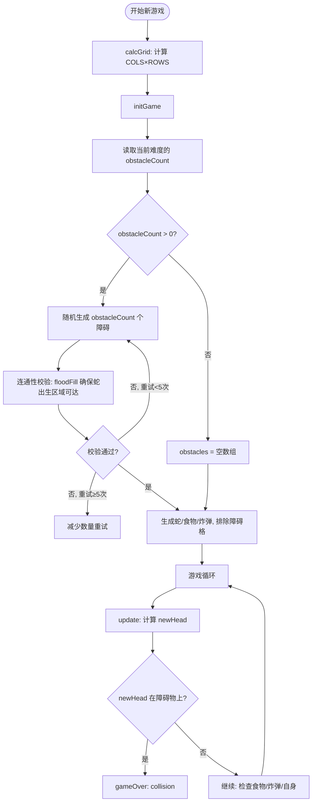
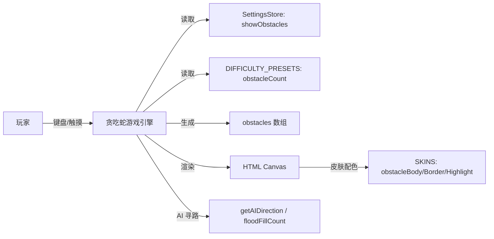
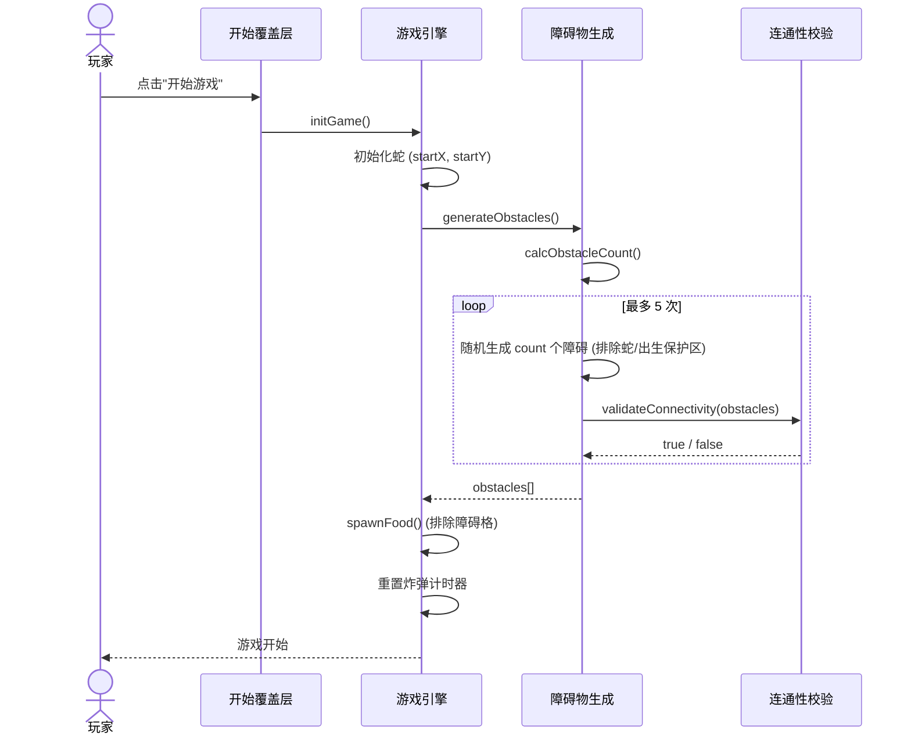

# 贪吃蛇障碍地图 系统分析与设计

## 文档信息

| 项目 | 内容 |
| --- | --- |
| 需求/项目编号 | snake-add-obstacle-map |
| 所属系统/模块 | 贪吃蛇游戏 — 地图与游戏引擎模块 |
| 作者/评审人 | 已确认 |
| 文档版本 | 0.1 |
| 更新时间 | 2026-08-16 |

## 1. 项目概述

### 1.1 背景

当前游戏地图为全屏动态网格（`COLS × ROWS`，由 `calcGrid()` 根据视口动态计算），地图本身仅由"背景 + 可选网格线"构成，没有任何静态地形元素。所有动态威胁（炸弹）每局随机生成，但缺乏长期空间约束，地图视觉与玩法策略深度均偏弱。

本次变更在现有全屏动态网格之上叠加一层**静态障碍物**，作为"基础地图"之上的"障碍地图"，在不引入新模式的前提下提升空间规划与路径选择的策略性。

### 1.2 目标与范围

**业务目标**

- 每局游戏在地图上随机生成一组静态障碍物，增加空间规划挑战
- 障碍物与现有难度体系联动（简单模式无障碍，困难模式障碍更多）
- 提供设置开关，允许玩家关闭障碍物

**系统目标**

- 障碍物在 `initGame()` 阶段一次性生成，整局不变
- 生成后必须保证蛇出生点、食物、炸弹可达（连通性校验）
- 障碍物参与碰撞、AI 寻路、食物/炸弹生成排除等所有占用检测
- 渲染与现有皮肤系统联动，每个皮肤提供障碍物配色

**本期范围**

- 新增 `obstacles` 数组与相关占用检测函数
- 难度预设新增 `obstacleCount` 字段
- 设置面板新增"障碍物"开关
- `draw()` 新增障碍物渲染层（位于网格线之后、食物之前）
- AI 挂机模式 `getAIDirection()` 将障碍物视为不可通行
- 皮肤系统新增障碍物配色字段

**非本期范围**

- 可破坏/可移动的障碍物
- 预设手绘关卡布局（本期仅随机生成）
- 障碍物与炸弹的交互（如炸弹炸毁障碍）
- 障碍物对分数/速度的影响

### 1.3 相关资料

| 资料 | 地址/编号 |
| --- | --- |
| PRD | 不涉及 |
| 原型/UI 稿 | 不涉及 |
| 现有代码 | `index.html`（单文件，~5500 行） |
| 前置设计 | `openspec/docs/20260801/full-screen-game-map.md` |
| 探索讨论 | `/opsx:explore` 会话记录（2026-08-16） |

## 2. 需求与业务分析

### 2.1 角色与用例

| 角色 | 核心用例 | 权限/边界 |
| --- | --- | --- |
| 玩家 | 在带障碍物的地图上玩经典/计时模式 | 障碍物撞上去即死，与撞墙同级 |
| 玩家 | 在设置中开关障碍物 | 开关仅在新局生效（当局障碍物不中途变化） |
| 挂机 AI | 在有障碍物的地图上自动寻路 | 障碍物视为不可通行，影响 floodFill 与方向评分 |

### 2.2 核心业务流程



### 2.3 需求清单

| 编号 | 功能/需求 | 优先级 | 验收标准 |
| --- | --- | --- | --- |
| FR-001 | 障碍物数据结构 | P0 | `obstacles` 为 `{x, y}[]`，与 `snake`/`bombs` 同级管理 |
| FR-002 | 难度联动生成 | P0 | 简单模式 `obstacleCount=0`；普通=`max(1, floor(totalCells/800))`；困难=`max(2, floor(totalCells/500))` |
| FR-003 | 出生点保护 | P0 | 蛇初始 3 节及前方 5 格范围内不得有障碍物 |
| FR-004 | 连通性校验 | P0 | 生成后 floodFill 从蛇头出发可达至少 60% 的非障碍格；不通过则重新生成（最多 5 次，之后减少数量） |
| FR-005 | 碰撞即死 | P0 | 蛇头进入障碍格时调用 `gameOver(false, 'obstacle')`，与撞墙同级 |
| FR-006 | 食物/炸弹生成排除 | P0 | `spawnFood()` 与 `spawnBomb()` 的空格判定包含 `!cellIsOccupiedByObstacle()` |
| FR-007 | AI 寻路适配 | P0 | `getAIDirection()` 候选方向排除障碍格；`floodFillCount()` 将障碍视为不可通行 |
| FR-008 | 障碍物渲染 | P0 | 在 `draw()` 中网格线之后、食物之前绘制；使用当前皮肤的障碍物配色 |
| FR-009 | 设置开关 | P1 | 设置面板"🎮 游戏"分区新增"障碍物"开关，持久化到 `snake-settings` |
| FR-010 | 皮肤配色联动 | P1 | 4 个皮肤（classic/retro/midnight/sunset）各新增 `obstacleBody`、`obstacleBorder`、`obstacleHighlight` 字段 |
| FR-011 | 当局不随开关变化 | P1 | 游戏中切换障碍物开关不影响当局，仅在新局 `initGame()` 时读取 |

### 2.4 约束与依赖

| 类型 | 内容 | 影响/处理方式 |
| --- | --- | --- |
| 约束 | 单文件架构，所有改动集中在 `index.html` | 按模块边界组织代码，与现有 `bombs` 模式对齐 |
| 约束 | 必须兼容挂机 AI 模式 | AI 的 `floodFillCount` 与 `getAIDirection` 必须感知障碍 |
| 约束 | 障碍物数量随网格面积变化（625~9600 格） | 使用面积比例公式 + 上下限，避免大屏障碍过密或小屏障碍过稀 |
| 假设 | 玩家接受障碍物为"固定地形"而非"动态威胁" | 与炸弹的"动态生成+爆炸"形成互补，不引入更多动态元素 |
| 依赖 | 现有 `floodFillCount()` 函数 | 复用其 BFS 逻辑，扩展为同时排除障碍格 |

## 3. 总体设计

### 3.1 系统与应用关系



本变更为纯前端改造，不涉及服务端、数据库或外部 API。

### 3.2 模块设计

| 模块 | 职责 | 输入/输出 | 依赖 |
| --- | --- | --- | --- |
| 障碍物生成模块 | 按难度与网格面积生成障碍物坐标 | 输入: `COLS`, `ROWS`, `currentDifficulty.obstacleCount`, `snake`；输出: `obstacles[]` | 连通性校验模块 |
| 连通性校验模块 | 验证生成后地图可达性 | 输入: `obstacles[]`, `snake`；输出: `boolean`（是否通过） | 现有 `floodFillCount` 逻辑 |
| 占用检测模块 | 统一提供"某格是否被占用"查询 | 输入: `{x, y}`；输出: `boolean` | `snake`, `bombs`, `obstacles`, `food` |
| 碰撞处理模块 | 蛇头进入障碍格时触发死亡 | 输入: `newHead`；输出: 调用 `gameOver` | 现有 `handleCollision`/`gameOver` |
| 障碍物渲染模块 | 在 Canvas 上绘制障碍物 | 输入: `obstacles[]`, `currentSkin.canvas`；输出: Canvas 绘制 | `draw()` 主渲染流程 |
| AI 寻路适配模块 | 将障碍物纳入 AI 不可通行判定 | 输入: 候选方向, `obstacles[]`；输出: 过滤后的安全方向 | `getAIDirection`, `floodFillCount` |
| 设置联动模块 | 障碍物开关的持久化与生效 | 输入: 用户点击；输出: `currentSettings.showObstacles` 更新 | `SettingsStore` |

### 3.3 关键方案与决策

| 设计项 | 方案 | 选择理由 | 影响/风险 |
| --- | --- | --- | --- |
| 障碍物生成时机 | `initGame()` 中一次性生成，整局不变 | 与炸弹的"动态生成"形成互补；降低实现复杂度；玩家可记忆布局 | 每局布局随机，无法"背板" |
| 障碍物数量公式 | 面积比例 + 难度系数（见 FR-002） | 与 `calcFoodCount`、`calcMaxBombs` 风格一致；大屏不会过密 | 具体系数需实测调优 |
| 碰撞行为 | 撞障碍 = 撞墙 = 即死 | 规则简单直观；与现有碰撞体系一致 | 无 |
| 连通性校验 | floodFill 从蛇头出发，要求可达 ≥60% 非障碍格 | 复用现有 `floodFillCount` 逻辑；60% 阈值保证不会把地图切碎 | 极端情况下可能重试多次，需设上限 |
| 设置开关 | 新增 `showObstacles` 字段，默认 `true` | 与 `showGridLines` 模式对齐；用户可关闭 | 开关仅新局生效，当局不变化 |
| 渲染层级 | 网格线 → **障碍物** → 食物 → 炸弹 → 爆炸 → 蛇 | 障碍物作为"地形"应在食物/蛇之下，避免遮挡关键元素 | 无 |
| AI 适配 | 障碍格视为不可通行，与墙同级 | AI 必须能正确绕开障碍，否则挂机模式会莽死 | `floodFillCount` 需扩展排除障碍 |

## 4. 详细设计

### 4.1 障碍物生成模块

#### 4.1.1 处理说明

在 `initGame()` 中，蛇初始化之后、食物/炸弹生成之前，调用 `generateObstacles()` 生成障碍物：

```
function generateObstacles() {
    if (!currentSettings.showObstacles) return [];
    const count = calcObstacleCount();
    if (count <= 0) return [];

    let obstacles = [];
    for (let attempt = 0; attempt < 5; attempt++) {
        obstacles = [];
        for (let i = 0; i < count; i++) {
            const pos = randomEmptyCell(obstacles);  // 排除蛇、食物、已有障碍
            if (pos) obstacles.push(pos);
        }
        if (validateConnectivity(obstacles)) return obstacles;
    }
    // 5 次失败后减少数量重试
    return generateObstaclesReduced(Math.floor(count / 2));
}
```

**出生点保护**：蛇初始位置为 `(floor(COLS/2), floor(ROWS/2))`，方向向右。生成障碍时排除蛇身 3 节及前方 5 格（即 `x ∈ [startX-2, startX+5], y == startY` 的矩形区域），确保蛇开局不会立即撞障碍。

**数量公式**：

```
function calcObstacleCount() {
    if (!currentSettings.showObstacles) return 0;
    const totalCells = COLS * ROWS;
    const base = currentDifficulty.obstacleBase;    // 简单=0, 普通=800, 困难=500
    if (base <= 0) return 0;
    const count = Math.floor(totalCells / base);
    const maxCount = Math.floor(totalCells * 0.15);  // 上限: 不超过 15% 的格子
    return Math.max(currentDifficulty.obstacleMin || 0, Math.min(count, maxCount));
}
```

#### 4.1.2 调用时序



#### 4.1.3 状态与关键规则

| 当前状态/条件 | 触发事件 | 处理结果 | 下一状态/异常处理 |
| --- | --- | --- | --- |
| 简单模式 (`obstacleBase=0`) | `initGame()` | `obstacles = []` | 无 |
| 普通/困难模式 | `initGame()` | 按面积比例生成障碍 | 连通性校验通过 → 继续；失败 → 重试 |
| 连通性校验失败 5 次 | 重试上限 | 数量减半重新生成 | 再次失败 → 放弃生成，`obstacles = []` |
| 设置中关闭障碍物 | 当局不生效 | 当局 `obstacles` 不变 | 新局 `initGame()` 时读取新设置 |

#### 4.1.4 事务与异常处理

| 关注点 | 设计说明 |
| --- | --- |
| 事务边界 | 不涉及——纯内存计算，无持久化 |
| 并发/锁 | 不涉及——JavaScript 单线程 |
| 幂等/重复处理 | `initGame()` 每次调用重新生成，无状态残留 |
| 超时/重试/补偿 | 生成重试上限 5 次；失败后降级为无障碍 |

### 4.2 连通性校验模块

#### 4.2.1 处理说明

复用现有 `floodFillCount(startX, startY, maxSteps)` 的 BFS 逻辑，扩展为同时排除障碍格：

```
function validateConnectivity(obstacles) {
    const head = snake[0];
    const totalFree = COLS * ROWS - obstacles.length - snake.length;
    const reachable = floodFillCountExcluding(head.x, head.y, totalFree, obstacles);
    return reachable >= totalFree * 0.6;  // 至少 60% 可达
}
```

`floodFillCountExcluding` 在现有 `floodFillCount` 基础上增加一个 `excluded` 数组参数，BFS 时跳过被排除的格子。此函数同时被 AI 模块复用。

#### 4.2.2 状态与关键规则

| 当前状态/条件 | 触发事件 | 处理结果 | 下一状态/异常处理 |
| --- | --- | --- | --- |
| 可达格 ≥ 60% 非障碍格 | 校验通过 | 接受当前 `obstacles` | 继续生成食物/炸弹 |
| 可达格 < 60% | 校验失败 | 拒绝当前 `obstacles`，重新生成 | 重试计数 +1 |

### 4.3 碰撞处理模块

#### 4.3.1 处理说明

在 `update()` 中，蛇头计算后、撞墙判定之后，新增障碍碰撞检测：

```
// Wall collision (existing)
if (newHead.x < 0 || newHead.x >= COLS || newHead.y < 0 || newHead.y >= ROWS) {
    if (!handleCollision()) return;
    return gameOver();
}

// Obstacle collision (new)
if (cellIsOccupiedByObstacle(newHead)) {
    if (!handleCollision()) return;  // 护盾可抵挡
    return gameOver(false, 'obstacle');
}
```

**护盾交互**：与撞墙一致——若护盾激活，反向弹回而不死亡，护盾消耗。

**死亡原因**：新增 `'obstacle'` 原因，`gameOver()` 中可显示"💥 撞障碍物了!"（与炸弹死亡区分）。

#### 4.3.2 状态与关键规则

| 当前状态/条件 | 触发事件 | 处理结果 | 下一状态/异常处理 |
| --- | --- | --- | --- |
| 蛇头进入障碍格，无护盾 | `update()` 碰撞检测 | `gameOver(false, 'obstacle')` | 游戏结束 |
| 蛇头进入障碍格，护盾激活 | `update()` 碰撞检测 | 护盾消耗，方向反转，不死亡 | 游戏继续 |

### 4.4 占用检测模块

#### 4.4.1 处理说明

新增 `cellIsOccupiedByObstacle(cell)` 函数，与现有 `cellIsOccupiedByBomb(cell)` 对齐：

```
function cellIsOccupiedByObstacle(cell) {
    return obstacles.some(o => o.x === cell.x && o.y === cell.y);
}
```

在以下函数中插入障碍排除：

- `spawnFood()` 的 `isEmpty(cell)`：追加 `&& !cellIsOccupiedByObstacle(cell)`
- `spawnBomb()` 的空格判定：追加 `&& !cellIsOccupiedByObstacle(candidate)`
- `randomCell()` 的调用方：若需随机空格，统一使用新的 `randomEmptyCell()` 辅助函数

### 4.5 AI 寻路适配模块

#### 4.5.1 处理说明

AI 挂机模式下，障碍物必须被视为不可通行：

1. **`getAIDirection()`**：候选方向过滤时，新增障碍排除：

```
// 禁止撞障碍 (new)
if (cellIsOccupiedByObstacle({x: nx, y: ny})) continue;
```

2. **`floodFillCount()`**：BFS 时跳过障碍格：

```
if (cellIsOccupiedByObstacle({x: nx, y: ny})) { continue; }
```

3. **方向评分**：障碍格附近不额外扣分（障碍已是硬约束，不需要软约束）。

#### 4.5.2 状态与关键规则

| 当前状态/条件 | 触发事件 | 处理结果 | 下一状态/异常处理 |
| --- | --- | --- | --- |
| AI 候选方向指向障碍格 | `getAIDirection()` 过滤 | 该方向被排除 | 从剩余安全方向中选择 |
| AI floodFill 遇到障碍格 | `floodFillCount()` BFS | 该格不计入可达区域 | 继续 BFS 其他方向 |
| 所有候选方向均指向障碍格或墙 | 无路可走 | 返回当前方向（撞死） | `update()` 触发 `gameOver` |

### 4.6 障碍物渲染模块

#### 4.6.1 处理说明

新增 `drawObstacles()` 函数，在 `draw()` 中网格线之后、食物之前调用：

```
function drawObstacles() {
    const cs = currentSkin.canvas;
    for (const obs of obstacles) {
        const ox = obs.x * CELL_SIZE;
        const oy = obs.y * CELL_SIZE;
        const padding = 1;

        // 主体: 深灰色方块
        ctx.fillStyle = cs.obstacleBody;
        ctx.fillRect(ox + padding, oy + padding, CELL_SIZE - padding * 2, CELL_SIZE - padding * 2);

        // 边框: 略深的描边
        ctx.strokeStyle = cs.obstacleBorder;
        ctx.lineWidth = 1;
        ctx.strokeRect(ox + padding, oy + padding, CELL_SIZE - padding * 2, CELL_SIZE - padding * 2);

        // 高光: 左上角小方块
        ctx.fillStyle = cs.obstacleHighlight;
        ctx.fillRect(ox + padding + 2, oy + padding + 2, 4, 4);
    }
}
```

**渲染层级**：

```
draw() {
    1. 背景填充 (boardBg)
    2. 网格线 (gridColor)
    3. 【新增】drawObstacles()
    4. 食物 (含光晕/粒子)
    5. drawBombs()
    6. drawExplosions()
    7. 蛇 (含眼睛/渐变)
    8. 粒子效果
}
```

#### 4.6.2 皮肤配色

每个皮肤新增 3 个字段：

| 皮肤 | `obstacleBody` | `obstacleBorder` | `obstacleHighlight` |
| --- | --- | --- | --- |
| classic | `#475569` (slate-600) | `#334155` (slate-700) | `rgba(148,163,184,0.4)` |
| retro | `#854d0e` (yellow-800) | `#713f12` (yellow-900) | `rgba(253,224,71,0.3)` |
| midnight | `#1e3a5f` (深蓝) | `#0f172a` (slate-900) | `rgba(96,165,250,0.3)` |
| sunset | `#9a3412` (orange-800) | `#7c2d12` (orange-900) | `rgba(253,186,116,0.3)` |

### 4.7 设置联动模块

#### 4.7.1 处理说明

1. **`DEFAULT_SETTINGS`** 新增 `showObstacles: true`
2. **设置面板 HTML**：在"🎮 游戏"分区的"网格线"开关下方，新增"障碍物"开关：

```html
<div class="settings-row settings-toggle-row">
    <span class="settings-toggle-label">障碍物</span>
    <button class="toggle-switch active" id="toggleObstacles" role="switch" aria-checked="true">
        <span class="toggle-knob"></span>
    </button>
</div>
```

3. **事件绑定**：与 `toggleGridLines` 模式一致：

```
var toggleObstacles = document.getElementById('toggleObstacles');
if (toggleObstacles) {
    var onObstacleToggle = function () {
        currentSettings.showObstacles = !currentSettings.showObstacles;
        SettingsStore.save(currentSettings);
        setToggle(toggleObstacles, currentSettings.showObstacles);
        if (!isRunning) draw();  // 重绘以反映变化
    };
    toggleObstacles.addEventListener('click', onObstacleToggle);
    addToggleKeyboard(toggleObstacles, onObstacleToggle);
}
```

4. **`refreshPanelUI()`**：新增 `setToggle(toggleObstacles, currentSettings.showObstacles)`

## 5. 接口设计

本变更不涉及后端 API。所有改动为前端 UI 和 Canvas 渲染逻辑。

| 接口名称 | 方法与地址 | 提供方 | 消费方 | 变更类型 |
| --- | --- | --- | --- | --- |
| 不涉及 | — | — | — | — |

## 6. 数据设计

### 6.1 数据模型

不涉及数据库变更。相关运行时状态变更：

| 变量 | 当前定义 | 变更 |
| --- | --- | --- |
| `obstacles` | 不存在 | 新增 `let obstacles = []`，与 `bombs` 同级 |
| `DEFAULT_SETTINGS` | `{ difficulty, skin, soundEnabled, playerName, showGridLines }` | 新增 `showObstacles: true` |
| `DIFFICULTY_PRESETS.easy` | 无 `obstacleBase` | 新增 `obstacleBase: 0, obstacleMin: 0` |
| `DIFFICULTY_PRESETS.normal` | 无 `obstacleBase` | 新增 `obstacleBase: 800, obstacleMin: 3` |
| `DIFFICULTY_PRESETS.hard` | 无 `obstacleBase` | 新增 `obstacleBase: 500, obstacleMin: 5` |
| `SKINS.*.canvas` | 无 obstacle 字段 | 每个皮肤新增 `obstacleBody`, `obstacleBorder`, `obstacleHighlight` |

### 6.2 本地存储

`snake-settings` localStorage key 新增 `showObstacles` 字段。

**兼容性**：旧数据读取时，若缺少 `showObstacles`，`Object.assign({}, DEFAULT_SETTINGS, parsed)` 会自动填充默认值 `true`，无需迁移逻辑。

## 7. 质量与运维设计

| 关注点 | 目标/风险 | 设计与验证方式 |
| --- | --- | --- |
| 性能与容量 | 障碍物数量随面积增长，渲染压力增加 | 上限 15% 格子；`drawObstacles()` 使用简单 `fillRect`，无光晕/粒子，性能开销远低于食物/炸弹 |
| 安全与权限 | 不涉及 | — |
| 可用性与降级 | 障碍物过密导致地图不可玩 | 连通性校验 60% 阈值 + 重试降级；设置开关允许关闭 |
| 数据一致性 | localStorage 新增字段 | `Object.assign` 自动兼容旧数据，无需迁移 |
| 日志、监控与告警 | 开发阶段需观察生成质量 | 控制台输出障碍物数量与校验结果（开发模式）；正式版移除 |

## 8. 测试、发布与回滚

### 8.1 测试与验收

| 测试类型/场景 | 覆盖内容 | 通过标准 |
| --- | --- | --- |
| 功能测试 | 简单模式无障碍 | 简单模式下 `obstacles` 为空数组 |
| 功能测试 | 普通/困难模式有障碍物 | 障碍物数量符合公式，整局不变 |
| 功能测试 | 撞障碍物死亡 | 蛇头进入障碍格触发 `gameOver(false, 'obstacle')` |
| 功能测试 | 护盾抵挡障碍碰撞 | 护盾激活时撞障碍不死亡，护盾消耗 |
| 功能测试 | 食物/炸弹不在障碍格生成 | 100 局测试，无食物/炸弹与障碍重叠 |
| 功能测试 | 连通性校验 | 100 局测试，蛇头 floodFill 可达 ≥60% 非障碍格 |
| 功能测试 | AI 挂机模式绕开障碍 | AI 不撞障碍；floodFill 正确排除障碍格 |
| 功能测试 | 设置开关 | 关闭后新局无障碍；当局不变 |
| 兼容性测试 | 不同分辨率 (375×667 ~ 2560×1440) | 障碍物数量随面积合理变化 |
| 回归测试 | 现有功能 (模式/皮肤/音效/排行榜/炸弹) | 所有现有功能正常 |

### 8.2 发布与回滚

| 项目 | 内容 |
| --- | --- |
| 发布步骤 | 1. 合并 feature 分支到 main；2. 部署静态文件到服务器 |
| 灰度/开关策略 | 不涉及——单一 HTML 文件直接替换；设置开关允许用户关闭 |
| 发布验证 | 打开页面，选择普通难度开始游戏，确认障碍物生成、碰撞、渲染正常 |
| 回滚条件与步骤 | 若出现严重碰撞检测或渲染问题，回滚到上一版本的 index.html |
| 数据回滚/修复 | 不涉及——localStorage 新增字段向后兼容 |

## 9. 风险与排期

### 9.1 风险与待确认事项

| 事项 | 影响 | 处理方案/结论 | 责任人 | 状态 |
| --- | --- | --- | --- | --- |
| 障碍物数量公式的系数 (800/500) 需实测调优 | 游戏平衡性 | 预留参数调整灵活性；实际测试后微调 | 待确认 | 待确认 |
| 连通性校验 60% 阈值是否合理 | 地图可玩性 | 实测后调整；极端情况下降级为无障碍 | 待确认 | 待确认 |
| 大屏 (96×54=5184 格) 障碍物数量可能过多 | 视觉拥挤 | 上限 15% 格子 (~777 个)；实测后调整 | 待确认 | 待确认 |
| 障碍物与炸弹爆炸的交互 | 本期不实现，但后续可能需要 | 本期障碍物不可被炸毁；后续可考虑 | 待确认 | 待确认 |

### 9.2 研发排期

| 模块/任务 | 依赖项 | 负责人 | 工作量（人日） | 完成日期 |
| --- | --- | --- | --- | --- |
| 障碍物数据结构与生成模块 | 无 | 待确认 | 0.5 | 待确认 |
| 连通性校验模块 | 障碍物生成 | 待确认 | 0.5 | 待确认 |
| 占用检测与碰撞处理 | 障碍物生成 | 待确认 | 0.5 | 待确认 |
| AI 寻路适配 | 占用检测 | 待确认 | 0.5 | 待确认 |
| 障碍物渲染 + 皮肤配色 | 无 | 待确认 | 0.5 | 待确认 |
| 设置开关 (HTML + JS + 持久化) | 无 | 待确认 | 0.5 | 待确认 |
| 难度预设扩展 | 无 | 待确认 | 0.25 | 待确认 |
| 测试与调优 | 全部 | 待确认 | 1 | 待确认 |
| **合计** | | | **4.25** | |

## 附录：评审检查清单

- [x] 目标、范围、需求和验收标准清晰。
- [x] 系统边界、模块职责及上下游依赖明确。
- [x] 核心流程、异常流程和关键技术方案完整。
- [x] 接口、数据变更和兼容策略可实施。（不涉及接口变更；localStorage 向后兼容）
- [x] 性能、安全、稳定性和可观测性已评估。
- [ ] 测试、发布、回滚、风险和责任人已明确。（责任人待确认）
