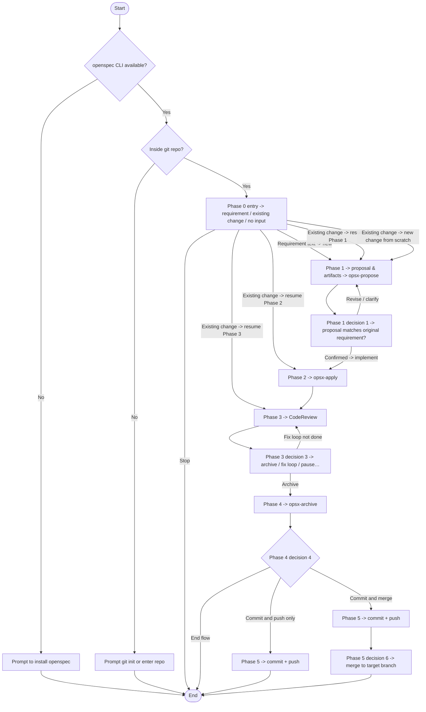

# End-to-end requirement development pipeline

## How to run

**Frontmatter and this page take precedence**; Phase steps and options are authoritative in `references/`.

**Flow overview** (main line `phase-0`–`phase-5`): Mermaid is a summary; `opsx-*` are aliases only; unresolved branches follow the Phase reference files.

**Highlights** (same order as reference files):

1. **Environment preflight (Phase 0)**: If `openspec` is unavailable → prompt install and stop; if not in a git repo → prompt init or enter repo and stop.
2. **Entry (Phase 0)**: No input → ask in plain text; requirement text → derive change name and enter Phase 1; **existing change** → `openspec status`, infer resume **Phase 1 Step 3 / Phase 2 / Phase 3** from artifact/task state, and have user confirm **Continue from Phase X / New change from scratch / Terminate** — **not** always Phase 1 gate first.
3. **Proposal and gate (Phase 1)**: **Decision 1** must pass before Phase 2. When the user revises requirements, update artifacts in text and return to this decision; clarification can fold into Phase 1.
4. **Apply and review (Phase 2–3)**: **Decision 2** can pause, skip review straight to archive, or terminate (`phase-2-apply.md`). Failed review: **fix-cr**, direct fix and re-review, pause, etc. (`phase-3-review.md`); `R3`→`REVIEW` in the diagram is the fix loop.
5. **Archive and Git (Phase 4–5)**: **Decision 4**: terminate / push only / commit and merge. Choosing commit-and-merge surfaces **decision 6**; push-only ends after push.

**Important:** All outputs must be in **English**.

---

**Input**: The user's requirement description, or an existing change name.

**Steps**

**After clarification, return to the flow (mandatory)**: After the user adds free-text clarification, proposal edits, or notes about apply/review/archive/commit, do **not** end the turn with explanation or confirmation only. In the **same** turn: (1) state **Phase** and **change**; (2) update artifacts and run commands per the current Phase `references/phase-*.md`; (3) advance to the next **decision point** (call AskQuestion when required). If information is missing, list gaps first, then ask; after answers, repeat this rule.

**Exit requires user consent**: Do not unilaterally close after many clarification rounds because the session is “too long,” etc. Except when the user chose **Terminate** at a decision point, to end the full pipeline first explain why and use AskQuestion for consent; if **not agreed**, return to current **Phase / change / unfinished step** and continue per “After clarification…” above and the matching `references/phase-*.md`. Exceptions: **Error Handling** in the appendix for environment/prereq failure; user already chose terminate/pause at a decision point or “pause pipeline” path — honor that.

Read and follow each Phase file in table order:

| Phase | Summary | Reference |
|-------|---------|-----------|
| 0 | Entry routing | `references/phase-0-entrance.md` |
| 1 | Proposal (Propose) | `references/phase-1-propose.md` |
| 2 | Apply | `references/phase-2-apply.md` |
| 3 | Code review | `references/phase-3-review.md` |
| 4 | Archive | `references/phase-4-archive.md` |
| 5 | Commit, merge, push | `references/phase-5-merge-push.md` |
| — | Resume, guardrails, errors, decision index | `references/recovery-guardrails-appendix.md` |
