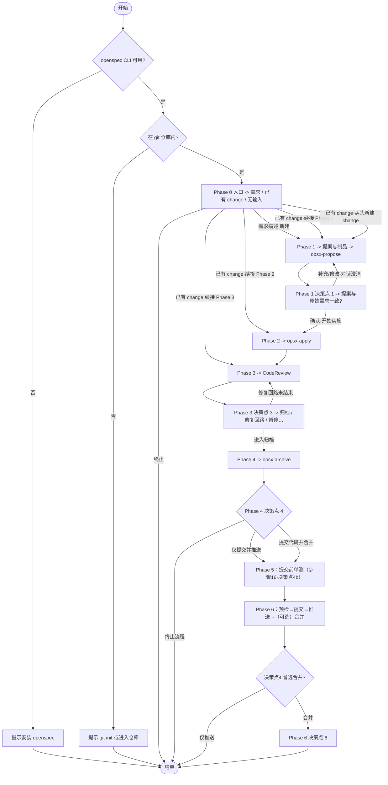

# 需求开发全流程流水线

**重要：** 所有输出使用中文。

---

**Input**: 用户的需求描述，或一个已有的 change 名称。

**Steps**

**澄清后强制回到流程（必填）**：用户以文本补充需求澄清、提案修改或实施/审查/归档/提交相关说明后，禁止仅解释或确认后收尾。同一回合内：(1) 标明 **Phase** 与 **change**；(2) 按当前 Phase 的 `references/phase-*.md` 更新制品并执行其中命令；(3) 推进至下一**决策点**（**首选**调用 AskQuestion；若不可用则按附录 **兼容性与降级** 用编号选项代替）。信息不足可先列缺口再追问，补答后重复本条。

**退出须用户同意**：多轮澄清后禁止以会话过长等理由单方收口。除用户在决策点已选「终止」外，若须结束全流程，须先说明原因并**征得同意**（**首选** AskQuestion；若不可用则用编号选项询问是否同意结束）；**不同意**则回到当前 **Phase / change / 未完成步骤**，按上条「澄清后强制回到流程」与对应 `references/phase-*.md` 继续。例外：附录 **Error Handling** 中环境与前置失败；用户在决策点或「暂停流水线」已选终止/暂停的，从其选项。

按下表顺序阅读并遵循各 Phase 文件中的步骤与决策点：

| Phase | 说明 | 引用文件 |
|-------|------|----------|
| 0 | 入口判断 | `references/phase-0-entrance.md` |
| 1 | 提案编写 (Propose) | `references/phase-1-propose.md` |
| 2 | 提案应用 (Apply) | `references/phase-2-apply.md` |
| 3 | 代码审查 (Review) | `references/phase-3-review.md` |
| 4 | 提案归档 (Archive) | `references/phase-4-archive.md` |
| 5 | 提交前单元测试 | `references/phase-5-unit-tests.md` |
| 6 | 提交合并推送 (Merge & Push) | `references/phase-6-merge-push.md` |
| — | 中断恢复、护栏、错误处理、决策点总览 | `references/recovery-guardrails-appendix.md` |

### 全局步骤索引（跨 Phase 连续编号）

各 `references/phase-*.md` 内沿用步骤编号 **1–22**；下表用于快速定位当前进度（决策点见附录 **决策点总览**）。

| Step | Phase | 摘要 | 引用文件 |
|:----:|:-----:|------|----------|
| 1–2 | 0 | 环境预检、入口类型与续接确认 | `phase-0-entrance.md` |
| 3–4 | 1 | 创建 change / 生成制品；**决策点 1**（提案门禁） | `phase-1-propose.md` |
| 5–7 | 2 | 获取 apply 上下文、按任务实施；**决策点 2** | `phase-2-apply.md` |
| 8–11 | 3 | 约定与 diff、审查、**决策点 3**（含 fix-cr 子流程） | `phase-3-review.md` |
| 12–15 | 4 | 归档前检查、delta 同步、执行归档；**决策点 4** | `phase-4-archive.md` |
| 16 | 5 | **决策点 4b**、单测子流程 | `phase-5-unit-tests.md` |
| 17–22 | 6 | 预提交（**5a/5b**）、暂存提交（**决策点 5**）、推送（**5c**）、合并（**决策点 6**）、合并后分支、最终摘要 | `phase-6-merge-push.md` |

### 兼容性、降级与子技能 fallback（摘要）

- **硬前置**：`openspec` CLI、git、在 git 仓库内工作；不满足则按 Phase 0 / 附录 **Error Handling** 处理并结束。
- **AskQuestion**：在 Cursor 中**首选**；若工具不可用，用与各 Phase **文案一致**的编号选项列表代替，见附录 **兼容性与降级**。
- **子技能**（`openspec-propose`、`openspec-apply-change`、`openspec-archive-change`）：**不必**单独 invoke；提案 / 应用 / 归档的等价步骤在 `references/` 中。Git 侧**代码审查、单测门禁、提交推送、合并分支**由 **Phase 3 / Phase 5 / Phase 6** 内联定义，**不**依赖任何独立 `git-*` skill。子技能缺失时**直接按本技能 Phase 文件执行**；若有同名 openspec 类 skill 仅可作补充阅读，**仍以本 `references/` 为准**。
- **细节与对照表**：`references/recovery-guardrails-appendix.md` 中的 **兼容性与降级**。

---

## 执行说明

**阅读顺序**：上文已列出 **Input**、**Steps**、Phase 引用表、全局步骤索引与兼容性摘要（优先执行）；本节及以下补充「元数据与权威来源」、脚本别名与流程示意图。

**元数据与本页正文优先**；各 Phase 步骤与选项以 `references/` 为准。

**代码规范**：凡涉及编写或修改实现/测试代码的 Phase，均以**目标仓库**的 **项目基准**（`openspec/project.md` → `openspec/config.yaml` → `CLAUDE.md`，与 Phase 3 步骤 8 一致）及**既有代码与单测风格**为准；细则见 `references/phase-2-apply.md` 与附录「代码与测试风格（项目内）」。

### 脚本（可选）

在**目标 git 仓库根目录**执行；若工作区仅有业务项目、技能在其它目录，请换为技能实际绝对路径，或直接运行各脚本内注释的等价 `openspec` 命令。

| Phase / 用途 | 脚本 | 说明 |
|----------------|------|------|
| 0 预检 | `opsx-preflight.sh` | `openspec --version` + git 仓库检测 |
| 0 / 1 / 4 | `opsx-change-status.sh <name>` | `openspec status --change <name> --json` |
| 0 / 1 | `opsx-list-changes.sh` | `openspec list --json`（可跟 `openspec list` 的其它参数） |
| 1 新建 | `opsx-new-change.sh <name>` | `openspec new change <name>` |
| 1 制品 | `opsx-instructions.sh <name> [artifact]` | `openspec instructions … --json`；省略 `artifact` 时用 `openspec status` 中第一件 **ready** 制品（需本机 `python3`） |
| 1 门禁（可选） | `opsx-validate-change.sh <name>` | 提案确认前结构校验 |
| 2 Apply | `opsx-instructions-apply.sh <name>` | `openspec instructions apply --change <name> --json` |
| 4 归档 | `opsx-archive.sh <name> …` | 封装 `openspec archive`（推荐 `-y`；不更新主 specs 时用 `--skip-specs`） |
| CI / 批处理 | `opsx-validate-all.sh` | `openspec validate --all --json --no-interactive` |
| 自检 | `opsx-selftest.sh` | 临时仓库中依次跑通本目录其余 `opsx-*.sh`（需 `git` + `openspec` + `python3`） |

**约定**：执行流水线步骤时**优先**一条命令跑完上述脚本（减少漏参、统一 `--json`）；若脚本不存在或环境限制，按各 `references/phase-*.md` 内原样 CLI 执行即可。

**流程概览**（`phase-0`～`phase-6` 主干）：Mermaid 为摘要；`opsx-*` 仅为别名；未尽分支以 Phase 引用文件为准。

**要点**（与引用文件同序）：

1. **环境预检（Phase 0）**：`openspec` 不可用 → 提示安装后结束；不在 git 仓库 → 提示初始化或进入仓库后结束。
2. **入口（Phase 0）**：无输入则文本询问；需求描述则推导 change 名并进入 Phase 1；**已有 change** 则 `openspec status`，按制品/任务状态判断续接 **Phase 1 Step 3 / Phase 2 / Phase 3**，并由用户确认「从 Phase X 继续 / 从头新建 / 终止」——**不是**一律先进入 Phase 1 门禁。
3. **提案与门禁（Phase 1）**：进入 Phase 2 前须过**决策点 1**。用户修改需求时以文本改制品并回到该决策点；澄清可与 Phase 1 合并。
4. **实施与审查（Phase 2～3）**：**决策点 2** 可暂停、跳过审查直接归档或终止（`phase-2-apply.md`）。审查未过：**fix-cr**、直接修复再审、暂停等（`phase-3-review.md`）；图中 `R3`→`REVIEW` 表示修复回路。
5. **归档与 Git（Phase 4～6）**：**决策点 4**：终止 / 仅推送 / 提交并合并。进入 **Phase 5** 后**须先经决策点 4b**（是否编写/补充单元测试并运行通过，或跳过/暂停），再在 **Phase 6** 执行预检与提交；选「提交并合并」时在推送后进入**决策点 6**；「仅推送」则不再合并。
