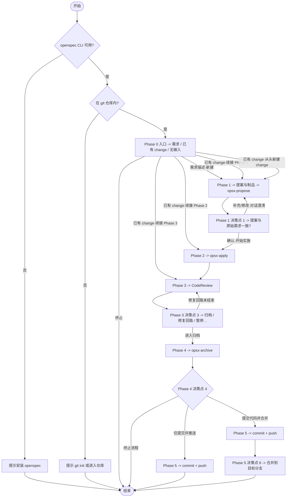

# 需求开发全流程流水线

## 执行说明

**元数据与本页正文优先**；各 Phase 步骤与选项以 `references/` 为准。

**流程概览**（`phase-0`～`phase-5` 主干）：Mermaid 为摘要；`opsx-*` 仅为别名；未尽分支以 Phase 引用文件为准。

**要点**（与引用文件同序）：

1. **环境预检（Phase 0）**：`openspec` 不可用 → 提示安装后结束；不在 git 仓库 → 提示初始化或进入仓库后结束。
2. **入口（Phase 0）**：无输入则文本询问；需求描述则推导 change 名并进入 Phase 1；**已有 change** 则 `openspec status`，按制品/任务状态判断续接 **Phase 1 Step 3 / Phase 2 / Phase 3**，并由用户确认「从 Phase X 继续 / 从头新建 / 终止」——**不是**一律先进入 Phase 1 门禁。
3. **提案与门禁（Phase 1）**：进入 Phase 2 前须过**决策点 1**。用户修改需求时以文本改制品并回到该决策点；澄清可与 Phase 1 合并。
4. **实施与审查（Phase 2～3）**：**决策点 2** 可暂停、跳过审查直接归档或终止（`phase-2-apply.md`）。审查未过：**fix-cr**、直接修复再审、暂停等（`phase-3-review.md`）；图中 `R3`→`REVIEW` 表示修复回路。
5. **归档与 Git（Phase 4～5）**：**决策点 4**：终止 / 仅推送 / 提交并合并。选「提交并合并」后出现**决策点 6**；选「仅推送」则 push 后直接结束。

**重要：** 所有输出使用中文。

---

**Input**: 用户的需求描述，或一个已有的 change 名称。

**Steps**

**澄清后强制回到流程（必填）**：用户以文本补充需求澄清、提案修改或实施/审查/归档/提交相关说明后，禁止仅解释或确认后收尾。同一回合内：(1) 标明 **Phase** 与 **change**；(2) 按当前 Phase 的 `references/phase-*.md` 更新制品并执行其中命令；(3) 推进至下一**决策点**（**首选**调用 AskQuestion；若不可用则按附录 **兼容性与降级** 用编号选项代替）。信息不足可先列缺口再追问，补答后重复本条。

**退出须用户同意**：多轮澄清后禁止以会话过长等理由单方收口。除用户在决策点已选「终止」外，若须结束全流程，须先说明原因并**征得同意**（**首选** AskQuestion；若不可用则用编号选项询问是否同意结束）；**不同意**则回到当前 **Phase / change / 未完成步骤**，按上条「澄清后强制回到流程」与对应 `references/phase-*.md` 继续。例外：附录 **Error Handling** 中环境与前置失败；用户在决策点或「暂停流水线」已选终止/暂停的，从其选项。

按下表顺序阅读并遵循各 Phase 文件中的步骤与决策点：

| Phase | 说明 | 引用文件 |
|-------|------|----------|
| 0 | 入口判断 | `references/phase-0-entrance.md` |
| 1 | 提案编写 (Propose) | `references/phase-1-propose.md` |
| 2 | 提案应用 (Apply) | `references/phase-2-apply.md` |
| 3 | 代码审查 (Review) | `references/phase-3-review.md` |
| 4 | 提案归档 (Archive) | `references/phase-4-archive.md` |
| 5 | 提交合并推送 (Merge & Push) | `references/phase-5-merge-push.md` |
| — | 中断恢复、护栏、错误处理、决策点总览 | `references/recovery-guardrails-appendix.md` |

### 全局步骤索引（跨 Phase 连续编号）

各 `references/phase-*.md` 内沿用步骤编号 **1–21**；下表用于快速定位当前进度（决策点见附录 **决策点总览**）。

| Step | Phase | 摘要 | 引用文件 |
|:----:|:-----:|------|----------|
| 1–2 | 0 | 环境预检、入口类型与续接确认 | `phase-0-entrance.md` |
| 3–4 | 1 | 创建 change / 生成制品；**决策点 1**（提案门禁） | `phase-1-propose.md` |
| 5–7 | 2 | 获取 apply 上下文、按任务实施；**决策点 2** | `phase-2-apply.md` |
| 8–11 | 3 | 约定与 diff、审查、**决策点 3**（含 fix-cr 子流程） | `phase-3-review.md` |
| 12–15 | 4 | 归档前检查、delta 同步、执行归档；**决策点 4** | `phase-4-archive.md` |
| 16–21 | 5 | 提交前检查、暂存提交（**决策点 5**）、推送、合并（**决策点 6**）、合并后分支、最终摘要 | `phase-5-merge-push.md` |

### 兼容性、降级与子技能 fallback（摘要）

- **硬前置**：`openspec` CLI、git、在 git 仓库内工作；不满足则按 Phase 0 / 附录 **Error Handling** 处理并结束。
- **AskQuestion**：在 Cursor 中**首选**；若工具不可用，用与各 Phase **文案一致**的编号选项列表代替，见附录 **兼容性与降级**。
- **子技能**（`openspec-propose`、`openspec-apply-change`、`git-code-review`、`git-commit-push`、`git-merge-branch`、`openspec-archive-change`）：**不必**单独 invoke；流水线已把等价步骤写在 `references/` 中。子技能缺失时**直接按本技能对应 Phase 文件执行**；若工作区内另有同名 skill 文件且需补充检查项，可读作参考，**仍以本 references 步骤为准**。
- **细节与对照表**：`references/recovery-guardrails-appendix.md` 中的 **兼容性与降级**。