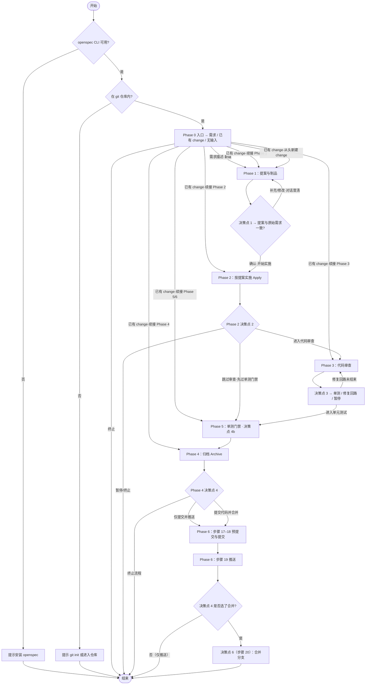

---

## name: opsx-dev-pipeline

description: OpenSpec + Git 需求开发全流程。  
license: MIT  
compatibility: 需安装 openspec 与 git CLI；建议在 Cursor 中配合 AskQuestion。默认兼容 OpenSpec 默认 schema，并优先支持 `openspec/config.yaml` 中声明的自定义 schema。  
metadata:  
  author: zhaoyi  
  version: "2.2"

# 需求开发全流程流水线

**重要：** 所有输出使用中文。

## Input

用户的需求描述，或一个已有的 change 名称。

## 执行约束（必读）

### 澄清后强制回到流程

用户以文本补充需求澄清、提案修改或实施/审查/归档/提交相关说明后，禁止仅解释或确认后收尾。**同一回合内**须完成：

1. 标明 **Phase** 与 **change**
2. 按当前 Phase 的 `references/phase-*.md` 更新制品并执行其中命令
3. 推进至下一**决策点**（**首选**调用 AskQuestion；若不可用则按 `references/recovery-guardrails-appendix.md` **§2.1** 用编号选项代替）

信息不足可先列缺口再追问，补答后重复本条。

### 退出须用户同意

多轮澄清后禁止以会话过长等理由单方收口。除用户在决策点已选「终止」外，若须结束全流程，须先说明原因并**征得同意**（**首选** AskQuestion；若不可用则用编号选项询问是否同意结束）：

- **不同意** → 回到当前 **Phase / change / 未完成步骤**，按上条「澄清后强制回到流程」与对应 `references/phase-*.md` 继续

**例外**：附录 **Error Handling** 中环境与前置失败；用户在决策点或「暂停流水线」已选终止/暂停的，从其选项。

### 决策点默认规则（摘要）

- 高风险决策必须显式确认；推荐项不等于自动代选
- 仅低风险、可逆、非门禁细节允许采用默认或保守假设
- 具体分级（A 类必须确认 / B 类可推荐不可静默默认 / C 类低风险默认）以 `references/recovery-guardrails-appendix.md` **§3.2 决策点总览** 为准

## Phase 引用表

按下表顺序阅读并遵循各 Phase 文件中的步骤与决策点：

| Phase | 说明                    | 引用文件                                                                             |
| ----- | --------------------- | -------------------------------------------------------------------------------- |
| 0     | 入口判断                  | `references/phase-0-entrance.md`                                                 |
| 1     | 提案编写 (Propose)        | `references/phase-1-propose.md`                                                  |
| 2     | 提案应用 (Apply)          | `references/phase-2-apply.md`                                                    |
| 3     | 代码审查 (Review)         | `references/phase-3-review.md`；「生成修复提案并应用」见 `references/phase-3.1-fix-review.md` |
| 4     | 提案归档 (Archive)        | `references/phase-4-archive.md`                                                  |
| 5     | 审查后单元测试门禁             | `references/phase-5-unit-tests.md`                                               |
| 6     | 提交合并推送 (Merge & Push) | `references/phase-6-merge-push.md`                                               |
| —     | 中断恢复、护栏、错误处理、决策点总览    | `references/recovery-guardrails-appendix.md`                                     |

### 全局步骤索引（跨 Phase 连续编号）

各 `references/phase-*.md` 内沿用步骤编号 **1–22**；下表用于快速定位当前进度。**条件触发**的子决策点（如 2a/2b、4a、5a/5b/5c、6a/6b）不在下表逐条展开；完整编号、语义与选项见 `references/recovery-guardrails-appendix.md` **§3.2 决策点总览**。

| 步骤    | Phase | 摘要                                                                         | 引用文件                                          |
| ----- | ----- | -------------------------------------------------------------------------- | --------------------------------------------- |
| 1–2   | 0     | 环境预检、入口类型与续接确认                                                             | `phase-0-entrance.md`                         |
| 3–4   | 1     | 创建 change / 生成制品；**决策点 1**（提案门禁）                                           | `phase-1-propose.md`                          |
| 5–7   | 2     | 获取 apply 上下文、按任务实施；**决策点 2**                                               | `phase-2-apply.md`                            |
| 8–11  | 3     | 约定与 diff、审查、**决策点 3**（含 fix-cr 子流程）                                        | `phase-3-review.md`，`phase-3.1-fix-review.md` |
| 16    | 5     | **决策点 4b**、单测子流程                                                           | `phase-5-unit-tests.md`                       |
| 12–16 | 4     | 归档前检查、verify、delta 同步、执行归档、归档后操作；**决策点 4 / 4a**                            | `phase-4-archive.md`                          |
| 17–22 | 6     | 预提交（**决策点 5a/5b**）、暂存提交（**决策点 5**）、推送（**决策点 5c**）、合并（**决策点 6**）、合并后分支、最终摘要 | `phase-6-merge-push.md`                       |

## 兼容性、降级与子技能 fallback（摘要）

- **硬前置**：`openspec` CLI、git、在 git 仓库内工作；不满足则按 Phase 0 / 附录 **Error Handling** 处理并结束
- **AskQuestion**：在 Cursor 中**首选**；若工具不可用，用与各 Phase **文案一致**的编号选项列表代替，见附录 **§2.1 AskQuestion 不可用**
- **子技能**（`openspec-propose`、`openspec-apply-change`、`openspec-archive-change`）：**不必**单独 invoke；提案 / 应用 / 归档的等价步骤在 `references/` 中。Git 侧**代码审查、单测门禁、提交推送、合并分支**由 **Phase 3 / Phase 5 / Phase 6** 内联定义，**不**依赖任何独立 `git-*` skill。子技能缺失时**直接按本技能 Phase 文件执行**；若有同名 openspec 类 skill 仅可作补充阅读，**仍以本 `references/` 为准**
- **细节与对照表**：`references/recovery-guardrails-appendix.md` 中的 **兼容性与降级** 全文章节

## 执行说明

**阅读顺序**：先完成上文 **Input**、**执行约束**、Phase 引用表、全局步骤索引与兼容性摘要；本节及以下为「元数据与权威来源」、脚本别名与流程示意图。

**元数据与本页正文优先**；各 Phase 步骤与选项以 `references/` 为准。

**代码规范**：凡涉及编写或修改实现/测试代码的 Phase，均以**目标仓库**的 **项目基准**（默认 `openspec/config.yaml` → `AGENTS.md` → `CLAUDE.md`；若 schema 为自定义 schema，则以 `openspec/config.yaml` 中定义的上下文与对应 standards 为增强基准，`AGENTS.md` / `CLAUDE.md` 仅作不冲突的补充约束，详见 `assets/schema-adapter-summary.md` 与 Phase 3 **步骤 8**）及**既有代码与单测风格**为准；细则见 `references/phase-2-apply.md` 与附录 **§2.4 代码与测试风格（项目内）**。

**进度跟踪**：Phase 1 等多制品阶段推荐使用 **TaskCreate / TaskUpdate / TaskList** 跟踪制品与任务进度（与 `references/phase-1-propose.md` 等处一致），降低遗漏。

**用户提示格式**：进入新 Phase、从暂停点恢复、或用户补充自由文本后，优先使用简短结构化提示：`Phase` / `change` / `当前步骤` / `已知状态` / `下一动作`。术语解释仅在首次出现或当前决策点直接依赖时补一行短说明，避免重复复述历史上下文；具体模板见 `references/recovery-guardrails-appendix.md` **§1.1–1.2**。

**维护入口**：维护 `SKILL.md`、`references/`、`scripts/` 的对应关系与联动检查时，先看 `assets/maintenance-index.md`；决策点语义以 `assets/decision-point-index.md` 为准，脚本输出契约以 `assets/script-io-conventions.md` 为准，恢复与异常路径以 `assets/failure-recovery-index.md` 为准。

### 脚本（可选）

**路径约定 `<SKILL_ROOT>`**：本技能**安装根目录**（内含 `scripts/`、`references/`）。各 `references/phase-*.md` 中的命令写为 `bash <SKILL_ROOT>/scripts/…`：

- 执行前将 `<SKILL_ROOT>` 换为实际绝对路径
- 工作目录仍以**目标 git 仓库根目录**为准（便于 `openspec` / `git` 解析项目）
- 勿假设技能文件夹名为 `opsx-dev-pipeline`
- 若不便使用脚本，可直接运行各 Phase 给出的等价 `openspec` CLI

| Phase / 用途    | 脚本（位于 `<SKILL_ROOT>/scripts/`）               | 说明                                                                                                   |
| ------------- | -------------------------------------------- | ---------------------------------------------------------------------------------------------------- |
| 0 预检          | `opsx-preflight.sh`                          | `openspec --version` + git 仓库检测                                                                      |
| 0 schema 探测   | `opsx-detect-schema.sh [name]`               | 识别 `openspec/config.yaml` 中的 schema、`.openspec.yaml` 与 `stacks`                                      |
| 0 / 1 / 4     | `opsx-change-status.sh <name>`               | `openspec status --change <name> --json`                                                             |
| 0 / 1         | `opsx-list-changes.sh`                       | `openspec list --json`（可跟 `openspec list` 的其它参数）                                                     |
| 1 新建          | `opsx-new-change.sh <name>`                  | `openspec new change <name>`                                                                         |
| 1 change 元数据  | `opsx-ensure-change-meta.sh <name> [stacks]` | 补齐/更新 `.openspec.yaml`，供自定义 schema 记录元数据                                                             |
| 1 制品          | `opsx-instructions.sh <name> [artifact]`     | `openspec instructions … --json`；省略 `artifact` 时用 `openspec status` 中第一件 **ready** 制品（需本机 `python3`） |
| 1 门禁（可选）      | `opsx-validate-change.sh <name>`             | 提案确认前结构校验                                                                                            |
| 2 Apply       | `opsx-instructions-apply.sh <name>`          | `openspec instructions apply --change <name> --json`                                                 |
| 2 / 3 / 5 上下文 | `opsx-change-context.sh <name>`              | 汇总 schema、`stacks`、merged context、standards 与规则摘要                                                    |
| 4 verify 解析   | `opsx-resolve-verify.sh <name>`              | 基于 schema / `stacks` 推导 archive 前 verify 命令                                                          |
| 4 归档          | `opsx-archive.sh <name> …`                   | 封装 `openspec archive`（推荐 `-y`；不更新主 specs 时用 `--skip-specs`）                                          |
| CI / 批处理      | `opsx-validate-all.sh`                       | `openspec validate --all --json --no-interactive`                                                    |
| 自检            | `opsx-selftest.sh`                           | 临时仓库中依次跑通本目录其余 `opsx-*.sh` 并覆盖 schema-aware 路径（需 `git` + `openspec` + `python3`）                     |

**约定**：执行流水线步骤时**优先**一条命令跑完上述脚本（减少漏参、统一 `--json`）；若脚本不存在或环境限制，按各 `references/phase-*.md` 内原样 CLI 执行即可。

**逐脚本 I/O**：关键脚本的输入参数、stdout / stderr、exit code、透传 / 包装边界见 `assets/script-io-conventions.md`。

### 流程概览（Mermaid）

**说明**（`phase-0`～`phase-6` 主干）：下图仅示意主干顺序；图中 **Phase N** 为方便阅读的**阶段昵称**，**不是** `openspec` 子命令名，也不一定对应某个脚本文件名；未尽分支以 Phase 引用文件为准。

### 要点（与引用文件同序）

1. **环境预检（Phase 0）**：`openspec` 不可用 → 提示安装后结束；不在 git 仓库 → 提示初始化或进入仓库后结束
2. **入口（Phase 0）**：无输入则文本询问；需求描述则推导 change 名并进入 Phase 1；**已有 change** 则 `openspec status`，并按“最早一个尚未完成的主干阶段或质量门禁优先”的顺序判断续接点：制品未完成 → **Phase 1 步骤 3**；制品已完成但任务未完成 → **Phase 2**；任务已完成且无审查报告 → **Phase 3**；已有审查报告但未完成审查后测试/归档链路 → **Phase 5**（完成后进入 **Phase 4**）；已归档后再根据 git 状态续接 **Phase 6** 对应步骤。若状态不完整或冲突，则以较早阶段作为**保守恢复推荐**并由用户确认；**不是**一律先进入 Phase 1，也**不是**一律直接进入 Phase 4
3. **提案与门禁（Phase 1）**：进入 Phase 2 前须过**决策点 1**。用户修改需求时以文本改制品并回到该决策点；澄清可与 Phase 1 合并
4. **实施与审查（Phase 2～3）**：**决策点 2** 可暂停、跳过审查并转入 **Phase 5** 单测门禁或终止（`phase-2-apply.md`）。审查未过：**fix-cr**、直接修复再审、暂停等（`phase-3-review.md`）；图中 `R3`→`REVIEW` 表示修复回路
5. **审查、单测与归档（Phase 3 / 5 / 4）**：**决策点 3** 后先进入 **Phase 5** 单元测试门禁，可暂停、跳过或补充测试；其后进入 **Phase 4** 执行 verify 与 archive；fix-cr / 直接修复等回路仍按 `phase-3-review.md` 执行
6. **归档后 Git（Phase 4 / 6）**：**决策点 4**：终止 / 仅推送 / 提交并合并。归档完成后进入 **Phase 6**。Phase 6 **内部顺序**以 `phase-6-merge-push.md` 为准：**步骤 17** 预提交检查 → **步骤 18** 暂存与提交 → **步骤 19** 推送 → 若决策点 4 选了「提交代码并合并」则进入 **步骤 20 决策点 6（合并）**；若选了「仅提交并推送」则跳过合并。流程图中将「步骤 17–18」「步骤 19」「合并」拆开，是为对齐上述顺序

